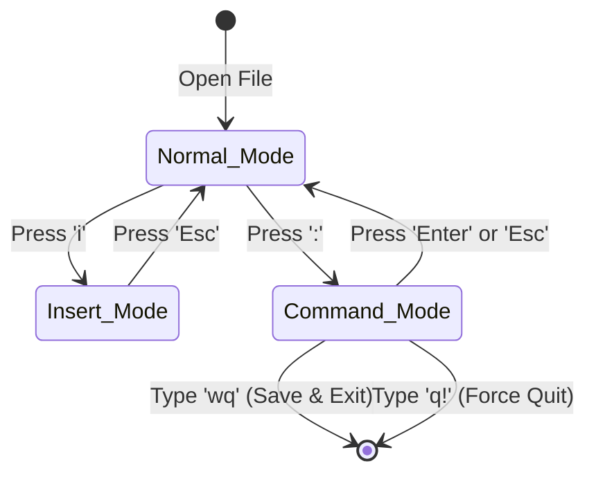

# Chapter 7 — Text Editors (nano & vim)

* **Difficulty:** Beginner
* **Estimated Time:** 2 Hours
* **Hands-on Labs:** 1
* **Interview Questions:** 2

## Learning Objectives

By the end of this chapter, you will be able to:
* Understand why terminal-based text editors are mandatory for Linux Engineers.
* Edit basic files using `nano`.
* Navigate the three primary modes of `vim` (Normal, Insert, and Command-Line).
* Exit `vim` safely without destroying configuration files.

## Visual Architecture: The Vim State Machine

Beginners often get trapped in `vim` because they do not understand it is a *modal* editor. You are always in one of three states. 

## Theory & Concepts

### Why Terminal Editors?
When a server crashes at 2:00 AM, you cannot RDP into it and open Notepad. You will be accessing it via SSH (Secure Shell) through a black terminal window. If a configuration file like `/etc/fstab` or `/etc/nginx/nginx.conf` has a typo, you must fix it using a terminal-based editor. 

### 1. `nano`: The Lifesaver
`nano` is the easiest editor to learn because the keyboard shortcuts are always visible at the bottom of the screen.
* **To open a file**: `nano /etc/hostname`
* **To save**: Press `Ctrl + O` (Write Out), then press `Enter`.
* **To exit**: Press `Ctrl + X`.

> [!WARNING]
> While `nano` is great for beginners, it is often **not installed** by default on minimal enterprise deployments (especially RHEL/CentOS). You cannot rely on it entirely.

### 2. `vim`: The Industry Standard
`vim` (Vi Improved) is installed on virtually every UNIX/Linux system in the world. It is incredibly powerful but famously unforgiving to beginners.

Unlike Notepad, when you open a file in `vim`, typing on your keyboard *does not type letters*. Instead, your keys act as commands (e.g., pressing `d` might delete a line). 

#### Mode 1: Normal Mode
When you type `vim filename.txt`, you start in **Normal Mode**. 
* You cannot type text here. 
* You use this mode to navigate the file (using the arrow keys) or delete things.
* To leave this mode and start typing, press the letter `i`.

#### Mode 2: Insert Mode
After pressing `i`, you will see `-- INSERT --` at the bottom of the screen. 
* Now, `vim` acts like Notepad. If you type 'hello', it writes 'hello'.
* When you are done typing, you **must** press the `Esc` key on your keyboard to return to Normal Mode.

#### Mode 3: Command-Line Mode
From Normal Mode, if you press the colon key `:`, your cursor drops to the very bottom of the screen. This is Command-Line mode, where you tell `vim` to save or quit.
* `:w` (Write / Save)
* `:q` (Quit - only works if you haven't made changes)
* `:wq` (Write and Quit)
* `:q!` (Force Quit - throws away all your changes)

## Real-World Scenarios

**Customer:**
*"I accidentally made a typo in my web server configuration. The server won't start. Please fix it!"*

How should a Linux Support Engineer investigate?
* **Action:** You SSH into the server and type `nano /etc/nginx/nginx.conf`. The system replies: `-bash: nano: command not found`.
* **The Fix:** Because you are a trained professional, you do not panic. You type `vim /etc/nginx/nginx.conf`. You use your arrow keys to find the typo. You press `i` to enter Insert Mode. You fix the typo. You press `Esc`. You type `:wq` to save and quit. You restart the web server, and the ticket is resolved.

## Hands-on Lab

> [!NOTE]
> **Practice Assignment Available**
> Before moving on, complete the exercises in the [Chapter 7 Practice Guide](../practice-files/V1-C07-practice.md) to build muscle memory for navigating Vim.

## Interview Questions

### Question 1: Why is `vim` preferred over `nano` in enterprise environments?
* **Target Answer**: "`vim` (or `vi`) is guaranteed to be installed on virtually every POSIX-compliant UNIX and Linux system by default, including highly stripped-down minimal containers and routers. `nano` often requires manual installation, which isn't possible if the network is down or the repository is unreachable."

### Question 2: How do you exit `vim` without saving your changes?
* **Target Answer**: "First, press `Esc` to ensure you are in Normal Mode. Then type `:q!` and press Enter. This forces the editor to quit and discards any unsaved modifications."

## Chapter Summary

You will not become a `vim` master overnight, and that is perfectly okay. The goal of a Support Engineer is not to write thousands of lines of code in `vim` at lightning speed; the goal is to be able to safely enter a file, change `False` to `True`, and save it without corrupting the server.

## Completion Checklist

- [ ] I understand the difference between Vim's Normal and Insert modes.
- [ ] I can successfully save and exit a file using `:wq`.
- [ ] I know how to panic-quit using `:q!` if I make a mistake.

---

## Navigation

⬅ Previous:
[Chapter 6 – Working with Files & Directories](V1-C06-working-with-files-and-directories.md)

🏠 Volume Contents:
[Table of Contents](../TOC.md)

➡ Next:
[Chapter 8 – Users & Groups](V1-C08-users-and-groups.md)
