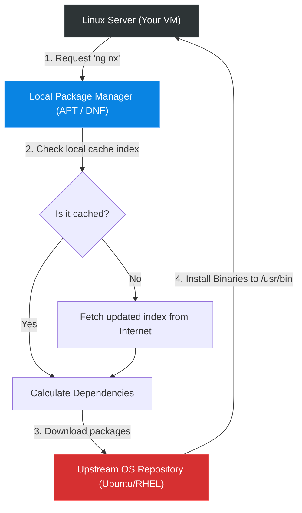

# Chapter 10 — Package Management

* **Difficulty:** Beginner
* **Estimated Time:** 2 Hours
* **Hands-on Labs:** 1
* **Interview Questions:** 3

## Learning Objectives

By the end of this chapter, you will be able to:
* Explain how Linux repositories differ from Windows `.exe` downloads.
* Manage software on Debian/Ubuntu systems using `apt`.
* Manage software on RHEL/CentOS systems using `dnf`.
* Search for, install, update, and completely remove packages safely.

## Visual Architecture: The Repository Model

In Windows, users historically downloaded installers from arbitrary websites. Linux uses a centralized, cryptographically signed **Repository Model**. Your server asks the Package Manager for software, the Package Manager fetches it from the upstream Repository, and automatically resolves any missing dependencies.

## Theory & Concepts

### 1. Repositories and the Cache
A repository is simply a massive web server hosting thousands of Linux programs (packages). 
To make searching fast, your local Linux machine keeps a database (cache) of every package available on the upstream repository. Before you install anything, you must sync your local cache with the upstream repository so your server knows what the latest versions are.

### 2. Dual-Distribution Command Guide

As a modern Linux Support Engineer, you must be bilingual. 

#### Updating the Cache
* **Debian/Ubuntu 26.04**: `sudo apt update`
* **RHEL 10 / CentOS**: `sudo dnf check-update`

#### Searching for Software
If you don't know the exact name of a package, you can search the cache.
* **Ubuntu**: `apt search "web server"`
* **RHEL**: `dnf search "web server"`

#### Installing Software
* **Ubuntu**: `sudo apt install nginx`
* **RHEL**: `sudo dnf install nginx`

#### Removing Software
* **Ubuntu**: `sudo apt remove nginx` (Leaves configuration files behind). Use `sudo apt purge nginx` to destroy everything.
* **RHEL**: `sudo dnf remove nginx`

### 3. Upgrading the Entire System
Unlike Windows which constantly pesters you to reboot for updates, Linux allows you to update the entire operating system and all installed applications with a single command.
* **Ubuntu**: `sudo apt upgrade`
* **RHEL**: `sudo dnf upgrade`

## Real-World Scenarios

**Customer:**
*"I am trying to run a script that downloads a file from the internet, but it keeps failing with 'curl: command not found'. Please install it."*

How should a Linux Support Engineer investigate?
* **Mental Map:** The server is missing the `curl` binary. The engineer must install it using the package manager.
* **The Fix (Ubuntu):** 
  1. The engineer runs `sudo apt update` to ensure their cache is fresh.
  2. The engineer runs `sudo apt install curl`.
  3. The engineer types `curl --version` to verify it installed successfully.
  4. The ticket is resolved in under 60 seconds.

## Hands-on Lab

> [!NOTE]
> **Practice Assignment Available**
> Before moving on, complete the exercises in the [Chapter 10 Practice Guide](../practice-files/V1-C10-practice.md) to practice updating your cache and installing monitoring tools on both distribution families.

## Interview Questions

### Question 1: What is the difference between `apt update` and `apt upgrade`?
* **Target Answer**: "`apt update` simply refreshes the local package index cache so the system knows what the newest available versions are. It does not install anything. `apt upgrade` actually downloads and installs those newer versions, replacing the older software on the disk."

### Question 2: A customer wants to completely wipe an application from their Ubuntu server, including all of its modified configuration files in `/etc`. What command should you use?
* **Target Answer**: "You should use `apt purge <package>`. The standard `apt remove` uninstalls the binary but intentionally leaves the configuration files behind in case the user decides to reinstall the software later."

### Question 3: Why is the Linux repository model considered more secure than downloading installers directly from websites?
* **Target Answer**: "Packages in official repositories are cryptographically signed by the OS maintainers (like Canonical or Red Hat). The package manager verifies these GPG signatures before installing. This ensures the software hasn't been tampered with or injected with malware during transit, unlike a random `.exe` downloaded from the internet."

## Chapter Summary

Installing software in Linux is incredibly streamlined once you understand the package manager. By syncing your local cache with the upstream repository, you have instant access to thousands of secure, verified applications. Remember your bilingual training: `apt` for Debian/Ubuntu, and `dnf` for RHEL/CentOS.

## Completion Checklist

- [ ] I understand why updating the cache is the mandatory first step before installing software.
- [ ] I can translate an `apt` command into a `dnf` command.
- [ ] I know the difference between `remove` and `purge`.

---

## Navigation

⬅ Previous:
[Chapter 9 – File Permissions & Ownership](V1-C09-file-permissions-and-ownership.md)

🏠 Volume Contents:
[Table of Contents](../TOC.md)

➡ Next:
[Chapter 11 – Process Management](V1-C11-process-management.md)
