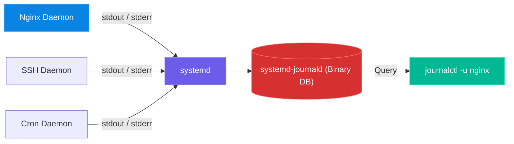

# Chapter 13 — Software Logs & Journals

* **Difficulty:** Intermediate
* **Estimated Time:** 2 Hours
* **Hands-on Labs:** 1
* **Interview Questions:** 3

## Learning Objectives

By the end of this chapter, you will be able to:
* Identify the difference between traditional `/var/log` text files and the modern `systemd` binary journal.
* Use `journalctl` to filter massive logs by specific service units.
* Use time-based filters (`--since`) to isolate incidents.
* Stream live logs from the journal (`-f`) for real-time troubleshooting.

## Visual Architecture: The Logging Pipeline

Historically, every application wrote its own text file into `/var/log`. Today, `systemd` acts as a centralized funnel. It captures the output of every daemon and writes it into a highly indexed, searchable binary database called the Journal.

## Theory & Concepts

### 1. The Old Way: Text Files in `/var/log`
Before `systemd` took over the Linux world, logging was entirely text-based. You used `cat`, `less`, and `grep` to read these files. Many applications (like web servers) still write to these files directly.
* `/var/log/syslog` (Ubuntu) or `/var/log/messages` (RHEL): The main system log.
* `/var/log/auth.log` (Ubuntu) or `/var/log/secure` (RHEL): The authentication log (tracking SSH logins and `sudo` usage).
* `/var/log/nginx/` or `/var/log/httpd/`: Web server access and error logs.

### 2. The New Way: `journalctl`
Because `systemd` starts the daemons, it can intercept everything they print to the screen (standard output/error) and save it in a binary format. You cannot read this binary database with `cat`. You must use the `journalctl` command.

Because the data is indexed, you can perform lightning-fast database-style queries on it.

#### Filtering by Service (Unit)
If you type `journalctl`, you get millions of lines of output. You must filter it.
* `journalctl -u sshd`: Shows *only* the logs generated by the SSH daemon. 

#### Filtering by Time
If an outage occurred at 3:00 PM yesterday, you don't want to scroll through last month's logs.
* `journalctl -u nginx --since "yesterday"`
* `journalctl -u nginx --since "2026-07-08 15:00:00" --until "2026-07-08 16:00:00"`

#### Navigation and Streaming
* `journalctl -u sshd -e`: Jumps immediately to the **End** of the log (the most recent entries).
* `journalctl -u sshd -f`: **Follows** the log in real-time, exactly like `tail -f`.

## Real-World Scenarios

**Customer:**
*"I modified the SSH configuration to change the default port, but now the SSH service won't restart. I ran `systemctl status sshd` but the output cuts off with `...` at the end of the line, so I can't read the error!"*

How should a Linux Support Engineer investigate?
* **Mental Map:** `systemctl status` only shows the last 10 lines of the log, and it truncates long lines to fit your terminal width. To see the full error, the engineer must query the journal.
* **The Fix:** The engineer runs `journalctl -u sshd -e`. This queries the journal for the SSH service and jumps to the very end. The output reveals the full error message: `line 15: Bad configuration option: Portt 2222`. 
* The engineer opens the file in `vim`, removes the extra 't' from 'Portt', saves, and restarts the service successfully.

## Hands-on Lab

> [!NOTE]
> **Practice Assignment Available**
> Before moving on, complete the exercises in the [Chapter 13 Practice Guide](../practice-files/V1-C13-practice.md) to practice isolating authentication logs using `journalctl`.

## Interview Questions

### Question 1: You try to run `cat /var/log/journal/...` to read a log file, but it outputs gibberish to your terminal. Why?
* **Target Answer**: "The `systemd` journal is not a flat text file; it is a binary, indexed database designed for fast querying and metadata storage. You cannot read it with standard text utilities like `cat` or `less`. You must use the `journalctl` command to query and format the binary data into readable text."

### Question 2: A database service crashed 10 minutes ago. How do you view its logs to see exactly what happened right before the crash?
* **Target Answer**: "I would use `journalctl -u <service_name> --since "15 minutes ago"`. This filters the massive system journal down to just the specific database unit, and further restricts the output to the relevant time window of the crash."

### Question 3: How do you stream the journal in real-time?
* **Target Answer**: "By using the `-f` (follow) flag. For example, `journalctl -u nginx -f` will lock onto the end of the journal and print new log entries to the screen as they happen, similar to `tail -f`."

## Chapter Summary

Logging has evolved. While you must still know how to `tail -f /var/log/syslog` for legacy applications, `journalctl` is the modern standard. By mastering the `-u` (unit), `-e` (end), and `-f` (follow) flags, you can instantly isolate the exact error message causing a service outage, drastically reducing your troubleshooting time.

## Completion Checklist

- [ ] I understand the difference between text logs and binary journals.
- [ ] I can filter the journal to show only logs from a specific daemon.
- [ ] I know how to jump to the end of the journal to see the latest errors.

---

## Navigation

⬅ Previous:
[Chapter 12 – Services & systemd](V1-C12-services-and-systemd.md)

🏠 Volume Contents:
[Table of Contents](../TOC.md)

➡ Next:
[Chapter 14 – Networking Fundamentals](V1-C14-networking-fundamentals.md)
