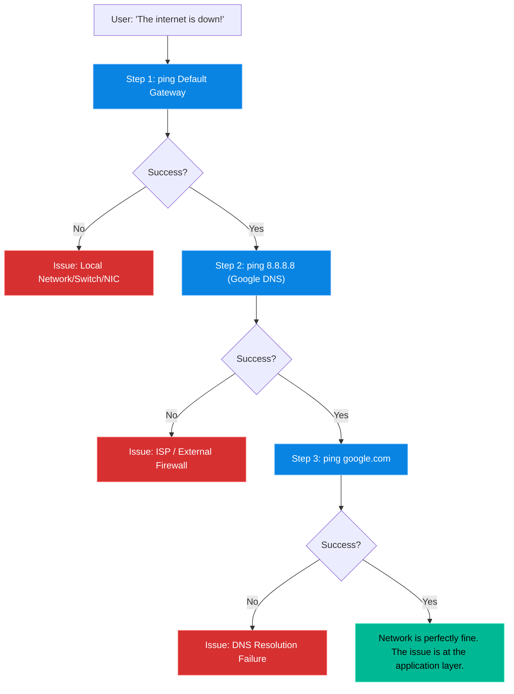

# Chapter 14 — Networking Fundamentals

* **Difficulty:** Intermediate
* **Estimated Time:** 2 Hours
* **Hands-on Labs:** 1
* **Interview Questions:** 3

## Learning Objectives

By the end of this chapter, you will be able to:
* Transition from legacy `net-tools` (like `ifconfig`) to modern `iproute2` commands (like `ip a`).
* Understand the OSI model at a high level (IPs vs Ports).
* Execute a methodical 3-step network troubleshooting sequence.
* Identify which services are listening on specific ports using `ss`.

## Visual Architecture: The 3-Step Troubleshooting Flow

When a server loses internet connectivity, do not guess. Follow this exact flow: verify local routing, verify external routing, and verify DNS resolution.

## Theory & Concepts

### 1. IPs and Ports (The Apartment Analogy)
* **IP Address**: Think of an IP address (like `192.168.1.50`) as the street address of an apartment building. It gets you to the server.
* **Port**: Think of a Port (like `22` or `80`) as the specific apartment number inside that building. A server can host many applications. The web server lives in apartment 80. The SSH daemon lives in apartment 22.

### 2. The `ip` Command (Goodbye `ifconfig`)
For decades, Linux engineers used `ifconfig`. It is now deprecated. You must use the `ip` command.
* `ip a` (short for `ip address`): Shows all network interfaces and their IP addresses.
* `ip r` (short for `ip route`): Shows the routing table, including the Default Gateway (the router that connects you to the internet).

### 3. Testing Connectivity
* `ping <IP>`: Sends ICMP echo requests to see if a machine is alive. *Note: In Linux, ping runs forever until you press `Ctrl+C`.*
* `curl -I <URL>`: Fetches the HTTP headers of a website. This proves not only that the server is online, but that the web server software (apartment 80/443) is actively responding.

### 4. DNS (Domain Name System)
Computers only understand IPs (like `142.250.190.46`). Humans understand names (like `google.com`). DNS translates the name to the IP.
* `dig google.com` or `nslookup google.com`: Queries a DNS server to ask for the IP address of a domain.

### 5. Hunting Open Ports
If you install a database, how do you know if it is actually listening for connections? You use the `ss` (Socket Statistics) command, which replaces the legacy `netstat` command.
* `ss -tulpn`: This is a mandatory memorization for Support Engineers.
  * `-t`: TCP ports
  * `-u`: UDP ports
  * `-l`: Only show Listening sockets
  * `-p`: Show the Process ID using the port (requires `sudo`)
  * `-n`: Show numeric IPs/Ports instead of trying to resolve their names

## Real-World Scenarios

**Customer:**
*"I just installed Nginx, but when I go to my server's IP address in a web browser, it says Connection Refused."*

How should a Linux Support Engineer investigate?
* **Mental Map:** "Connection Refused" means the packet reached the server, but nobody answered the door at port 80.
* **Investigation:** The engineer logs in and runs `sudo ss -tulpn | grep 80`.
* **Diagnosis:** The output is completely blank. Nginx is not actually listening on port 80. 
* **The Fix:** The engineer runs `systemctl status nginx` and realizes the service crashed on startup due to a configuration error. They fix the error, start the service, run `ss -tulpn` again to verify it is listening, and the website loads.

## Hands-on Lab

> [!CAUTION]
> **Practice Assignment Available**
> Before moving on, complete the exercises in the [Chapter 14 Practice Guide](../practice-files/V1-C14-practice.md). You will execute the 3-step network troubleshooting flow on your own machine.

## Interview Questions

### Question 1: What is the modern equivalent of the `ifconfig` command to view your IP address?
* **Target Answer**: "The modern command is `ip a` or `ip address show`, which is part of the `iproute2` package. `ifconfig` from the `net-tools` package is deprecated."

### Question 2: A server can successfully ping `8.8.8.8`, but it fails to ping `google.com` with a "Name or service not known" error. What is the exact problem?
* **Target Answer**: "The server has full internet connectivity, but DNS resolution is broken. The system cannot translate the human-readable domain name into an IP address. I would check the `/etc/resolv.conf` file to ensure valid nameservers are configured."

### Question 3: What does the command `ss -tulpn` do?
* **Target Answer**: "It lists all active TCP (`-t`) and UDP (`-u`) ports that are currently in a listening (`-l`) state. The `-n` flag forces numerical output (disabling reverse DNS lookups for speed), and the `-p` flag displays the specific Process ID (PID) and program name bound to that port."

## Chapter Summary

Networking is about knowing exactly where the packet died. By strictly following the 3-step sequence (Local Gateway -> Internet IP -> DNS Name), you remove the guesswork from troubleshooting. Combine this with `ss -tulpn` to verify your applications are actually listening on their expected ports, and you will resolve 90% of connectivity tickets within minutes.

## Completion Checklist

- [ ] I can find my IP address and default gateway using `ip a` and `ip r`.
- [ ] I can execute the 3-step troubleshooting sequence from memory.
- [ ] I know what `ss -tulpn` stands for and why it is useful.

---

## Navigation

⬅ Previous:
[Chapter 13 – Software Logs & Journals](V1-C13-software-logs-and-journals.md)

🏠 Volume Contents:
[Table of Contents](../TOC.md)

➡ Next:
[Chapter 15 – SSH Administration](V1-C15-ssh-administration.md)
