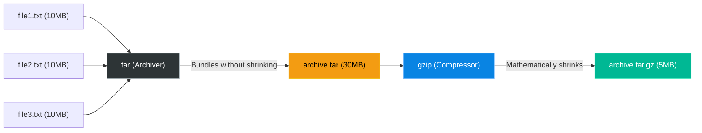

# Chapter 16 — Archiving and Compression

* **Difficulty:** Beginner
* **Estimated Time:** 1.5 Hours
* **Hands-on Labs:** 1
* **Interview Questions:** 3

## Learning Objectives

By the end of this chapter, you will be able to:
* Differentiate between archiving (grouping files) and compressing (reducing file size).
* Use the `tar` command to bundle directories.
* Use `gzip` to compress archives.
* Memorize the mandatory `tar` flag combinations for creating and extracting `.tar.gz` files.

## Visual Architecture: The Pipeline

In Windows, `.zip` files do two things at once: they group files together, and they make them smaller. In Linux, these are historically two separate steps. The files are first bundled by `tar`, and then squeezed by `gzip`. Modern `tar` commands do both simultaneously using the `-z` flag.

## Theory & Concepts

### 1. Archiving (`tar`)
`tar` stands for Tape Archive. Originally designed to write data to sequential magnetic tapes, it is now used to bundle hundreds or thousands of files into a single file (called a tarball).
* **Important:** Archiving does *not* save disk space. If you `tar` 100MB of text files, the resulting `.tar` file will be exactly 100MB.

### 2. Compression (`gzip` and `bzip2`)
Compression algorithms search for repeating patterns in a file and use math to reduce the file size. 
* `gzip`: The industry standard. Fast and efficient. Results in `.gz` files.
* `bzip2`: Slower than `gzip`, but achieves much smaller file sizes. Results in `.bz2` files.

### 3. The `tar` Flags (Mandatory Memorization)
You must memorize the following letters:
* `c`: **C**reate an archive.
* `x`: e**X**tract an archive.
* `z`: Filter the archive through g**Z**ip (compress/decompress).
* `v`: **V**erbose. (Print the filenames to the screen as it works).
* `f`: **F**ile. (This must *always* be the last flag before the filename).

### 4. Creating and Extracting
To combine archiving and compression into one command:
* **To Create**: `tar -czvf my_backup.tar.gz /var/log/`
  *(Create, Compress, Verbose, File... resulting in my_backup.tar.gz, containing the /var/log directory).*
* **To Extract**: `tar -xzvf my_backup.tar.gz -C /tmp/`
  *(Extract, Decompress, Verbose, File... dumping the contents into the /tmp directory).*

## Real-World Scenarios

**Customer:**
*"Our developers need to download the Apache web server logs to analyze a bug. There are 4,500 individual log files in the directory. Downloading them via SFTP is taking hours."*

How should a Linux Support Engineer investigate?
* **Mental Map:** Downloading 4,500 tiny files over a network is incredibly slow because of the TCP handshake overhead required for each individual file.
* **The Fix:** The engineer logs in and runs:
  `sudo tar -czvf /tmp/apache_logs.tar.gz /var/log/httpd/`
* **Result:** The engineer bundles all 4,500 files into a single `.tar.gz` file. Because text logs compress exceptionally well, the 5GB of logs shrinks down to a 300MB file. The developer downloads the single file in 15 seconds.

## Hands-on Lab

> [!CAUTION]
> **Practice Assignment Available**
> Before moving on, complete the exercises in the [Chapter 16 Practice Guide](../practice-files/V1-C16-practice.md). You will create a directory of dummy files, package them into a `.tar.gz` archive, delete the originals, and then extract the archive to restore them.

## Interview Questions

### Question 1: You have a 10GB `.tar` file. Did `tar` save you any disk space?
* **Target Answer**: "No. `tar` is purely an archiver. It bundles files together but does not apply any mathematical compression. To save space, the `.tar` file must be passed through a compressor like `gzip` or `bzip2`."

### Question 2: What does the command `tar -xzvf archive.tar.gz` do?
* **Target Answer**: "It extracts (`x`) and decompresses (`z`) the gzipped tarball. It prints the names of the files to the screen (`v` for verbose) as it extracts them from the file (`f`) named `archive.tar.gz`."

### Question 3: Why must the `f` flag always be the last letter in your `tar` arguments?
* **Target Answer**: "The `f` flag stands for 'file' and it expects the very next word in the command line to be the filename of the archive. If you type `tar -cfvz archive.tar`, `tar` will think the name of your archive is literally 'v'."

## Chapter Summary

Mastering `tar` is essential for backups and data transfers. Always remember that archiving and compression are two distinct concepts in Linux, seamlessly combined by adding the `-z` flag to your `tar` commands. Memorize `-czvf` to create, and `-xzvf` to extract.

## Completion Checklist

- [ ] I understand that `tar` does not compress data by itself.
- [ ] I know what `c`, `x`, `z`, `v`, and `f` stand for.
- [ ] I can create and extract a `.tar.gz` file from memory.

---

## Navigation

⬅ Previous:
[Chapter 15 – SSH Administration](V1-C15-ssh-administration.md)

🏠 Volume Contents:
[Table of Contents](../TOC.md)

➡ Next:
[Chapter 17 – Storage & Disk Management](V1-C17-storage-and-disk-management.md)
