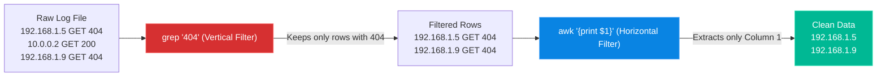

# Chapter 18 — Advanced Grep & Awk

* **Difficulty:** Advanced
* **Estimated Time:** 2 Hours
* **Hands-on Labs:** 1
* **Interview Questions:** 3

## Learning Objectives

By the end of this chapter, you will be able to:
* Extract specific rows using advanced `grep` flags (`-i`, `-v`, `-r`).
* Isolate specific columns of data using `awk`.
* Chain `grep` and `awk` together to parse massive, unstructured log files into clean, readable data.

## Visual Architecture: Horizontal vs Vertical Filtering

Think of a log file as a massive spreadsheet. `grep` filters vertically (finding the rows you care about). `awk` filters horizontally (extracting the columns you care about). 

## Theory & Concepts

### 1. Advanced `grep`
You already know that `grep` searches for words in a file. But Support Engineers need more precision.
* **`-i` (Ignore Case)**: `grep -i "error" file.txt` will find "error", "ERROR", and "ErRoR".
* **`-v` (Invert Match)**: This is the most powerful troubleshooting flag. It removes noise. If a file has 10,000 lines of "Success" and 5 lines of "Failure", running `grep -v "Success" file.txt` will instantly reveal the 5 failures.
* **`-r` (Recursive)**: Searches inside every file, within every folder, starting from your current location. `grep -r "password" /etc/` will hunt for the word password everywhere inside `/etc`.

### 2. Introduction to `awk`
`awk` is a full programming language, but 99% of the time, Linux Engineers use it for one specific task: printing columns of data based on spaces.
* Syntax: `awk '{print $X}'`
* `$1` prints the first column (the first word).
* `$2` prints the second column.
* `$NF` prints the **N**umber of **F**ields (the very last column, no matter how many columns there are).

If a text file says `Laxman Aryal Engineer`, running `awk '{print $3, $1}'` will output `Engineer Laxman`.

### 3. The Power of the Pipe (`|`)
You can chain these commands together. The output of the left command becomes the input of the right command.
`cat /var/log/nginx/access.log | grep -v "200 OK" | awk '{print $1}'`
*(Translation: Read the log, filter out the successful 200 codes so we only see errors, and then extract the 1st column, which is usually the IP address).*

## Real-World Scenarios

**Customer:**
*"Our Nginx web server is under attack! Someone is constantly trying to access `/admin.php` and getting 404 errors. I need a list of the IP addresses attacking us so I can block them in the firewall."*

How should a Linux Support Engineer investigate?
* **Diagnosis:** The access log contains hundreds of thousands of lines. Reading it manually is impossible.
* **Investigation:** The engineer logs in and looks at one line of the log to understand the format:
  `14.55.201.2 - - [08/Jul/2026] "GET /admin.php" 404 ...`
* **The Fix:** The engineer realizes the IP address is in Column 1 (`$1`). They run:
  `grep "admin.php" /var/log/nginx/access.log | awk '{print $1}'`
* **Result:** The terminal instantly outputs a clean, neat list of every single IP address that has tried to hit the admin page. The engineer hands the list to the customer.

## Hands-on Lab

> [!CAUTION]
> **Practice Assignment Available**
> Before moving on, complete the exercises in the [Chapter 18 Practice Guide](../practice-files/V1-C18-practice.md). You will create a raw data file and use `grep -v` and `awk` to extract exactly what you need.

## Interview Questions

### Question 1: How do you search for a specific string inside thousands of configuration files across multiple directories simultaneously?
* **Target Answer**: "I would use `grep -r` (recursive). For example, `grep -r 'Port 22' /etc/` will search through every single file and folder inside `/etc` and print both the filename and the matching line."

### Question 2: What does the `-v` flag do in grep, and why is it useful?
* **Target Answer**: "The `-v` flag stands for 'invert match'. It prints every line that *does not* match the pattern. It is incredibly useful for filtering out 'noise' in log files, such as piping a massive log through `grep -v 'Success'` to quickly isolate the errors."

### Question 3: You have a log file where the date is the first word, the time is the second word, and the error code is the third word. How do you print just the error codes using `awk`?
* **Target Answer**: "Assuming the words are separated by spaces, I would use `awk '{print $3}' filename`. This tells awk to split each line by spaces and print the 3rd field/column."

## Chapter Summary

Raw data is useless unless you can parse it. `grep` gives you the power to find the exact rows you need (and `grep -v` helps you ignore the rows you don't). `awk` takes those rows and isolates the exact columns you want. Mastering these two tools elevates you from a beginner who reads logs to an engineer who parses data.

## Completion Checklist

- [ ] I can use `grep -v` to exclude words from an output.
- [ ] I can use `grep -r` to search an entire directory tree.
- [ ] I understand that `awk '{print $1}'` extracts the first word of every line.

---

## Navigation

⬅ Previous:
[Chapter 17 – Storage & Disk Management](V1-C17-storage-and-disk-management.md)

🏠 Volume Contents:
[Table of Contents](../TOC.md)

➡ Next:
[Chapter 19 – Output Redirection (Piping)](V1-C19-output-redirection.md)
