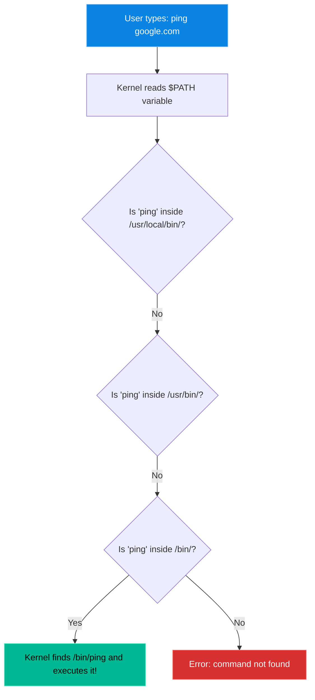

# Chapter 21 — Environment Variables

* **Difficulty:** Advanced
* **Estimated Time:** 2 Hours
* **Hands-on Labs:** 1
* **Interview Questions:** 3

## Learning Objectives

By the end of this chapter, you will be able to:
* Differentiate between local variables and global environment variables.
* Explain exactly how the `$PATH` variable resolves commands.
* Append a custom directory to `$PATH`.
* Make variable modifications permanent using `~/.bashrc`.

## Visual Architecture: The Search for a Command

When you type `ping`, Linux does not magically know where the `ping` application lives. It must search for it. The `$PATH` variable provides the exact list of directories the Kernel is allowed to search.

## Theory & Concepts

### 1. What are Environment Variables?
Your shell needs to keep track of a lot of information: Who are you? Where is your home directory? What language do you speak? 
It stores this data in **Environment Variables**. 
* They are always written in ALL CAPS.
* You can view all of them by running the `env` or `printenv` commands.
* Common examples: `$USER` (your username), `$HOME` (your home directory), `$PWD` (your present working directory).

### 2. The Almighty `$PATH`
`$PATH` is the most important variable in Linux. It is a colon-separated list of directories. 
If you type `ls`, Linux checks the first directory in the `$PATH` list. If `ls` isn't there, it checks the second directory. It keeps checking until it finds the executable. If it checks every directory and still can't find it, it returns `command not found`.

**Why `./` is required for scripts:**
When you wrote a script in Chapter 20, you had to run it using `./script.sh`. Why? Because the folder you created the script in (e.g., your home directory) is **NOT** in the `$PATH` variable! The `./` explicitly tells Linux: "Do not use the `$PATH` variable to search for this file. Just look right here."

### 3. Modifying the `$PATH`
If you install a custom application into `/opt/myapp/bin`, Linux will not know it exists because `/opt/myapp/bin` is not in the default `$PATH`.
* **The Temporary Fix**: `export PATH=$PATH:/opt/myapp/bin`
*(Translation: Make the new PATH equal to the old PATH, plus my new directory).*

### 4. Making it Permanent (`.bashrc`)
If you use the `export` command in your terminal, the variable will disappear the second you log out. 
To make a variable permanent, you must write the `export` command into a configuration file that runs automatically every time you log in.
* **`~/.bashrc`**: This file lives in your home directory. It runs every time you open a terminal. If you put an `export` command at the bottom of this file, the variable becomes permanent for *you*.

## Real-World Scenarios

**Customer:**
*"I downloaded a binary called `aws-cli` and put it in my `/home/user/tools` directory. But when I just type `aws-cli` in the terminal, it says 'command not found'. I don't want to type the full path every time. Fix this!"*

How should a Linux Support Engineer investigate?
* **Diagnosis:** The command is valid, but the `/home/user/tools` directory is not part of the system's `$PATH`.
* **The Fix:** 
  1. The engineer opens the user's configuration file: `nano ~/.bashrc`
  2. At the very bottom of the file, they append: `export PATH=$PATH:/home/user/tools`
  3. They save the file.
  4. They run `source ~/.bashrc` to force the terminal to re-read the file immediately without logging out.
* **Result:** The customer can now type `aws-cli` from anywhere in the system, and Linux will successfully find and execute it.

## Hands-on Lab

> [!CAUTION]
> **Practice Assignment Available**
> Before moving on, complete the exercises in the [Chapter 21 Practice Guide](../practice-files/V1-C21-practice.md). You will create a custom application, observe the "command not found" error, and permanently fix it by modifying your `$PATH`.

## Interview Questions

### Question 1: What is the `$PATH` environment variable used for?
* **Target Answer**: "The `$PATH` variable contains a colon-separated list of directories. When a user types a command without providing an absolute path, the shell searches through these directories sequentially to locate the executable binary. If it is not found in any of those directories, it returns a 'command not found' error."

### Question 2: Why do you have to type `./script.sh` to run a script in your current directory, instead of just `script.sh`?
* **Target Answer**: "For security reasons, the current working directory (`.`) is intentionally excluded from the `$PATH` variable. Therefore, the shell will not search the current directory for executables. You must explicitly tell the shell where the script is by providing the relative path (`./`)."

### Question 3: You ran `export MY_VAR="123"`, but after rebooting the server, the variable is gone. How do you make it permanent?
* **Target Answer**: "The `export` command only applies to the current shell session. To make it persistent across reboots and new sessions, the export command must be appended to the user's profile configuration file, such as `~/.bashrc` or `~/.bash_profile`."

## Chapter Summary

The `$PATH` variable is the hidden engine behind every command you type. If you understand how Linux searches for executables, and how to permanently modify that search path using `~/.bashrc`, you will resolve software installation issues in seconds rather than hours.

## Completion Checklist

- [ ] I can view my current `$PATH` by echoing it.
- [ ] I understand the danger of overwriting `$PATH` instead of appending to it.
- [ ] I know which configuration file to edit to make variables permanent.

---

## Navigation

⬅ Previous:
[Chapter 20 – Bash Scripting Basics](V1-C20-bash-scripting-basics.md)

🏠 Volume Contents:
[Table of Contents](../TOC.md)

➡ Next:
[Chapter 22 – User Automation (Cron)](V1-C22-user-automation-cron.md)
