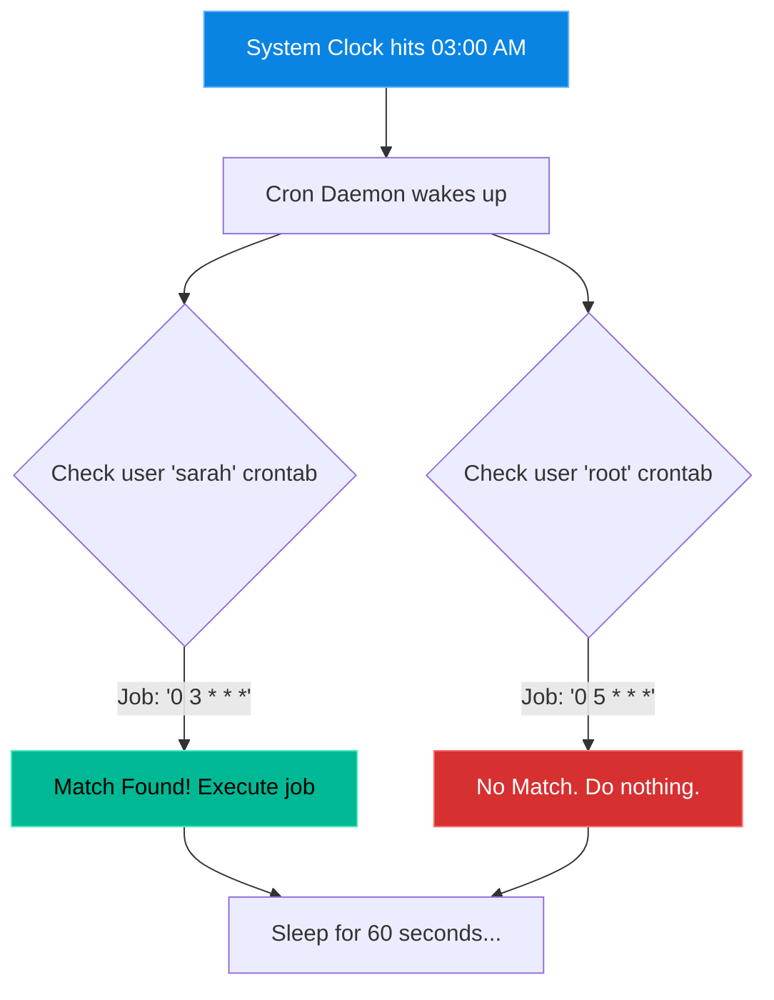

# Chapter 22 — User Automation (Cron)

* **Difficulty:** Intermediate
* **Estimated Time:** 2 Hours
* **Hands-on Labs:** 1
* **Interview Questions:** 3

## Learning Objectives

By the end of this chapter, you will be able to:
* Explain the role of the `cron` daemon.
* Translate the 5-star cron syntax into human-readable schedules.
* Schedule recurring scripts using `crontab -e`.
* Understand the most common reason cron jobs fail (the `$PATH` trap).

## Visual Architecture: The Cron Loop

The `cron` daemon is a background service that wakes up exactly once every 60 seconds. It checks every user's `crontab` file. If the current system time matches the 5-star syntax written in the file, it executes the command.



## Theory & Concepts

### 1. What is Cron?
In Chapter 20, you wrote a script. In Chapter 21, you made it accessible everywhere. But you still had to type the command to run it. `cron` is the Linux time-based job scheduler. It types the commands for you while you are asleep.

### 2. The Crontab
Every user on a Linux system can have their own "Cron Table" (crontab).
* `crontab -e`: **E**dit your crontab file. (It will open in your default text editor, usually `nano` or `vim`).
* `crontab -l`: **L**ist the contents of your crontab file to see what is currently scheduled.

### 3. The 5-Star Syntax
Every line in a crontab file follows this exact format:
`[Minute] [Hour] [DayOfMonth] [Month] [DayOfWeek] /path/to/command`

You must memorize the 5 positions:
1. **Minute** (0 - 59)
2. **Hour** (0 - 23, Military Time)
3. **Day of Month** (1 - 31)
4. **Month** (1 - 12)
5. **Day of Week** (0 - 7, where 0 and 7 are both Sunday)

An asterisk `*` means "Every".

### 4. The `$PATH` Trap (Why Cron Jobs Fail)
When you run a script manually, it works. When cron runs it, it fails. Why?
Because **cron does not load your `~/.bashrc` file**. Cron runs in a highly restricted environment with a very basic `$PATH`. If your script relies on a custom tool, cron won't find it.
* **The Fix**: Inside your script, always use **Absolute Paths**. Instead of typing `python3`, type `/usr/bin/python3`. Instead of `systemctl`, type `/bin/systemctl`.

## Real-World Scenarios & Sample Scripts

### Scenario 1: The Database Backup
A company needs their MySQL database backed up every night at 2:00 AM, and they want the backup compressed to save space.

**The Script (`/opt/scripts/db_backup.sh`):**
```bash
#!/bin/bash
# We use absolute paths because cron is running this!
/usr/bin/mysqldump -u root -p'SecretPass' my_database > /backups/db_backup_$(date +\%F).sql
/bin/tar -czvf /backups/db_backup_$(date +\%F).tar.gz /backups/db_backup_$(date +\%F).sql
/bin/rm /backups/db_backup_$(date +\%F).sql
```
**The Crontab Entry:**
```text
# Run at 2:00 AM every single day
0 2 * * * /opt/scripts/db_backup.sh
```

### Scenario 2: The Cache Cleaner
An application fills up the `/tmp/app_cache` directory constantly. If it isn't emptied weekly, the server crashes. The engineer schedules a wipe for Sunday at midnight.

**The Script (`/opt/scripts/clear_cache.sh`):**
```bash
#!/bin/bash
/bin/rm -rf /tmp/app_cache/*
/bin/echo "Cache cleared on $(date)" >> /var/log/cache_cleaner.log
```
**The Crontab Entry:**
```text
# Run at 00:00 (Midnight) only on Day 0 (Sunday)
0 0 * * 0 /opt/scripts/clear_cache.sh
```

### Common Syntax Examples Reference
Support Engineers reference these constantly:
* `* * * * *`: Run every single minute. (Great for testing).
* `*/5 * * * *`: Run every 5 minutes.
* `0 12 * * *`: Run at exactly 12:00 PM (Noon) every day.
* `0 8 * * 1-5`: Run at 8:00 AM, Monday through Friday.

## Hands-on Lab

> [!CAUTION]
> **Practice Assignment Available**
> Before moving on, complete the exercises in the [Chapter 22 Practice Guide](../practice-files/V1-C22-practice.md). You will write a heartbeat script, schedule it to run every minute, and verify the automation is working.

## Interview Questions

### Question 1: What does the cron syntax `0 5 * * 1` mean?
* **Target Answer**: "This job will run at exactly 5:00 AM, every Monday. The first digit is the minute (0), the second is the hour (5), the asterisks mean every day of the month and every month, and the 1 represents Monday."

### Question 2: A developer writes a script that works perfectly when they run it manually, but it fails when triggered by cron. What is the most likely cause?
* **Target Answer**: "The most likely cause is an Environment Variable issue, specifically the `$PATH`. The cron daemon executes with a minimal, stripped-down environment and does not load the user's `~/.bashrc`. The developer needs to update their script to use absolute paths for all commands and binaries."

### Question 3: How do you edit the crontab for the `root` user while logged in as a standard user with `sudo` privileges?
* **Target Answer**: "You would run `sudo crontab -e`. The `-e` flag opens the crontab file for the user executing the command, which in this case is elevated to `root` by `sudo`."

## Chapter Summary

Cron is the invisible heartbeat of Linux automation. By mastering the 5-star syntax and understanding the critical requirement to use Absolute Paths in your scripts, you can completely automate maintenance tasks, backups, and log rotations.

## Completion Checklist

- [ ] I can decipher the 5-star cron syntax (`Minute Hour Dom Month Dow`).
- [ ] I know the difference between `crontab -e` and `crontab -l`.
- [ ] I understand why cron scripts must use absolute paths.

---

## Navigation

⬅ Previous:
[Chapter 21 – Environment Variables](V1-C21-environment-variables.md)

🏠 Volume Contents:
[Table of Contents](../TOC.md)

➡ Next:
[Chapter 23 – Basic System Monitoring](V1-C23-basic-system-monitoring.md)
