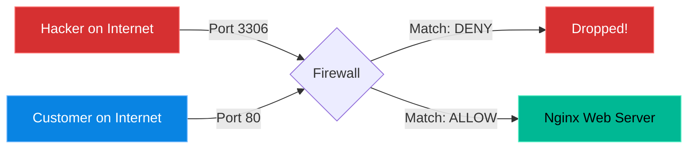

# Chapter 24 — Introduction to Networking (Firewalls)

* **Difficulty:** Intermediate
* **Estimated Time:** 1.5 Hours
* **Hands-on Labs:** 1
* **Interview Questions:** 3

## Learning Objectives

Security requires defense in depth. By mastering `iptables` and `firewalld`, you can control exactly which traffic is allowed into and out of your server, blocking attackers at the gate.

By the end of this chapter, you will be able to:
* Understand the concept of a "Default Deny" policy.
* Manage firewall rules on Ubuntu using `ufw`.
* Manage firewall rules on CentOS/RHEL using `firewalld`.
* Safely enable a firewall without locking yourself out of SSH.

## Visual Architecture: The Default Deny

A modern Linux firewall operates on a "Default Deny" philosophy. Unless you explicitly open a door (a Port), the traffic is dropped before it ever reaches your application. 

## Theory & Concepts

### 1. What is a Firewall?
If you install Nginx, it listens on Port 80. But just because Nginx is listening doesn't mean anyone can connect. The Kernel's firewall acts as a security guard standing at the front door. If Port 80 is not on the "Guest List", the security guard ignores the connection attempt.

### 2. The Distro Split
This is where Linux distributions diverge significantly. Under the hood, they both use the Linux Kernel's `netfilter` system. But the command-line tools you use to talk to it are completely different.
* **Ubuntu/Debian** uses `ufw` (Uncomplicated Firewall).
* **RHEL/CentOS/Rocky** uses `firewalld`.

### 3. Managing UFW (Ubuntu)
UFW is incredibly simple, hence the name.
* `sudo ufw status`: Check if it is running and view the current rules.
* `sudo ufw allow 80/tcp`: Open port 80 for web traffic.
* `sudo ufw allow 22/tcp`: Open port 22 for SSH. **(CRITICAL: Always do this before enabling the firewall!)**
* `sudo ufw enable`: Turn the firewall on. 

### 4. Managing Firewalld (RHEL/CentOS)
Firewalld is more complex and uses the concept of "Zones" (like public, trusted, drop).
* `sudo firewall-cmd --state`: Check if it is running.
* `sudo firewall-cmd --list-all`: View the active rules in your default zone.
* `sudo firewall-cmd --add-port=80/tcp --permanent`: Open port 80. The `--permanent` flag is mandatory, otherwise the rule vanishes when the server reboots.
* `sudo firewall-cmd --reload`: You must reload the firewall for permanent rules to take effect.

## Real-World Scenarios

> [!IMPORTANT]
> **Incident Report & Roleplay**
>
> **👤 End User (Dave):**
> *""I just installed a web server on Ubuntu. When I type `ss -tulpn`, I clearly see it listening on Port 80. But when I type my IP address into my web browser on my laptop, it times out!""*
>
> **🧑‍💻 Tech Support (Charlie):**
> - **Mental Map:** The service is running internally, but failing externally. It is being blocked at the perimeter.
>
> **👨‍🔧 Junior Admin (Bob):**
> - **Investigation:** The engineer logs in and runs `sudo ufw status`. The output says `Status: active`, but Port 80 is not listed in the rules.
>
> **🦸‍♀️ Senior Admin (Alice):**
> - **The Fix:** The engineer runs `sudo ufw allow 80/tcp`. 
>
> **🏢 Business Owner (Eve):**
> - **Result:** The customer refreshes their browser and the website loads instantly.
>   
>
## Hands-on Lab

> [!CAUTION]
> **Practice Assignment Available**
> Before moving on, complete the exercises in the [Chapter 24 Practice Guide](../practice-files/V1-C24-practice.md). You will securely enable your firewall without locking yourself out.

## Interview Questions

### Question 1: What does "Default Deny" mean in the context of a Linux firewall?
* **Target Answer**: "A default deny policy means that all incoming network traffic is blocked and dropped by default. Traffic is only permitted to reach an application if a system administrator has explicitly created an 'ALLOW' rule for that specific port or protocol."

### Question 2: You are setting up a brand new Ubuntu server and want to turn on `ufw`. What is the very first rule you must add before typing `ufw enable`?
* **Target Answer**: "You must explicitly allow Port 22 (`ufw allow 22/tcp`). If you enable a default-deny firewall without allowing SSH traffic first, the firewall will instantly drop your connection and you will permanently lock yourself out of the remote server."

### Question 3: A customer using CentOS ran `firewall-cmd --add-port=443/tcp`. It worked perfectly. But a week later, the server rebooted and the port is blocked again. Why?
* **Target Answer**: "The customer forgot to append the `--permanent` flag to their command. Without that flag, `firewalld` only applies the rule to the running memory configuration. Upon reboot, the firewall reloaded from its saved configuration files on disk, which did not include the new rule."

## Chapter Summary

As a Support Engineer, the firewall is the first suspect whenever an application is "running but unreachable." Ensure you know which distribution you are working on, use `ufw` or `firewalld` accordingly, and *never* turn on a firewall without allowing Port 22 first.

## Completion Checklist

- [ ] I understand that firewalld requires the `--permanent` flag.
- [ ] I can check the status of `ufw`.
- [ ] I know why locking yourself out via Port 22 is the most common beginner mistake.

---

## Navigation

⬅ Previous:
[Chapter 23 – Basic System Monitoring](V1-C23-basic-system-monitoring.md)

🏠 Volume Contents:
[Table of Contents](../TOC.md)

➡ Next:
[Chapter 25 – DNS & Name Resolution](V1-C25-dns-and-name-resolution.md)
