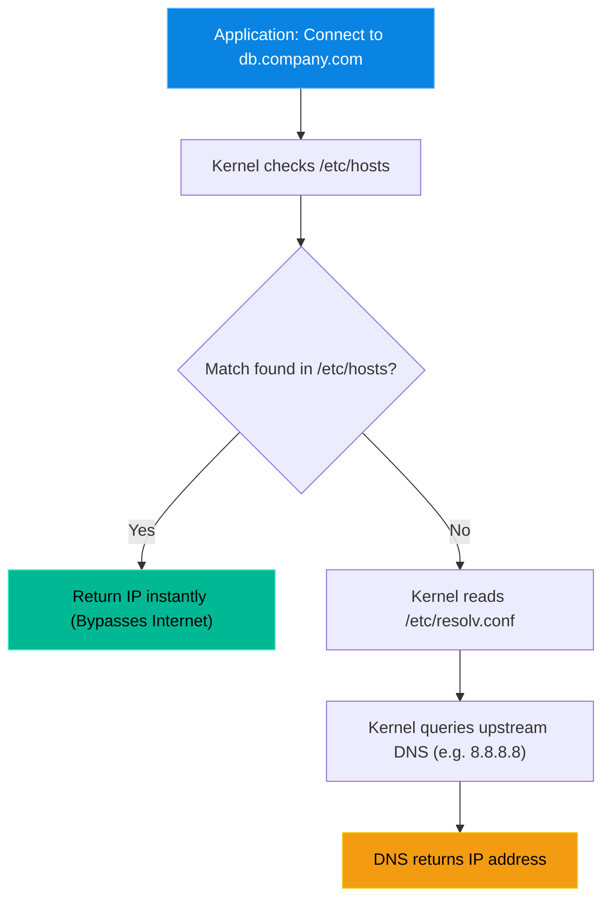

# Chapter 25 — DNS & Name Resolution

* **Difficulty:** Advanced
* **Estimated Time:** 2 Hours
* **Hands-on Labs:** 1
* **Interview Questions:** 3

## Learning Objectives

By the end of this chapter, you will be able to:
* Explain how Linux resolves domains to IP addresses.
* Read the `/etc/resolv.conf` file to identify upstream DNS servers.
* Use the `/etc/hosts` file to override global DNS.
* Apply the local host override trick to seamlessly migrate applications.

## Visual Architecture: The Resolution Flow

When an application asks Linux to connect to `db.company.com`, Linux does not immediately ask the internet. It checks its own internal, hardcoded list first (`/etc/hosts`). If it finds nothing there, only then does it ask the global DNS servers listed in `/etc/resolv.conf`.

## Theory & Concepts

### 1. The Global Resolver (`/etc/resolv.conf`)
This file is the phonebook directory for your server. It tells Linux *who* to ask when it needs to translate a name into an IP address.
If you `cat /etc/resolv.conf`, you will see lines like:
`nameserver 8.8.8.8`
`nameserver 1.1.1.1`
If this file is empty or corrupted, your server cannot connect to anything by name (e.g., `ping google.com` will fail), but it can still connect to raw IPs (e.g., `ping 8.8.8.8` will succeed).

### 2. The Local Override (`/etc/hosts`)
Before DNS existed on the internet, every computer relied on a single text file to map names to IPs. That file still exists today at `/etc/resolv.conf`.
**The Golden Rule:** The `/etc/hosts` file *always* wins. If global DNS says `google.com` is `142.250.190.46`, but you write `127.0.0.1 google.com` in your `/etc/hosts` file, your computer will completely ignore the internet and point Google to itself.

### 3. [USEFUL TRICK] The Migration Override
When you migrate a website from Server A to Server B, you have to update the global DNS records. But global DNS can take up to 24 hours to update worldwide. How can you test if Server B is working *before* you change the global DNS?
**The Trick:** 
You open the `/etc/hosts` file on your personal laptop. You add a line pointing the domain name to the IP of Server B. Now, when *you* open your browser, your laptop connects to Server B. Everyone else on the internet still connects to Server A. You can safely test the migration in secret!

## Real-World Scenarios

**Customer:**
*"We just bought a new database server. We migrated all the data over, and we updated the public DNS to point `database.ourcompany.com` to the new IP. But our web application is still writing data to the old server!"*

How should a Linux Support Engineer investigate?
* **Diagnosis:** The web application server is suffering from DNS caching. It is still resolving `database.ourcompany.com` to the old IP address because the new DNS record hasn't propagated through the internet yet.
* **The Fix:** The engineer SSHs into the web server. They edit the `/etc/hosts` file.
  They add the line: `192.168.5.50 database.ourcompany.com` (using the new IP).
* **Result:** The moment the file is saved, the web server stops asking the internet for directions. It instantly routes all traffic for that domain to the new IP. The customer's application is fixed instantly, without waiting 24 hours for global DNS propagation.

## Hands-on Lab

> [!CAUTION]
> **Practice Assignment Available**
> Before moving on, complete the exercises in the [Chapter 25 Practice Guide](../practice-files/V1-C25-practice.md). You will hijack a fake domain name and force your VM to resolve it locally.

## Interview Questions

### Question 1: A server can ping `8.8.8.8` successfully, but pinging `google.com` returns "Name or service not known". What file should you check first?
* **Target Answer**: "I would check `/etc/resolv.conf`. If the server can reach a public IP address but cannot resolve a domain name, the upstream DNS configuration is missing, incorrect, or the nameservers listed in that file are unreachable."

### Question 2: In what order does Linux resolve domain names?
* **Target Answer**: "By default, Linux checks the local `/etc/hosts` file first. If a match is found, it uses that IP address immediately and stops looking. If no match is found, it proceeds to query the external nameservers defined in `/etc/resolv.conf`."

### Question 3: How would you test a website migration on a new server without changing the public DNS records for the domain?
* **Target Answer**: "I would edit the `/etc/hosts` file on my local machine. By adding an entry mapping the domain name to the new server's IP address, I force my local machine to bypass global DNS. This allows me to view and test the new server in my browser while the rest of the world continues to see the old server."

## Chapter Summary

DNS issues are often disguised as application errors. Always remember the resolution flow. `/etc/resolv.conf` is where the server asks for external help, but `/etc/hosts` is the absolute source of truth. Mastering the `/etc/hosts` override trick will save you countless hours of waiting during server migrations.

## Completion Checklist

- [ ] I understand that `/etc/hosts` is checked before `/etc/resolv.conf`.
- [ ] I know how to map a fake domain to an IP using `/etc/hosts`.
- [ ] I can use the override trick to securely test server migrations.

---

## Navigation

⬅ Previous:
[Chapter 24 – Introduction to Networking (Firewalls)](V1-C24-introduction-to-networking-firewalls.md)

🏠 Volume Contents:
[Table of Contents](../TOC.md)

➡ Next:
[Chapter 26 – System Startup & Troubleshooting](V1-C26-system-startup-and-troubleshooting.md)
