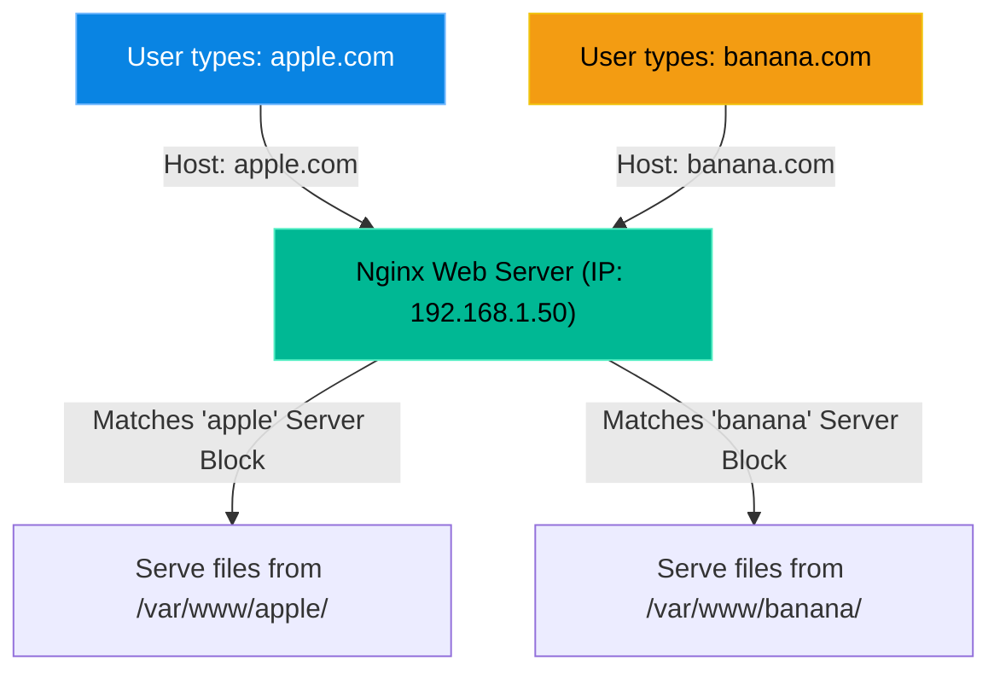

# Chapter 27 — Introduction to Web Servers

* **Difficulty:** Intermediate
* **Estimated Time:** 2 Hours
* **Hands-on Labs:** 1
* **Interview Questions:** 3

## Learning Objectives

By the end of this chapter, you will be able to:
* Identify the difference between the Apache and Nginx web servers.
* Understand the concept of the Document Root (`/var/www/html`).
* Understand how Virtual Hosts / Server Blocks allow one server to host multiple websites.
* Troubleshoot "403 Forbidden" errors and config syntax crashes.

## Visual Architecture: Virtual Hosts (Server Blocks)

How does a $5/month DigitalOcean droplet host 10 different websites on a single IP address? Through Virtual Hosts. The web server reads the `Host` header in the incoming HTTP request and routes the traffic to the correct folder.

## Theory & Concepts

### 1. The Big Two: Apache vs. Nginx
There are two web servers that power the majority of the internet.
* **Apache (`apache2` or `httpd`)**: The older, highly flexible standard. Uses `.htaccess` files to let developers override settings on a per-directory basis.
* **Nginx (`nginx`)**: The modern, incredibly fast, event-driven web server. It is primarily used as a reverse proxy. It does not support `.htaccess` files.

### 2. The Document Root
A web server is fundamentally just a piece of software that takes files from a hard drive and sends them over the network. The **Document Root** is the folder on the hard drive where those files live.
* By default, on both Apache and Nginx, the main document root is: `/var/www/html/`
* If you place a file named `cat.jpg` in that folder, anyone on the internet can view it by visiting `http://your-ip-address/cat.jpg`.

### 3. Web Server Users
Web servers do not run as the `root` user for security reasons. They run as limited service accounts.
* On Ubuntu, both Apache and Nginx run as the user: `www-data`.
* On RHEL/CentOS, Apache runs as `apache` and Nginx runs as `nginx`.
* **The Rule:** If the `www-data` user does not have read permissions to the files in `/var/www/html/`, the web server cannot serve them!

## Scenario-Based Troubleshooting

### Scenario A: The "403 Forbidden" Error
**The Incident:** A customer uploads their new website files via SFTP using the `root` user. When they visit their website in a browser, they get a massive "403 Forbidden" error.

**The Investigation & Fix:**
1. The engineer logs in and immediately tails the web server error log: 
   `tail -f /var/log/nginx/error.log`
2. The customer refreshes the page. The log spits out: 
   `[error] 1234#0: *1 open() "/var/www/html/index.html" failed (13: Permission denied)`
3. The engineer checks the file permissions: 
   `ls -l /var/www/html/`
4. The output shows the files are owned by `root:root`. The Nginx user (`www-data`) is being blocked from reading them.
5. The engineer runs the fix: `chown -R www-data:www-data /var/www/html/`
6. The customer refreshes the page, and the website loads perfectly.

### Scenario B: The Syntax Crash
**The Incident:** A customer edits their Nginx configuration file to add a redirect. They type `systemctl restart nginx`, but it fails. Their entire website goes down.

**The Investigation & Fix:**
1. The engineer logs in. They DO NOT blindly run `systemctl restart nginx` again.
2. They run the built-in syntax checker: `nginx -t`
3. The checker returns a fatal error: 
   `nginx: [emerg] unexpected "}" in /etc/nginx/sites-enabled/default:42`
4. The engineer knows immediately that line 42 of the config file is broken.
5. They open `nano /etc/nginx/sites-enabled/default`, go to line 41, and realize the customer forgot to put a semicolon `;` at the end of the line.
6. They add the semicolon, save the file, and run `nginx -t` again.
7. The checker returns: `nginx: configuration file syntax is ok`.
8. The engineer safely runs `systemctl restart nginx` and the site comes back online.

## Hands-on Lab

> [!CAUTION]
> **Practice Assignment Available**
> Before moving on, complete the exercises in the [Chapter 27 Practice Guide](../practice-files/V1-C27-practice.md). You will test web responses locally and practice using the crucial syntax checker tools.

## Interview Questions

### Question 1: A user uploads an `index.html` file to `/var/www/html/` on an Ubuntu server running Nginx, but visitors receive a 403 Forbidden error. What is the most likely cause?
* **Target Answer**: "The most likely cause is incorrect file ownership or permissions. Nginx runs as the `www-data` user on Ubuntu. If the files were uploaded as `root` and do not have world-readable permissions, Nginx is denied access. Running `chown -R www-data:www-data` on the directory usually resolves this."

### Question 2: What is a Virtual Host (or Server Block), and how does it work?
* **Target Answer**: "A Virtual Host (Apache) or Server Block (Nginx) allows a single web server to host multiple domain names on a single IP address. When an HTTP request arrives, the web server reads the `Host:` header in the request to determine which domain the user is asking for, and routes the traffic to the corresponding document root directory."

### Question 3: A customer asks you to restart Nginx after they made a configuration change. What command should you run *before* restarting the service?
* **Target Answer**: "You should always run `nginx -t` before restarting. This tests the configuration file for syntax errors. If there is a typo and you restart the service without checking, Nginx will crash and take all hosted websites offline."

## Chapter Summary

Web servers are essentially file-delivery mechanisms. If a site won't load, check the `error.log`. If it's a 403 error, check the file ownership (`chown`). If the server won't start, check the syntax (`nginx -t` or `apache2ctl configtest`). Never guess—let the logs tell you the answer.

## Completion Checklist

- [ ] I understand how Virtual Hosts utilize the HTTP Host header.
- [ ] I know why files must be owned by `www-data` (or `apache`/`nginx`).
- [ ] I will always use `nginx -t` before restarting a web server.

---

## Navigation

⬅ Previous:
[Chapter 26 – System Startup & Troubleshooting](V1-C26-system-startup-and-troubleshooting.md)

🏠 Volume Contents:
[Table of Contents](../TOC.md)

➡ Next:
[Chapter 28 – Reverse Proxies & Load Balancing](V1-C28-reverse-proxies-and-load-balancing.md)
