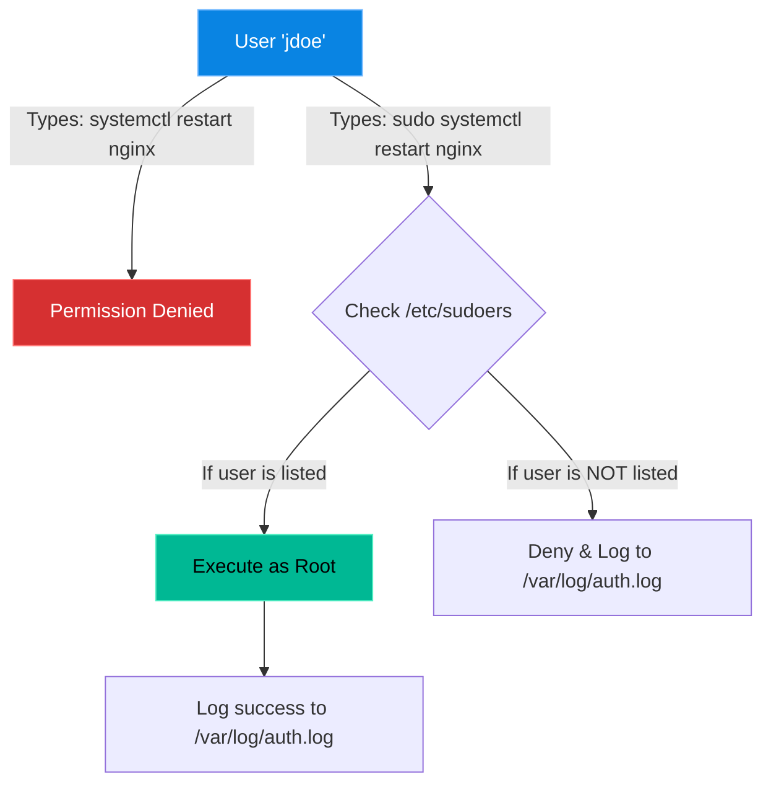

# Chapter 1 — The Root of All Power

* **Difficulty:** Intermediate
* **Estimated Time:** 1.5 Hours
* **Hands-on Labs:** 1
* **Interview Questions:** 3

## Learning Objectives

By the end of this chapter, you will be able to:
* Explain why logging directly into the `root` account is forbidden in the enterprise.
* Understand the mechanics of the `sudo` command.
* Safely edit the `/etc/sudoers` file to grant granular privileges.
* Use `visudo` to prevent locking yourself out of your own server.

## Visual Architecture: The Sudo Escalation

In enterprise environments, access is strictly audited. You do not hand out the keys to the castle; you temporarily grant an employee a keycard that works for exactly one door, for exactly five minutes, and you log the event.

## Theory & Concepts

### 1. The Death of Root
In Volume 1, you learned that `root` is the absolute master of the Linux system. So why don't we just give all system administrators the `root` password? 
1. **No Audit Trail:** If five engineers share the `root` password and someone deletes a production database, the logs only show that "root" deleted it. You have no idea *which* engineer actually did it.
2. **Accidental Damage:** When logged in as `root`, there are no safety nets. A simple typo (`rm -rf /`) executes immediately.

### 2. The `sudo` Command
`sudo` stands for "Superuser Do". It allows a standard user to execute a command with `root` privileges. 
* It requires the user to enter *their own* password, not the root password.
* It logs exactly who ran the command and what time they ran it.

### 3. The Sudoers File
The `/etc/sudoers` file dictates exactly who is allowed to use the `sudo` command. 
If you open the file, you will see a line like this:
`%admin ALL=(ALL) ALL`
* This means anyone in the `admin` group can run `ALL` commands as `ALL` users from `ALL` terminals.

## Scenario-Based Troubleshooting

### Scenario A: The Lockout (The `visudo` Warning)

> [!CAUTION]
> **NEVER USE NANO OR VIM TO EDIT `/etc/sudoers`.**

**The Incident:** A junior administrator needs to grant a developer `sudo` access. They type `sudo nano /etc/sudoers`. They add the line for the developer, but they make a syntax typo. They save the file and exit. 
Ten minutes later, the admin tries to run a `sudo` command. The server responds:
`>>> /etc/sudoers: syntax error near line 25 <<<`
`sudo: parse error in /etc/sudoers near line 25`
`sudo: no valid sudoers sources found, quitting`

**The Disaster:** Because `/etc/sudoers` is broken, the `sudo` command is permanently disabled. Because the admin cannot use `sudo`, they cannot open the file to fix their typo! They are completely locked out of administrative access.

**The Fix (And How to Prevent It):**
To fix it, a senior engineer must physically reboot the server into a specialized "Rescue Mode" to bypass the operating system and fix the text file manually. 
To *prevent* it, you must **always** use the `visudo` command. `visudo` opens the file safely. When you try to save, it checks your syntax. If you made a typo, it refuses to save the file, saving your career.

### Scenario B: The Missing Command
**The Incident:** An engineer wants to grant the `devteam` group the ability to restart the Nginx web server, and absolutely nothing else. They use `visudo` and add:
`%devteam ALL=(ALL) NOPASSWD: systemctl restart nginx`
The developer runs `sudo systemctl restart nginx` but receives a "Command not allowed" error.

**The Investigation & Fix:**
1. The engineer realizes that the `sudoers` file is extremely paranoid. It does not trust relative commands.
2. The engineer runs `which systemctl` to find the absolute path of the executable. It returns `/bin/systemctl`.
3. The engineer runs `sudo visudo` and updates the line to:
   `%devteam ALL=(ALL) NOPASSWD: /bin/systemctl restart nginx`
4. The developer tries again, and the command succeeds.

## Hands-on Lab

> [!TIP]
> **Practice Assignment Available**
> Proceed to the [Chapter 1 Practice Guide](../practice-files/V2-C01-practice.md) to practice writing granular `sudoers` rules using `visudo`.

## Interview Questions

### Question 1: Why is it considered a terrible security practice to log in directly as the `root` user?
* **Target Answer**: "Logging in directly as `root` destroys accountability. Because `root` is a shared identity, the system logs cannot distinguish which specific engineer ran a destructive command. Using `sudo` forces engineers to log in with their personal accounts, creating a perfect audit trail of who executed what command, and when."

### Question 2: You need to edit the `/etc/sudoers` file. Should you use `nano /etc/sudoers`? Why or why not?
* **Target Answer**: "No, you must never edit the file directly with a standard text editor. You should always use the `visudo` command. `visudo` locks the file to prevent simultaneous edits and, most importantly, performs a strict syntax check when you try to save. If you introduce a typo using `nano`, the `sudo` system breaks, completely locking all administrators out of the server."

### Question 3: How do you grant a user named 'appdev' the ability to restart the apache2 service without prompting them for a password?
* **Target Answer**: "I would run `sudo visudo` and add the following line: `appdev ALL=(ALL) NOPASSWD: /bin/systemctl restart apache2`. Using the absolute path to the binary is required for security."

## Chapter Summary

The `sudoers` file is the gateway to your server's security. Give people only the exact permissions they need to do their jobs (The Principle of Least Privilege), always use absolute paths for executables, and **never** forget the `visudo` command.

## Completion Checklist

- [ ] I can explain why shared `root` accounts break audit trails.
- [ ] I understand the catastrophic danger of editing `/etc/sudoers` with `nano`.
- [ ] I know how to find the absolute path of a command using `which`.

---

## Navigation

⬅ Previous:
[Volume 1 Fundamentals](../../volume-01-linux-fundamentals/README.md)

🏠 Volume Contents:
[Table of Contents](../TOC.md)

➡ Next:
[Chapter 2 – PAM (Pluggable Authentication Modules) *[Coming Soon]*](#)
