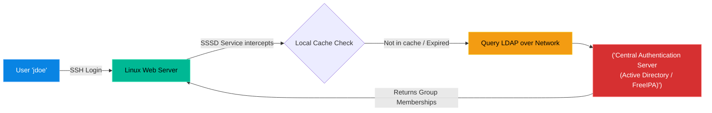

# Chapter 3 — Centralized Authentication

* **Difficulty:** Advanced
* **Estimated Time:** 2 Hours
* **Hands-on Labs:** 1
* **Interview Questions:** 3

## Learning Objectives

By the end of this chapter, you will be able to:
* Understand the concept of LDAP (Lightweight Directory Access Protocol).
* Identify major centralized authentication servers (Windows Active Directory, FreeIPA, OpenLDAP).
* Understand how Linux uses SSSD to bridge the gap and join a Windows Domain.
* Troubleshoot "Stale Cache" login issues in SSSD.

## Visual Architecture: The Windows to Linux Bridge

In an enterprise with 500 Linux servers, creating local users via `useradd` on every single machine is impossible. Instead, companies use a central directory. When a user tries to SSH into a Linux server, the Linux server asks the central directory (like Windows Active Directory) if the user is allowed in.

## Theory & Concepts

### 1. The Power of LDAP
LDAP (Lightweight Directory Access Protocol) is the industry standard for centralized user management. An LDAP server holds a massive database of users, passwords, and groups. 
When an employee is fired, the IT Helpdesk deletes their account from the central LDAP server. Instantly, that employee loses access to all 500 Linux servers at the company.

### 2. The Big Players
There are several major implementations of LDAP:
* **OpenLDAP:** The open-source, bare-bones standard. 
* **FreeIPA:** Red Hat's powerful, open-source centralized identity manager designed specifically for Linux environments.
* **Windows Active Directory (AD):** Microsoft's implementation. Despite being a Windows product, Active Directory is the undisputed king of the corporate world. Almost every Fortune 500 company uses AD, meaning Linux Engineers *must* know how to connect Linux servers to it.

### 3. SSSD (System Security Services Daemon)
Linux cannot natively understand the complex language of Windows Active Directory. To bridge this gap, we install a service called **SSSD**.
SSSD acts as a translator. When you type `id jdoe` on a Linux server, SSSD translates the request, queries the Windows Domain Controller over the network, translates the response back into Linux UID/GID formats, and caches the result.

## Scenario-Based Troubleshooting

### Scenario A: The Stale Cache
**The Incident:** A new developer, Jane, tries to SSH into the `db-server`. She receives `Permission Denied`. Jane contacts the Helpdesk. The Windows Administrator checks Active Directory and says, "Jane was just added to the *Database_Admins* group 5 minutes ago. She should have access."

**The Investigation & Fix:**
1. The Linux Support Engineer logs into the `db-server`. They run `id jane`.
2. The output shows Jane's groups, but *Database_Admins* is missing.
3. The engineer understands the architecture: To save network bandwidth, SSSD caches Active Directory responses. By default, this cache lasts for hours. The Linux server doesn't know Jane was promoted because it is looking at an old, cached version of her profile.
4. The engineer flushes the SSSD cache for the entire domain:
   `sss_cache -E`
5. To be absolutely certain, the engineer restarts the SSSD service:
   `systemctl restart sssd`
6. The engineer runs `id jane` again. The SSSD service is forced to query the Windows Domain Controller. The *Database_Admins* group appears in the output. Jane successfully logs in.

## Hands-on Lab

> [!TIP]
> **Practice Assignment Available**
> Proceed to the [Chapter 3 Practice Guide](../practice-files/V2-C03-practice.md) to learn how to distinguish between local users and centralized domain users.

## Interview Questions

### Question 1: In an enterprise environment with hundreds of Linux servers, why do administrators avoid using `useradd` to create local accounts?
* **Target Answer**: "Managing local accounts on hundreds of servers is unscalable and highly insecure. If an employee leaves the company, an administrator would have to manually log into all 500 servers to delete their account. Instead, enterprises use centralized authentication (like LDAP, FreeIPA, or Active Directory) so that access can be granted or revoked globally from a single location."

### Question 2: What is the primary purpose of the SSSD (System Security Services Daemon) in Linux?
* **Target Answer**: "SSSD acts as a bridge between the Linux operating system and remote directory services like LDAP or Windows Active Directory. It translates Linux authentication requests into protocols the remote server understands, and it caches the credentials and group memberships locally so users can still log in even if the remote directory goes offline."

### Question 3: A user was just added to a new security group in Active Directory, but your Linux server is not recognizing their new permissions. What is the cause and the solution?
* **Target Answer**: "The cause is that SSSD caches group memberships locally to reduce network traffic. The Linux server is relying on an outdated cache. The solution is to clear the cache using the `sss_cache -E` command, and optionally restart the `sssd` service, forcing Linux to pull fresh data from Active Directory."

## Chapter Summary

Centralized Authentication is the backbone of enterprise security. Whether the backend is OpenLDAP, FreeIPA, or Windows Active Directory, the mechanics on the Linux side are usually the same: SSSD intercepts the login, checks its cache, and queries the network. When permissions seem out of sync, always clear the SSSD cache first.

## Completion Checklist

- [ ] I understand the concept and purpose of LDAP.
- [ ] I know that SSSD acts as the translator between Linux and Active Directory.
- [ ] I know how to clear a stale authentication cache (`sss_cache -E`).

---

## Navigation

⬅ Previous:
[Chapter 2 – Pluggable Authentication Modules (PAM)](V2-C02-pluggable-authentication-modules.md)

🏠 Volume Contents:
[Table of Contents](../TOC.md)

➡ Next:
[Chapter 4 – Logical Volume Management (LVM) *[Coming Soon]*](#)
