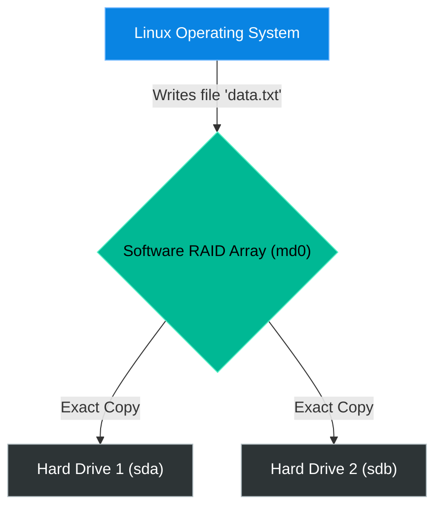

# Chapter 5 — RAID Arrays

* **Difficulty:** Intermediate
* **Estimated Time:** 1.5 Hours
* **Hands-on Labs:** 1
* **Interview Questions:** 3

## Learning Objectives

By the end of this chapter, you will be able to:
* Explain the golden rule: "RAID is not a backup."
* Differentiate between RAID 0 (Striping), RAID 1 (Mirroring), and RAID 5 (Parity).
* Identify a degraded array using `/proc/mdstat`.
* Use `mdadm` to remove a dead drive and rebuild a RAID array.

## Visual Architecture: The RAID 1 Mirror

Hard drives fail. In an enterprise environment, it is not a question of *if* a drive will die, but *when*. RAID (Redundant Array of Independent Disks) ensures that when a drive dies, the server stays online. 

## Theory & Concepts

### 1. The Golden Rule
> **"RAID is for uptime. It is NOT for backups."**

If your server has a RAID 1 Mirror and you accidentally run `rm -rf /etc`, the RAID controller will faithfully and instantly delete `/etc` from *both* hard drives. RAID protects you from hardware failures; it does not protect you from human errors. You must still perform daily off-site backups.

### 2. The 3 Major RAID Levels
1. **RAID 0 (Striping):** Splits data across two drives. Extremely fast. **Zero redundancy.** If one drive dies, you lose 100% of the data. Never use this for critical data.
2. **RAID 1 (Mirroring):** Writes an exact copy of the data to both drives. If you buy two 1TB drives, you only get 1TB of usable space. If one drive dies, the system survives.
3. **RAID 5 (Striping with Parity):** Requires at least 3 drives. Data and "parity calculations" are spread across all three. If one drive dies, the remaining drives use the math calculations to magically rebuild the missing data. 

### 3. Hardware vs. Software RAID
* **Hardware RAID:** A physical circuit board inside the server handles the math. The OS only sees one giant hard drive.
* **Software RAID:** The Linux kernel handles the math using the `mdadm` (Multiple Device Administrator) tool. Software RAID is heavily used in modern cloud environments and budget-friendly servers.

## Scenario-Based Troubleshooting

### Scenario A: The Degraded Array
**The Incident:** An automated monitoring system emails the Support Engineering team: `CRITICAL: Array /dev/md0 is DEGRADED`.

**The Investigation & Fix:**
1. The Support Engineer logs in. They do not panic, because the server is still perfectly online. This is RAID 1 doing its job!
2. The engineer runs `cat /proc/mdstat` to view the raw status of the array directly from the kernel.
3. The output shows: `md0 : active raid1 sda[0] sdb[1](F)` and `[1/2] [U_]`. 
4. The engineer knows that `[UU]` means healthy. `[U_]` means Drive 2 (`sdb`) has failed (`F`). 
5. The engineer officially flags the drive as dead in the software controller:
   `mdadm --manage /dev/md0 --fail /dev/sdb`
6. The engineer removes the drive from the array:
   `mdadm --manage /dev/md0 --remove /dev/sdb`
7. The engineer physically unplugs the dead drive from the server and inserts a brand new one.
8. The engineer adds the new drive to the array:
   `mdadm --manage /dev/md0 --add /dev/sdb`
9. The engineer runs `cat /proc/mdstat` again. The output now says `[===>....] recovery = 15.0%`. The RAID controller is currently copying all the data from Drive 1 onto the new Drive 2. Once it reaches 100%, the array will return to `[UU]`.

## Hands-on Lab

> [!TIP]
> **Practice Assignment Available**
> Proceed to the [Chapter 5 Practice Guide](../practice-files/V2-C05-practice.md) to inspect the kernel's raw RAID tracker.

## Interview Questions

### Question 1: A customer requests that you configure their server with RAID 0 because they want maximum performance and redundancy. What is wrong with their request?
* **Target Answer**: "RAID 0 (Striping) provides excellent performance, but it provides absolutely zero redundancy. Data is split across all drives. If a single drive in a RAID 0 array fails, the entire array is destroyed and all data is lost. If they require redundancy, they should use RAID 1 or RAID 10."

### Question 2: Why do system administrators say 'RAID is not a backup'?
* **Target Answer**: "RAID protects against hardware failure (a dead hard drive) by ensuring continuous uptime. However, it does not protect against data corruption, accidental deletion, or ransomware. If an administrator runs `rm -rf` on a file, the RAID controller immediately mirrors that deletion across all drives. True backups must be stored off-server and historically versioned."

### Question 3: You log into a Linux server and run `cat /proc/mdstat`. The output for the array shows `[U_]`. What does this indicate?
* **Target Answer**: "The `[U_]` indicator means the Software RAID array is degraded. In a standard two-drive RAID 1 array, `[UU]` means both drives are healthy and in sync. `[U_]` means the second drive is missing or has failed. The server is still functioning, but it has lost its redundancy and the faulty drive must be replaced immediately."

## Chapter Summary

RAID is your hardware safety net. Memorize the difference between `[UU]` (Healthy) and `[U_]` (Degraded). When a drive fails, use `mdadm` to flag it, remove it, and add the replacement. And remember: RAID will not save you if you accidentally delete the database. Take backups!

## Completion Checklist

- [ ] I can differentiate between RAID 0, RAID 1, and RAID 5.
- [ ] I know why RAID is not a substitute for off-site backups.
- [ ] I know how to check Software RAID health using `cat /proc/mdstat`.

---

## Navigation

⬅ Previous:
[Chapter 4 – Logical Volume Management (LVM)](V2-C04-logical-volume-management.md)

🏠 Volume Contents:
[Table of Contents](../TOC.md)

➡ Next:
[Chapter 6 – Network Attached Storage *[Coming Soon]*](#)
