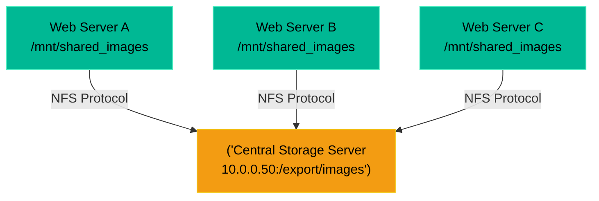

# Chapter 6 — Network Attached Storage (NFS & SMB)

## Learning Objectives

By the end of this chapter, you will be able to:
* Distinguish between Block Storage (SAN/RAID) and File-Level Storage (NAS).
* Differentiate between NFS (Linux native) and SMB/CIFS (Windows native).
* Mount a remote filesystem using `/etc/fstab`.
* Troubleshoot and recover a frozen "Stale NFS Mount."

> [!IMPORTANT]
> **ServiceNow Ticket: INC-76255**
> **Priority:** High
> **Reported By:** Enterprise Application Team
> **Issue:** We are experiencing a critical failure related to Network Attached Storage (NFS & SMB). Please investigate immediately.
> 
> **Support Engineer Objective:** Use operational thinking to collect evidence, identify the root cause, and restore service without causing further disruption.

## Visual Architecture: The Shared File Pool

If you have three web servers sitting behind a load balancer, they must all serve the exact same images to the customer. You cannot save the images to Server A's local hard drive. Instead, you create a central NAS (Network Attached Storage) and instruct all three servers to mount it over the network.

## Theory & Concepts

### 1. Block vs. File Storage
* **Block Storage:** This is what we covered in Chapters 4 and 5 (LVM and RAID). Block storage gives you raw, unformatted chunks of disk. The operating system formats it with `ext4` or `xfs`.
* **File-Level Storage (NAS):** The storage server formats the drive and manages the files. It simply shares a folder over the network. The client server (your web server) just mounts the folder and reads the files. 

### 2. The Two Major Protocols
* **NFS (Network File System):** The native protocol for Unix/Linux systems. It is fast, lightweight, and relies on IP addresses for security.
* **SMB / CIFS (Server Message Block):** The native protocol for Windows. If a Linux server needs to connect to a Windows shared folder, it must use the `cifs-utils` package to speak the SMB language.

### 3. Persistent Mounts (`/etc/fstab`)
In Volume 1, you learned how to use the `mount` command. However, if the server reboots, the mount is lost. To make a network mount permanent, it must be added to the `/etc/fstab` (File System Table) file.
Example of an NFS fstab entry:
`10.0.0.50:/export/images  /mnt/shared_images  nfs  defaults  0  0`

## Scenario-Based Troubleshooting

### Scenario A: The Stale Mount Crash
**The Incident:** A junior admin accidentally reboots the central Storage Server. Immediately, Web Server A completely freezes. An engineer SSHs into Web Server A and types `df -h` to check the disk space. The command hangs indefinitely. The terminal refuses to respond to `Ctrl+C`. The entire server feels dead.

**The Investigation & Fix:**

1. The Support Engineer opens a second SSH session to Web Server A. 
2. They do not run `df -h`. They know that `df -h` queries every mounted drive on the system. If a network drive is unreachable, `df -h` will wait forever for a response.
3. The engineer runs `cat /etc/mtab` to view the currently mounted drives without actually pinging them. They spot the NFS mount to `10.0.0.50`.
4. The engineer knows that because the storage server rebooted, the connection was broken. The Linux kernel is trapped waiting for a network packet that will never arrive (a "Stale File Handle").
5. The engineer attempts to unmount the frozen drive:
   `umount /mnt/shared_images`
6. The system replies: `device is busy`.
7. The engineer uses the "Lazy Unmount" force command. This tells the kernel to immediately detach the filesystem from the directory tree, even if processes are still trying to use it:
   `umount -l /mnt/shared_images`
8. The command succeeds. Suddenly, the frozen `df -h` command in the first terminal finishes executing! The server is unfrozen. 
9. The engineer runs `mount -a` to cleanly re-establish the connection to the storage server now that it has finished rebooting.

## Hands-on Lab

> [!TIP]
> **Practice Assignment Available**
> Proceed to the [Chapter 6 Practice Guide](../practice-files/V2-C06-practice.md) to practice reading the `/etc/fstab` file and identifying network mounts.

## Interview Questions

### Question 1: An application running on Linux needs to read files from a shared folder hosted on a Windows Server. What protocol must be used, and what package might you need to install on the Linux server?
* **Target Answer**: "The Linux server must use the SMB/CIFS protocol to communicate with a Windows shared folder. To mount the share, you would typically need to install the `cifs-utils` package on the Linux machine and mount it using the `cifs` filesystem type."

### Question 2: You run `df -h` on a server, but the command hangs indefinitely and does not return any output. What is the most likely cause?
* **Target Answer**: "The most likely cause is a stale or unreachable network mount (such as an NFS share). The `df` command attempts to query the status of all mounted filesystems. If the remote storage server has crashed or a firewall is blocking the connection, the kernel will hang while waiting for the network timeout."

### Question 3: How do you recover a server that is frozen due to an unreachable NFS mount when standard `umount` commands return 'device is busy'?
* **Target Answer**: "I would use the lazy unmount command (`umount -l /mount/point`) or the force unmount command (`umount -f /mount/point`). The lazy unmount immediately detaches the filesystem from the directory hierarchy, allowing frozen commands like `df` to complete, and cleans up all references to the filesystem once it is no longer busy."

## Chapter Summary

Network Attached Storage allows hundreds of servers to read the same files simultaneously. However, it introduces a massive single point of failure. If the storage server drops offline, every client server connected to it can freeze. When dealing with NFS, the `umount -l` (Lazy Unmount) command is your best friend.

## Completion Checklist

- [ ] I can explain the difference between NFS (Linux) and SMB (Windows).
- [ ] I understand how a dropped network connection can cause `df -h` to freeze.
- [ ] I know how to forcefully detach a frozen mount using `umount -l`.

---

## Navigation

← Previous: [Chapter 5 — RAID Arrays](V2-C05-raid-arrays.md)

↑ Volume Contents: [Table of Contents](TOC.md)

→ Next: [Chapter 7 — Filesystem Tuning and Inodes](V2-C07-filesystem-tuning-and-inodes.md)
