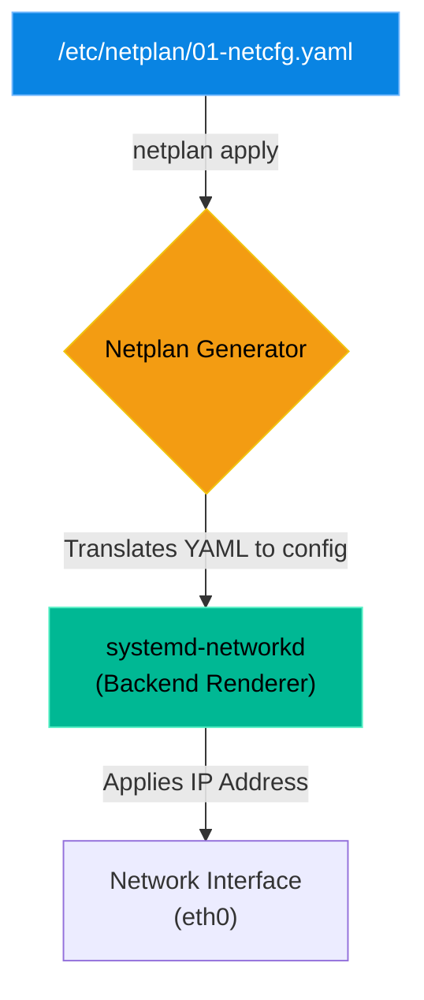

# Chapter 8 — Static IP Configuration

* **Difficulty:** Intermediate
* **Estimated Time:** 1.5 Hours
* **Hands-on Labs:** 1
* **Interview Questions:** 3

## Learning Objectives

By the end of this chapter, you will be able to:
* Explain why enterprise servers require static IP addresses instead of DHCP.
* Configure a static IP in Ubuntu using the modern `netplan` YAML framework.
* Configure a static IP in RHEL/CentOS using `nmcli` (NetworkManager).
* Safely apply network changes using `netplan try` to prevent SSH lockouts.

## Visual Architecture: The Netplan Hierarchy

In modern Ubuntu, you do not edit the network interfaces directly. Instead, you write a YAML file that describes how the network *should* look. Netplan reads that file and generates the configuration for the backend renderer (usually `systemd-networkd`).



## Theory & Concepts

### 1. The Death of DHCP on Servers
When you connect your laptop to Wi-Fi, a DHCP server assigns you a random IP address. This is great for laptops, but terrible for servers. If a Database Server's IP address randomly changes on Tuesday, every single Web Server trying to connect to the database will suddenly crash. Enterprise servers must be assigned permanent, **Static IP Addresses**.

### 2. The Ubuntu Standard: Netplan
Historically, administrators edited `/etc/network/interfaces`. Today, Ubuntu uses `netplan`.
A standard Netplan file looks like this:
```yaml
network:
  version: 2
  renderer: networkd
  ethernets:
    eth0:
      dhcp4: false
      addresses:
        - 10.0.0.50/24
      routes:
        - to: default
          via: 10.0.0.1
      nameservers:
        addresses: [8.8.8.8, 1.1.1.1]
```

### 3. The RHEL Standard: NetworkManager
Red Hat Enterprise Linux (RHEL) and CentOS use NetworkManager. Instead of editing text files, administrators use the `nmcli` command-line tool.
To set a static IP on RHEL:
`nmcli con mod eth0 ipv4.addresses 10.0.0.50/24`
`nmcli con mod eth0 ipv4.gateway 10.0.0.1`
`nmcli con mod eth0 ipv4.method manual`
`nmcli con up eth0`

## Scenario-Based Troubleshooting

### Scenario A: The Missing Gateway
**The Incident:** A junior engineer is tasked with giving a new Ubuntu server a static IP. They edit the Netplan file, disable DHCP, and assign `10.0.0.50`. They run `netplan apply`. 
They can successfully `ping 10.0.0.51` (the database server sitting right next to it), but when they try to `ping 8.8.8.8` (Google/The Internet), the server replies: `Network is unreachable`.

**The Investigation & Fix:**
1. The Support Engineer logs in and runs `ip route`. 
2. The output shows the local subnet (`10.0.0.0/24`), but it is missing a `default` route. 
3. The engineer realizes the mistake: The junior engineer assigned the IP address, but forgot to tell the server how to reach the router! Without a Default Gateway, the server cannot talk to anyone outside its own subnet.
4. The engineer opens the Netplan file and adds the gateway block:
   ```yaml
      routes:
        - to: default
          via: 10.0.0.1
   ```
5. **The Safety Net:** The engineer does *not* run `netplan apply`. If they made a typo, they might permanently drop their own SSH connection! Instead, they run:
   `netplan try`
6. The system applies the change and starts a 120-second countdown: `Do you want to keep these settings?`. If the engineer's SSH session drops, the countdown will expire and Netplan will automatically revert the IP address back to its previous state.
7. The SSH session remains stable. The engineer presses `ENTER` to permanently accept the change. The server can now reach the internet.

## Hands-on Lab

> [!TIP]
> **Practice Assignment Available**
> Proceed to the [Chapter 8 Practice Guide](../practice-files/V2-C08-practice.md) to practice mapping out your MAC addresses and reading your server's current IP configuration.

## Interview Questions

### Question 1: Why is it critical that enterprise infrastructure servers (like Web Servers or Database Servers) use Static IP Addresses rather than DHCP?
* **Target Answer**: "Infrastructure servers must be reliably accessible by other servers and by DNS records. If a server relies on DHCP, its IP address could change unexpectedly after a reboot or lease expiration. If a database server's IP changes, every web application configured to connect to the old IP will immediately crash."

### Question 2: You are modifying the `netplan` configuration on a remote production server via SSH. Why should you use `netplan try` instead of `netplan apply`?
* **Target Answer**: "If you make a typo in the IP address or gateway when running `netplan apply`, your SSH connection will drop immediately, and you will be permanently locked out of the server until you can access it via a physical console. `netplan try` applies the changes but starts a countdown. If you lose your SSH connection, the countdown expires and the system automatically reverts to the previous working configuration."

### Question 3: How do you configure a static IP address in modern RHEL/CentOS systems? Do you use Netplan?
* **Target Answer**: "No, Netplan is specific to Ubuntu and Debian systems. Modern RHEL systems use NetworkManager. To configure a static IP, you use the `nmcli` command-line utility to modify the connection profile (e.g., setting `ipv4.method manual`, defining the `ipv4.addresses`, and bringing the connection `up`)."

## Chapter Summary

The days of editing `/etc/network/interfaces` are over. In the modern Linux landscape, you must be comfortable reading YAML for Ubuntu (`netplan`) and using the command line for RHEL (`nmcli`). And remember: whenever you are modifying networking on a remote server, `netplan try` is the only thing standing between you and a massive outage.

## Completion Checklist

- [ ] I understand the difference between `netplan` and `NetworkManager`.
- [ ] I can write the YAML block required to define a default gateway in Netplan.
- [ ] I understand how `netplan try` prevents catastrophic remote lockouts.

---

## Navigation

⬅ Previous:
[Chapter 7 – Filesystem Tuning and Inodes](V2-C07-filesystem-tuning-and-inodes.md)

🏠 Volume Contents:
[Table of Contents](../TOC.md)

➡ Next:
[Chapter 9 – Network Routing & Gateways](V2-C09-network-routing.md)
