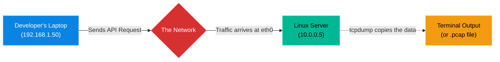

# Chapter 10 — Packet Capture & Analysis

## Learning Objectives

By the end of this chapter, you will be able to:
* Explain why packet capture is the ultimate source of truth in IT troubleshooting.
* Use `tcpdump` to capture live network traffic on a specific interface.
* Filter `tcpdump` output by IP address and port.
* Write packet captures to a `.pcap` file for advanced analysis in Wireshark.

> [!IMPORTANT]
> **ServiceNow Ticket: INC-26600**
> **Priority:** High
> **Reported By:** Enterprise Application Team
> **Issue:** We are experiencing a critical failure related to Packet Capture & Analysis. Please investigate immediately.
> 
> **Support Engineer Objective:** Use operational thinking to collect evidence, identify the root cause, and restore service without causing further disruption.

## Visual Architecture: The Invisible Observer

When an application breaks, developers often say, "The network is dropping my connection." As a Linux Support Engineer, you cannot just guess if they are right. You must prove it. `tcpdump` allows you to sit exactly at the server's network card and watch every single piece of data enter and leave in real-time.

## Theory & Concepts

### 1. The Ultimate Source of Truth
Logs can lie. Applications can have bugs. But network packets never lie. If a packet hits your network card, it happened. If it didn't, it didn't. `tcpdump` is the tool you use to see this truth. It puts the network card into "promiscuous mode," allowing it to read all traffic passing through it.

### 2. The Command Anatomy
If you run `tcpdump` by itself, your terminal will instantly flood with thousands of lines of unreadable text and crash. You must always use **filters**.
* **Specify the interface:** `tcpdump -i eth0` (Only listen on eth0).
* **Filter by Port:** `tcpdump -i eth0 port 443` (Only show HTTPS traffic).
* **Filter by Host:** `tcpdump -i eth0 host 10.0.0.50` (Only show traffic coming from or going to this specific IP).

### 3. PCAP Files and Wireshark
Reading raw packet data in a terminal is incredibly difficult. For complex issues, engineers write the capture to a file, download it to their laptop, and open it in a GUI tool called **Wireshark**.
To write to a file, use the `-w` flag:
`tcpdump -i eth0 port 443 -w capture.pcap`

## Scenario-Based Troubleshooting

### Scenario A: The Blame Game
**The Incident:** A software developer contacts the IT Helpdesk. "Our new API is down," they say. "My laptop (192.168.1.50) is sending data to the Linux web server (10.0.0.5) on port 8080, but I'm getting connection timeouts. The network team must have misconfigured a router. Please fix the network."

**The Investigation & Fix:**

1. The Support Engineer logs into the Linux web server. They do not assume the network is broken, and they do not assume the application is broken. They seek the truth.
2. The engineer runs the following packet capture:
   `tcpdump -i eth0 port 8080 and host 192.168.1.50`
3. The engineer asks the developer to try the connection again. 
4. Suddenly, text scrolls across the terminal! The output shows `Flags [S]` (a SYN packet) arriving from `192.168.1.50`, followed immediately by the Linux server sending `Flags [R.]` (a RST/Reset packet) back.
5. The engineer stops the capture using `Ctrl+C`. 
6. **The Conclusion:** The engineer has absolute proof that the network is fine. The developer's packet successfully traveled across the internet, through the routers, and physically arrived at the Linux server's network card. 
7. Why did it fail? The Linux server sent a Reset packet because the application wasn't actually running. The engineer runs `systemctl status api-service` and sees it is stopped. They start the service, and the developer's connection succeeds. The "broken network" was actually a stopped service.

## Hands-on Lab

> [!TIP]
> **Practice Assignment Available**
> Proceed to the [Chapter 10 Practice Guide](../practice-files/V2-C10-practice.md) to practice capturing live ICMP (ping) packets on your VM.

## Interview Questions

### Question 1: A developer claims that a firewall is blocking their traffic before it reaches your server. How can you use `tcpdump` to prove whether the traffic is actually arriving at your server?
* **Target Answer**: "I would run `tcpdump -i <interface> host <developer_ip>` on the server. If I see incoming packets from the developer's IP address, I have absolute proof that the network and external firewalls are allowing the traffic through, and the issue resides locally on the server (e.g., a local firewall or stopped service). If I see no packets, the developer is correct, and an upstream router or firewall is dropping the traffic."

### Question 2: If you run `tcpdump` without any flags on a busy production server, what will happen?
* **Target Answer**: "The terminal will be overwhelmed with thousands of lines of output per second, making it impossible to read and potentially causing the terminal session to freeze or crash. Furthermore, it will capture everything, including the SSH traffic you are using to connect to the server, creating an infinite feedback loop of packets. You must always use filters like `port` and `host`."

### Question 3: What is a `.pcap` file, and why would you use the `-w` flag with `tcpdump`?
* **Target Answer**: "A `.pcap` (Packet Capture) file is a standardized file format for storing network traffic. Reading raw packet payloads in a command-line terminal is extremely difficult. By using the `-w filename.pcap` flag, `tcpdump` saves the raw data to a file instead of printing it to the screen. I can then download that file to my workstation and open it in a graphical analysis tool like Wireshark for deep inspection."

## Chapter Summary

`tcpdump` is the ultimate arbiter of truth. Whenever there is a dispute between the application team and the network team, `tcpdump` provides the undeniable evidence needed to resolve the issue. Always remember to filter your captures, and when the data gets too complex, write it to a `.pcap` file for Wireshark.

## Completion Checklist

- [ ] I understand why packet capture is used to verify network delivery.
- [ ] I can write a `tcpdump` command using `port` and `host` filters.
- [ ] I know how to save a capture to a `.pcap` file.

---

## Navigation

← Previous: [Chapter 9 — Network Routing & Gateways](V2-C09-network-routing.md)

↑ Volume Contents: [Table of Contents](TOC.md)

→ Next: [Chapter 11 — Advanced Firewalls (UFW & firewalld)](V2-C11-advanced-firewalls.md)
