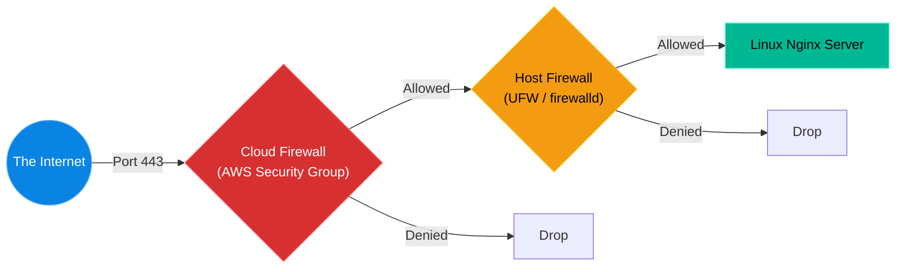

# Chapter 11 — Advanced Firewalls (UFW & firewalld)

* **Difficulty:** Intermediate
* **Estimated Time:** 1.5 Hours
* **Hands-on Labs:** 1
* **Interview Questions:** 3

## Learning Objectives

By the end of this chapter, you will be able to:
* Differentiate between a Network Firewall (e.g., AWS Security Group) and a Host-Based Firewall.
* Configure Ubuntu's UFW (Uncomplicated Firewall).
* Configure RHEL's `firewalld` using Zones.
* Avoid the catastrophic "Self-Lockout" scenario when enabling a firewall remotely.

## Visual Architecture: The Two Layers of Defense

In enterprise cloud environments, traffic must pass through two entirely separate firewalls before it reaches your application. First, it hits the Cloud Network Firewall (which protects the whole subnet). If it passes, it hits the Host-Based Firewall running directly inside the Linux Kernel (iptables/nftables). 

## Theory & Concepts

### 1. The Linux Kernel (iptables/nftables)
Technically, Linux only has one firewall: the packet filtering system built directly into the Kernel (historically `iptables`, currently `nftables`). 
However, configuring `nftables` directly requires writing complex, highly technical rules. To make administration easier, distributions created "frontend" managers. 
* Ubuntu created **UFW** (Uncomplicated Firewall).
* RHEL created **firewalld**.
When you use UFW or `firewalld`, they are secretly writing `nftables` rules for you in the background.

### 2. Ubuntu: UFW (Uncomplicated Firewall)
UFW is designed to be as simple as possible. By default, it denies all incoming traffic and allows all outgoing traffic.
To allow a port: `ufw allow 443/tcp`
To allow a specific IP: `ufw allow from 192.168.1.50`
To check the status: `ufw status numbered`

### 3. RHEL: firewalld and Zones
`firewalld` uses a concept called "Zones" to manage trust levels. A server might have its public network card assigned to the `public` zone (which drops everything) and its private network card assigned to the `trusted` zone (which allows everything).
To allow a port in the default zone permanently:
`firewall-cmd --add-port=443/tcp --permanent`
`firewall-cmd --reload`

## Scenario-Based Troubleshooting

### Scenario A: The Locked Out Admin
**The Incident:** A junior administrator is tasked with securing a new Ubuntu web server hosted in an offshore data center. They log in via SSH (Port 22). They check the firewall status using `ufw status` and notice it is `inactive`.
Being proactive, they run `ufw enable`. The system prints a warning: `Command may disrupt existing ssh connections. Proceed with operation (y|n)?`. The admin presses `y`. 
Instantly, their SSH terminal freezes. They close the terminal and try to SSH back in. The connection times out. They are locked out.

**The Investigation & Fix:**
1. A Senior Engineer gets the frantic phone call. 
2. The senior engineer explains the mistake: By default, UFW drops *all* incoming traffic. When the junior admin enabled it, UFW immediately dropped the active SSH connection because no rule existed to allow Port 22.
3. Because SSH is blocked, the senior engineer cannot fix it over the network. They must log into the Cloud Provider's Web Console and use the "Virtual Serial Console" to physically simulate plugging a keyboard and monitor into the server.
4. Once logged in via the virtual console, the senior engineer fixes the mistake:
   `ufw allow 22/tcp`
5. They verify the rule exists with `ufw status`. The junior admin can now SSH back in over the network.

> [!CAUTION]  
> **The Golden Rule of Firewalls:** Before you *ever* type `ufw enable`, you must **always** type `ufw allow ssh` first!

## Hands-on Lab

> [!TIP]
> **Practice Assignment Available**
> Proceed to the [Chapter 11 Practice Guide](../practice-files/V2-C11-practice.md) to practice enabling UFW safely and checking its status.

## Interview Questions

### Question 1: If your company already uses a hardware firewall at the edge of the network, why is it necessary to also run a host-based firewall (like UFW or firewalld) on individual Linux servers?
* **Target Answer**: "A host-based firewall provides a 'Defense in Depth' strategy. If an attacker breaches the perimeter hardware firewall or compromises a neighboring server on the same internal subnet, the host-based firewall acts as a last line of defense to prevent lateral movement and block unauthorized access to the server."

### Question 2: You are about to run `ufw enable` on a remote production server. What is the very first command you must run before enabling it, and why?
* **Target Answer**: "The very first command must be `ufw allow ssh` (or `ufw allow 22`). By default, enabling UFW blocks all incoming connections. If you enable the firewall before explicitly allowing your own SSH traffic, your connection will be instantly dropped and you will be permanently locked out of the server until you can access a physical console."

### Question 3: In RHEL's `firewalld`, what is the purpose of the `--permanent` flag?
* **Target Answer**: "If you run `firewall-cmd --add-port=80/tcp` without the `--permanent` flag, the rule is applied immediately to the running configuration but will be lost as soon as the server reboots. The `--permanent` flag saves the rule to the configuration files on disk, ensuring it survives a reboot. However, you must run `firewall-cmd --reload` for a permanent rule to take effect immediately."

## Chapter Summary

Firewalls are essential for security, but they are also the number one cause of self-inflicted downtime. Whether you are using Ubuntu's UFW or RHEL's `firewalld`, the logic is the same: always secure your own administrative access (SSH) *before* you flip the switch. 

## Completion Checklist

- [ ] I understand the concept of Defense in Depth (Network vs. Host firewalls).
- [ ] I know how to check the status of UFW or `firewalld`.
- [ ] I will never enable a firewall without allowing SSH first.

---

## Navigation

⬅ Previous:
[Chapter 10 – Packet Capture & Analysis](V2-C10-packet-capture.md)

🏠 Volume Contents:
[Table of Contents](../TOC.md)

➡ Next:
[Chapter 12 – SSH Hardening *[Coming Soon]*](#)
