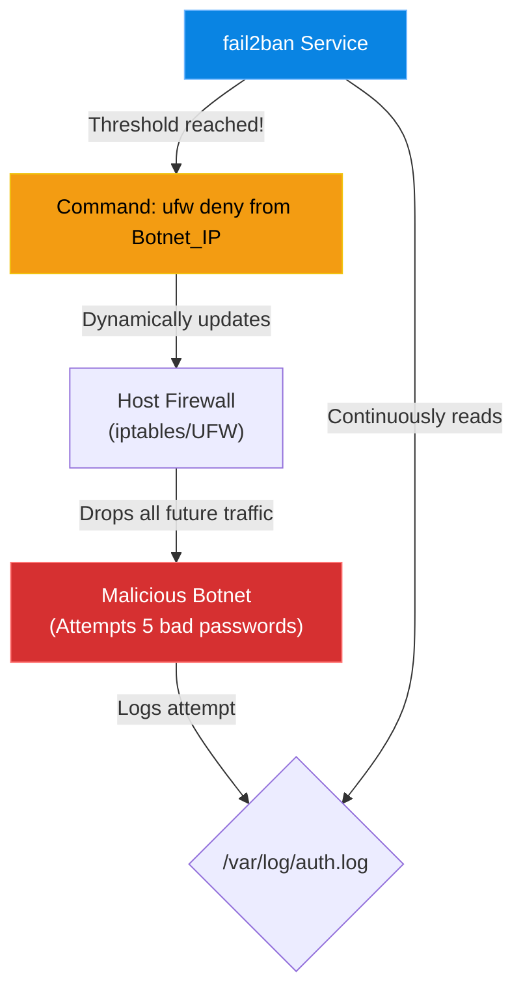

# Chapter 13 — Intrusion Prevention (fail2ban)

* **Difficulty:** Intermediate
* **Estimated Time:** 1.5 Hours
* **Hands-on Labs:** 1
* **Interview Questions:** 3

## Learning Objectives

By the end of this chapter, you will be able to:
* Explain the difference between a static firewall and an active Intrusion Prevention System (IPS).
* Understand how `fail2ban` parses log files to identify malicious behavior.
* Configure `fail2ban` jails for services like SSH.
* Use the `fail2ban-client` to unban an IP address after a false positive lockout.

## Visual Architecture: The Dynamic Defense

If you open Port 22 (SSH) in your firewall, anyone in the world can attempt to log in. A firewall is a dumb door; it doesn't care if the same IP address tries to guess your password 10,000 times a second. 
`fail2ban` acts as a security guard standing behind the door. If it sees someone acting suspiciously, it runs over to the firewall and dynamically writes a new rule to block them.

## Theory & Concepts

### 1. The Background Noise of the Internet
The moment you connect a Linux server to the internet, automated botnets will find it. Within 5 minutes, they will begin attempting to SSH into your server using common usernames (`root`, `admin`, `ubuntu`) and common passwords. Check your `/var/log/auth.log` file—it is likely filled with thousands of failed login attempts right now.

### 2. How fail2ban Works
`fail2ban` is a background daemon that reads log files. You configure "Jails" (rules) for specific services. 
For example, you can create an SSH Jail that says: "Watch `/var/log/auth.log`. If you see the same IP address generate 5 'authentication failure' messages within 10 minutes, ban that IP address for 1 hour."

### 3. The `fail2ban-client`
Because `fail2ban` works by dynamically modifying the underlying `iptables` firewall, you should not edit the firewall manually to fix a ban. You must ask `fail2ban` to do it using its client tool.
To see which IPs are currently banned from SSH:
`fail2ban-client status sshd`

## Scenario-Based Troubleshooting

### Scenario A: The Banned Admin
**The Incident:** A security-conscious engineer installs `fail2ban` on their production server. They configure the SSH jail to be extremely strict: 3 failed attempts results in a 24-hour ban. 
Later that afternoon, the engineer tries to log into the server. They have caps-lock turned on and mistype their password 3 times in a row. 
On the 4th attempt, the connection simply drops. The terminal says `Connection refused`. They are completely locked out of the server.

**The Investigation & Fix:**
1. The engineer realizes exactly what happened. `fail2ban` did its job perfectly. It saw 3 failed attempts, assumed the engineer was a botnet, and commanded the firewall to drop their IP address. 
2. The engineer cannot fix this from their laptop because their laptop's IP is blocked by the firewall. 
3. The engineer connects to a VPN (or uses their cellphone hotspot) to get a different IP address. 
4. The engineer successfully logs into the server using the new IP address. 
5. The engineer asks `fail2ban` for the status of the SSH jail:
   `fail2ban-client status sshd`
6. The output shows their original laptop IP address in the "Banned IP list".
7. The engineer uses the client to unban themselves:
   `fail2ban-client set sshd unbanip <LAPTOP_IP_ADDRESS>`
8. The engineer disconnects from the VPN, tests the connection from their laptop, and successfully logs in.

## Hands-on Lab

> [!TIP]
> **Practice Assignment Available**
> Proceed to the [Chapter 13 Practice Guide](../practice-files/V2-C13-practice.md) to inspect the `/var/log/auth.log` file and witness the background noise of the internet for yourself.

## Interview Questions

### Question 1: What is the difference between a standard firewall (like UFW) and an Intrusion Prevention System (like fail2ban)?
* **Target Answer**: "A standard firewall is static; it either allows traffic on a specific port or it denies it. If you allow SSH on port 22, the firewall allows anyone to attempt a login. An IPS like `fail2ban` is dynamic. It actively monitors log files for malicious behavior (like repeated failed logins), and if a threshold is crossed, it dynamically updates the firewall to drop traffic from the attacking IP address."

### Question 2: You configured `fail2ban` to protect SSH. An employee accidentally locked themselves out by typing the wrong password too many times. How do you restore their access?
* **Target Answer**: "Because `fail2ban` dynamically manages the underlying firewall rules, I should not manually edit the firewall to fix this. Instead, I would use the built-in management tool and run `fail2ban-client set sshd unbanip <EMPLOYEE_IP>` to gracefully remove the ban."

### Question 3: How does `fail2ban` know that an attack is occurring?
* **Target Answer**: "`fail2ban` relies on regular expressions (regex) to parse application log files in real-time. For example, it reads `/var/log/auth.log` (or `/var/log/secure` on RHEL) looking for specific text strings that indicate a failed password attempt. Once it counts enough matches from a single source IP, it triggers the ban."

## Chapter Summary

If a server is on the internet, it is being attacked. `fail2ban` gives your server the ability to fight back automatically, dropping malicious IPs before they can consume your server's resources. Just remember to be careful with your own passwords, or you might find yourself fighting your own security system!

## Completion Checklist

- [ ] I understand how `fail2ban` parses log files to trigger bans.
- [ ] I can list the command to unban an IP (`fail2ban-client set <jail> unbanip <IP>`).
- [ ] I know why I shouldn't manually edit the firewall to remove a `fail2ban` rule.

---

## Navigation

⬅ Previous:
[Chapter 12 – SSH Hardening](V2-C12-ssh-hardening.md)

🏠 Volume Contents:
[Table of Contents](../TOC.md)

➡ Next:
[Chapter 14 – Mandatory Access Control *[Coming Soon]*](#)
