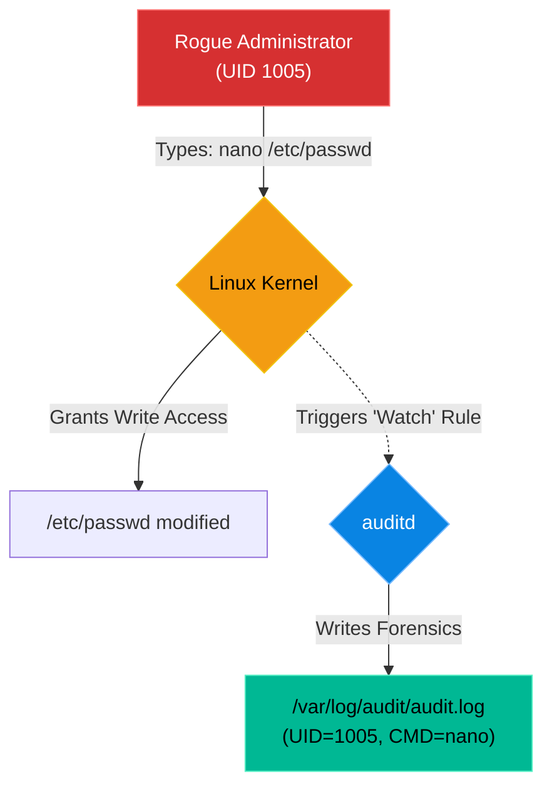

# Chapter 15 — Security Auditing & Compliance

* **Difficulty:** Intermediate
* **Estimated Time:** 1.5 Hours
* **Hands-on Labs:** 1
* **Interview Questions:** 3

## Learning Objectives

By the end of this chapter, you will be able to:
* Explain the purpose of CIS (Center for Internet Security) Benchmarks.
* Understand the role of `auditd` (The Linux Audit Daemon).
* Place a persistent watch on a critical file to monitor for unauthorized changes.
* Use `ausearch` to extract actionable forensics from the audit log.

## Visual Architecture: The Security Camera

If `fail2ban` is the security guard at the door, `auditd` is the security camera inside the building. `auditd` plugs directly into the Linux Kernel. It watches every single system call (e.g., "Open File", "Execute Program"). If a system call matches a rule you defined, it records exactly who did it and when.

## Theory & Concepts

### 1. Compliance and CIS Benchmarks
When you work for a bank, a hospital, or the government, you cannot just say "My server is secure." You must prove it to an auditor. 
The industry standard for proving security is the **CIS Benchmarks** (Center for Internet Security). These are massive, 300-page checklists detailing exactly how every single setting on a Linux server should be configured to achieve compliance.

### 2. The Linux Audit Daemon (`auditd`)
One of the primary requirements of CIS compliance is having an active auditing system. `auditd` is the standard tool.
Unlike `syslog` (which relies on applications choosing to log messages), `auditd` operates at the Kernel level. Applications cannot hide from it. If a program touches the hard drive, `auditd` sees it.

### 3. Setting a Watch
You can tell `auditd` to place a tripwire on any file in the system using `auditctl`. 
For example, to place a watch (`-w`) on the password file, specifically monitoring for Writes or Attribute changes (`-p wa`), and label the log entry with a custom key (`-k passwd_changes`):
`auditctl -w /etc/passwd -p wa -k passwd_changes`

## Scenario-Based Troubleshooting

### Scenario A: Who touched my file?
**The Incident:** The Linux Engineering team discovers that a critical configuration file (`/etc/nginx/nginx.conf`) was modified at 2:00 AM, bringing the entire website down. 
The problem? 50 different engineers have `sudo` access. Everyone claims they were asleep. Standard logs (`syslog`, `.bash_history`) show nothing. The team needs to find the culprit so they can provide them with additional training.

**The Investigation & Fix:**
1. The Support Engineer restores the web server from a backup.
2. Knowing the culprit might try again, the engineer places a Kernel-level watch on the configuration file:
   `auditctl -w /etc/nginx/nginx.conf -p wa -k nginx_watch`
3. Three days later, the website goes down again at 2:00 AM. 
4. The engineer logs in. They don't check `bash_history` because smart users can delete it. They check the immutable audit log. They use `ausearch` to look specifically for the key they created:
   `ausearch -k nginx_watch`
5. The output prints a detailed forensic record!
   `type=SYSCALL ... arch=c000003e syscall=257 success=yes ... exe="/usr/bin/vim" ... auid=1005`
6. The engineer extracts the critical data: The file was opened using `/usr/bin/vim` by a user with the Audit UID (`auid`) of `1005`. 
7. The engineer runs `id 1005` and discovers it belongs to the junior developer "J. Smith". 
8. The mystery is solved. The engineer contacts J. Smith to discuss proper change management procedures.

## Hands-on Lab

> [!TIP]
> **Practice Assignment Available**
> Proceed to the [Chapter 15 Practice Guide](../practice-files/V2-C15-practice.md) to install `auditd` and set a tripwire on a test file!

## Interview Questions

### Question 1: What are the CIS Benchmarks, and why are they important to Linux System Administrators?
* **Target Answer**: "The Center for Internet Security (CIS) Benchmarks are globally recognized best practices for securing IT systems. For Linux administrators, they provide a strict, auditable checklist for server hardening. Adhering to CIS Benchmarks is often legally required for organizations dealing with financial data (PCI-DSS) or healthcare data (HIPAA)."

### Question 2: Why would you use `auditd` to monitor file changes instead of just checking a user's `.bash_history` file?
* **Target Answer**: "The `.bash_history` file is easily manipulated; a malicious user can simply clear the history or run commands with a leading space to avoid logging. `auditd` operates at the Kernel level. It records the exact system calls as they happen, making it impossible for a user-space application to hide its actions. `auditd` is a forensic tool, whereas `.bash_history` is just a user convenience."

### Question 3: Explain the command `auditctl -w /etc/shadow -p wa -k shadow_monitor`.
* **Target Answer**: "This command configures `auditd` to place a watch (`-w`) on the `/etc/shadow` file (which contains user password hashes). The `-p wa` flag tells the daemon to only trigger an alert if the file is Written to or its Attributes change (ignoring simple reads). The `-k shadow_monitor` flag attaches a custom search key to the log entry, making it easy to filter later using `ausearch -k shadow_monitor`."

## Chapter Summary

Compliance is not just paperwork; it is a mindset of total visibility. By utilizing `auditd`, you turn your Linux kernel into an unblinking security camera. When an outage occurs due to a rogue configuration change, you will never have to guess "Who did this?" again.

## Completion Checklist

- [ ] I understand the purpose of the CIS Benchmarks.
- [ ] I can write an `auditctl` command to place a watch on a file.
- [ ] I know how to use `ausearch` to retrieve records based on a custom key.

---

## Navigation

⬅ Previous:
[Chapter 14 – Mandatory Access Control](V2-C14-mandatory-access-control.md)

🏠 Volume Contents:
[Table of Contents](../TOC.md)

➡ Next:
[Chapter 16 – Advanced Bash Scripting *[Coming Soon]*](#)
