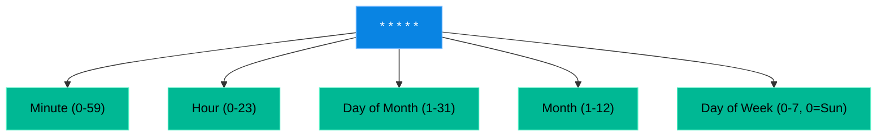

# Chapter 17 — Cron & Task Scheduling

## Learning Objectives

By the end of this chapter, you will be able to:
* Read and write the 5-star `cron` syntax.
* Differentiate between system cron (`/etc/crontab`) and user cron (`crontab -e`).
* Troubleshoot the most common reason cronjobs fail: The Missing `$PATH`.

> [!IMPORTANT]
> **ServiceNow Ticket: INC-95852**
> **Priority:** High
> **Reported By:** Enterprise Application Team
> **Issue:** We are experiencing a critical failure related to Cron & Task Scheduling. Please investigate immediately.
> 
> **Support Engineer Objective:** Use operational thinking to collect evidence, identify the root cause, and restore service without causing further disruption.

## Visual Architecture: The Five Stars

The `cron` daemon wakes up every single minute and checks its tables to see if it needs to execute a command. The schedule is defined by a 5-part syntax.

### Examples:
* `* * * * *` = Every minute of every day.
* `0 2 * * *` = At 2:00 AM, every single day.
* `0 2 * * 5` = At 2:00 AM, but only on Fridays.

## Theory & Concepts

### 1. System Cron vs. User Cron
There are two ways to schedule a task:
* **System Cron (`/etc/crontab`):** This file requires `root` access to edit. It has a 6th field where you must explicitly state which user should run the command.
  `0 2 * * * root /usr/local/bin/backup.sh`
* **User Cron (`crontab -e`):** Every user on the system has their own hidden crontab file. When you run `crontab -e`, it opens your personal file. It does *not* have a user field, because it already knows who you are.
  `0 2 * * * /home/user/scripts/backup.sh`

### 2. The Stripped Environment
When you log into Linux, the system loads a massive amount of "Environment Variables" into your terminal. The most important is `$PATH`. This variable tells the terminal where to find commands like `tar`, `ping`, and `bash`.
When `cron` wakes up in the middle of the night, it does *not* load your environment variables. It runs in an almost entirely blank environment.

## Scenario-Based Troubleshooting

### Scenario A: The Missing Path
**The Incident:** A developer writes an incredibly complex data-processing script. They test it manually by typing `./process_data.sh`. It runs perfectly!
They use `crontab -e` to schedule it to run at midnight:
`0 0 * * * /home/dev/process_data.sh`
The developer goes to sleep. The next morning, they check the logs. The script failed instantly. The `cron` logs simply say: `tar: command not found`.

**The Investigation & Fix:**

1. The Support Engineer investigates. They ask the developer to run the script manually. It works! So why does it fail in `cron`?
2. The engineer explains the **Missing `$PATH`** rule. 
3. When the developer runs the script manually, their terminal knows that the `tar` command lives in `/usr/bin/tar`. 
4. When `cron` runs the script, its environment is blank. When it reaches the word `tar`, it literally has no idea what `tar` is or where to find it.
5. **The Fix:** The engineer teaches the developer the Golden Rule of Cron: **Always use Absolute Paths.**
6. The developer opens their script and changes `tar -czf` to `/usr/bin/tar -czf`. They change `python3 script.py` to `/usr/bin/python3 /home/dev/script.py`. 
7. The script is scheduled for midnight and runs perfectly.

## Hands-on Lab

> [!TIP]
> **Practice Assignment Available**
> Proceed to the [Chapter 17 Practice Guide](../practice-files/V2-C17-practice.md) to write your first cronjob using the `crontab -e` editor!

## Interview Questions

### Question 1: Explain the syntax `0 4 * * 0`. When will this cronjob execute?
* **Target Answer**: "This cronjob will execute at 4:00 AM, only on Sundays. The first field is Minute (0), the second is Hour (4), the third and fourth are Day of Month and Month (which are wildcards), and the fifth is Day of Week (0 represents Sunday)."

### Question 2: You write a script that executes perfectly when you run it from your terminal. You add it to your crontab, but it fails to execute correctly. What is the most likely reason?
* **Target Answer**: "The most likely reason is a missing Environment Variable, specifically the `$PATH` variable. When a script runs interactively, it inherits the user's `$PATH`, allowing it to find standard commands. When `cron` executes a script, it uses a very stripped-down, default `$PATH`. If the script relies on relative commands rather than absolute paths (e.g., calling `python` instead of `/usr/bin/python`), `cron` will not be able to find the executable."

### Question 3: What is the difference between editing `/etc/crontab` and running `crontab -e`?
* **Target Answer**: "`/etc/crontab` is the system-wide cron configuration file. It requires `root` privileges to edit, and its syntax includes an extra column specifying which user should execute the command. `crontab -e` opens the individual user's personal cron file. It does not require `root` (unless running `sudo crontab -e`), and it does not have a user column because the commands automatically run as the user who owns the crontab."

## Chapter Summary

Automation is the key to scaling your career. If you find yourself typing the same command every week, write a script and schedule it in `cron`. But always remember: `cron` is blind. You must give it the absolute, full path to every file and command it needs to touch!

## Completion Checklist

- [ ] I can decipher the 5-star `cron` syntax.
- [ ] I understand the difference between `/etc/crontab` and `crontab -e`.
- [ ] I will always use absolute paths inside my automation scripts.

---

## Navigation

← Previous: [Chapter 16 — Advanced Bash Scripting](V2-C16-advanced-bash-scripting.md)

↑ Volume Contents: [Table of Contents](TOC.md)

→ Next: [Chapter 18 — System Backup & Restoration (rsync)](V2-C18-system-backup.md)
