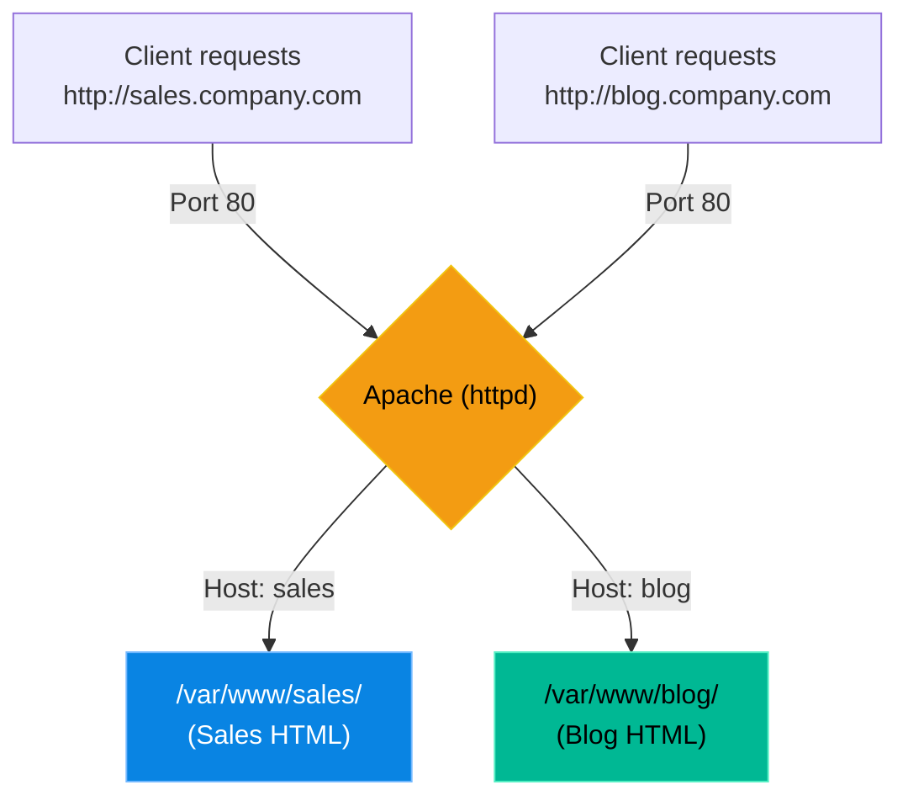

# Chapter 2 — Deploying Apache HTTP Server

* **Difficulty:** Intermediate
* **Estimated Time:** 1.5 Hours
* **Hands-on Labs:** 1
* **Interview Questions:** 3

## Learning Objectives

By the end of this chapter, you will be able to:
* Install and start the Apache web server.
* Understand the difference between `apache2` (Ubuntu) and `httpd` (RHEL).
* Explain the concept of a Document Root (`/var/www/html`).
* Configure Virtual Hosts to serve multiple websites from a single server.

## Visual Architecture: Virtual Hosts

In the 1990s, one server hosted exactly one website. Today, a single Linux server can host thousands of websites simultaneously. Apache uses **Virtual Hosts** to read the `Host:` header in the HTTP request and route the traffic to the correct folder on the hard drive.

## Theory & Concepts

### 1. The Naming War (`apache2` vs. `httpd`)
The Apache HTTP Server is the most famous web server in the world. However, Linux distributions could not agree on what to call it.
* **Ubuntu/Debian:** The package, the daemon, and the configuration folder are all named `apache2`.
* **RHEL/CentOS:** The package, the daemon, and the configuration folder are all named `httpd` (HTTP Daemon).
They are the exact same software, just packaged with different names.

### 2. The Document Root
When a user connects to your server, Apache needs to know which folder contains the HTML files. This folder is called the **Document Root**.
By default, the Document Root is almost always `/var/www/html/`. If you place an `index.html` file in this directory, Apache will serve it to anyone who visits your IP address.

### 3. Sites-Available vs. Sites-Enabled
In Ubuntu, Apache configurations are split into two directories:
* `/etc/apache2/sites-available/`: Where you write and store your configuration files.
* `/etc/apache2/sites-enabled/`: Where Apache actually looks for active configurations.
To activate a site, you don't copy the file; you create a symlink using the command `a2ensite` (Apache 2 Enable Site).

## Scenario-Based Troubleshooting

### Scenario A: The Missing Website
**The Incident:** A junior administrator is tasked with launching a new internal website for the sales team (`sales.company.internal`). They write a beautiful Virtual Host configuration file and save it to `/etc/apache2/sites-available/sales.conf`. 
They restart Apache (`systemctl restart apache2`). But when they visit the URL, the browser just displays the default "Welcome to Ubuntu Apache" page!

**The Investigation & Fix:**
1. The Support Engineer logs in. They run `apachectl -S` (or `httpd -S` on RHEL). This command forces Apache to print out every Virtual Host it is currently loading.
2. The output shows the default site, but `sales.company.internal` is completely missing from the list.
3. The engineer checks the `/etc/apache2/sites-enabled/` directory. It is empty except for the default site symlink. 
4. The engineer explains the issue: "Apache doesn't read the `sites-available` folder. It only reads `sites-enabled`."
5. The engineer runs `a2ensite sales.conf`. This automatically creates a symlink from `sites-available` to `sites-enabled`.
6. They reload the service (`systemctl reload apache2`). The `apachectl -S` command now lists the sales site, and the website loads perfectly.

## Hands-on Lab

> [!TIP]
> **Practice Assignment Available**
> Proceed to the [Chapter 2 Practice Guide](../practice-files/V3-C02-practice.md) to install Apache, modify the Document Root, and host your very first HTML page!

## Interview Questions

### Question 1: What is the difference between `apache2` and `httpd`?
* **Target Answer**: "There is no difference in the underlying software; they both refer to the Apache HTTP Server. The difference is purely in the package naming conventions used by different Linux distributions. Debian-based systems (like Ubuntu) call the package and service `apache2`, while Red Hat-based systems (like CentOS/RHEL) call them `httpd`."

### Question 2: What is a Document Root?
* **Target Answer**: "The Document Root is a directory on the server's filesystem that acts as the base folder for a website. When a web server receives an HTTP request for a domain, it looks inside the configured Document Root (often `/var/www/html/` by default) to find the requested files, such as `index.html` or images."

### Question 3: In an Ubuntu Apache environment, why might a perfectly written Virtual Host configuration file in `/etc/apache2/sites-available/` fail to load?
* **Target Answer**: "Apache on Ubuntu is configured to only load configuration files that exist in the `/etc/apache2/sites-enabled/` directory. The `sites-available` directory is just for storage. To fix the issue, you must activate the configuration by creating a symbolic link into the `sites-enabled` directory, which is most easily done using the `a2ensite` command."

## Chapter Summary

Deploying a web server is the moment Linux becomes truly fun. By mastering Virtual Hosts and Document Roots, you can host 50 different websites on a single $5/month cloud server. Just remember: always enable your sites, and always reload your daemon!

## Completion Checklist

- [ ] I understand the naming difference between Ubuntu (`apache2`) and RHEL (`httpd`).
- [ ] I understand the purpose of a Document Root.
- [ ] I can explain why `a2ensite` is necessary on Ubuntu systems.

---

## Navigation

⬅ Previous:
[Chapter 1 – Web Server Fundamentals](V3-C01-web-fundamentals.md)

🏠 Volume Contents:
[Table of Contents](../TOC.md)

➡ Next:
[Chapter 3 – Deploying NGINX *[Coming Soon]*](#)
