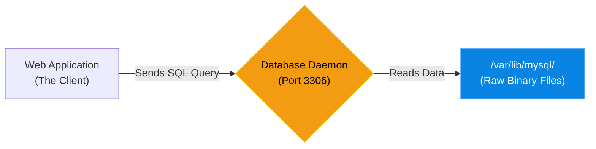

# Chapter 6 — Relational Database Concepts

## Learning Objectives

By the end of this chapter, you will be able to:
* Explain the difference between Relational (SQL) and Non-Relational (NoSQL) databases.
* Understand Tables, Rows, Columns, and Primary Keys.
* Understand the Client-Server database model.
* Troubleshoot basic database network connectivity issues.

## Visual Architecture: The Client-Server Model

Many beginners assume a database is just a massive spreadsheet file (like an Excel `.xlsx` file) sitting on a hard drive. While the data *is* eventually written to disk, you never interact with the files directly. 
A Database is actually a Linux Daemon (a background service) that listens on a specific network port (like Port 3306 for MySQL). Applications (the Clients) send SQL queries to that port. The Daemon reads the query, fetches the data from the disk, and sends it back.

## Theory & Concepts

### 1. SQL vs. NoSQL
There are two primary ways to store data:
* **Relational (SQL):** Data is highly structured into rigid Tables with strict Columns (like a spreadsheet). Tables relate to each other using Keys. If a column is defined as an Integer, you cannot insert text into it. (Examples: MySQL, PostgreSQL, Oracle).
* **Non-Relational (NoSQL):** Data is stored as loose, flexible JSON documents. You can insert text, arrays, or completely new fields on the fly without updating a schema. (Examples: MongoDB, Redis).

### 2. The Anatomy of a Relational Database
* **Table:** A collection of related data (e.g., a `users` table).
* **Row (Record):** A single entry in the table (e.g., User ID 1, John Doe, john@example.com).
* **Column (Field):** A specific piece of data within a row (e.g., the `email` column).
* **Primary Key:** A column that uniquely identifies every single row (e.g., the `user_id`). No two rows can have the same Primary Key.

### 3. Structured Query Language (SQL)
To communicate with the Database Daemon, you must speak its language.
* `SELECT * FROM users WHERE age > 21;` (Read data)
* `INSERT INTO users (name, age) VALUES ('Alice', 25);` (Create data)
* `UPDATE users SET age = 26 WHERE name = 'Alice';` (Modify data)

## Scenario-Based Troubleshooting

### Scenario A: The Network Block
**The Incident:** A developer is deploying a new Python application on `Server A`. They installed a MySQL database on `Server B`. The developer configures the Python app to connect to `Server B`'s IP address, but the application throws an error: `Connection Refused` or `Connection Timed Out`.

**The Investigation & Fix:**

1. The Support Engineer starts by verifying the database daemon is actually running. They SSH into `Server B` and run `systemctl status mysql`. It is active and running.
2. The engineer checks if the daemon is listening on the correct port:
   `ss -tulpn | grep 3306`
   The output shows MySQL is listening on `0.0.0.0:3306` (all network interfaces).
3. The engineer realizes this is a network issue, not a database issue. They SSH into `Server A` (the Python server) and attempt to connect to the port manually using `telnet` or `nc`:
   `nc -vz 10.0.0.55 3306`
4. The connection hangs. This confirms a firewall is blocking the traffic.
5. The engineer logs back into `Server B` and checks the firewall rules (`ufw status` or `iptables -L`). They discover that Port 3306 is not open.
6. The engineer runs `ufw allow 3306/tcp`. 
7. The Python application instantly connects to the database successfully.

> [!TIP]
> **Senior Engineer Note**
> When troubleshooting Relational Database Concepts in production, never restart the service immediately. Restarts clear memory buffers, wipe temporary state, and destroy the exact evidence you need to find the root cause. Always capture logs (e.g., `journalctl` or container logs) *before* attempting a fix.

## Hands-on Lab

> [!TIP]
> **Practice Assignment Available**
> Proceed to the [Chapter 6 Practice Guide](../practice-files/V3-C06-practice.md) to practice writing SQL statements and sketching an Entity Relationship Diagram (ERD)!

## Interview Questions

### Question 1: What is the fundamental difference between a SQL (Relational) database and a NoSQL (Non-Relational) database?
* **Target Answer**: "SQL databases are highly structured, storing data in rigid tables with predefined schemas and enforcing data integrity through relationships and constraints. NoSQL databases are flexible and schema-less, often storing data as JSON documents or key-value pairs, allowing for rapid iteration and horizontal scaling without strict data typing."

### Question 2: A developer says, "I copied the `/var/lib/mysql` directory to a new server, but the database is corrupted." Why did this happen?
* **Target Answer**: "A database is a live, running daemon. It constantly caches data in RAM and holds locks on the binary files on the disk. If you simply `cp` or `rsync` the raw files while the daemon is running, you will copy incomplete or fractured data, leading to corruption. To safely move a database, you must either stop the daemon first, or use a logical backup tool like `mysqldump`."

### Question 3: An application server cannot connect to a remote database server. The DB service is running. What two tools would you use to troubleshoot the connection?
* **Target Answer**: "First, I would log into the database server and use `ss -tulpn` to verify the DB daemon is actually listening on the correct port and bound to the public IP (not just `127.0.0.1`). Second, I would log into the application server and use a tool like `nc -vz <db_ip> <port>` (or `telnet`) to verify if a firewall is blocking the TCP connection."

## Chapter Summary

Before we deploy complex database systems, we must remember the golden rule: A database is just a daemon listening on a port. If you cannot connect to it, it is almost always a firewall issue, a binding issue, or an authentication issue.

## Completion Checklist

- [ ] I understand that databases are running services, not just static files.
- [ ] I can explain the difference between a Table, a Row, and a Column.
- [ ] I know how to use `nc` or `telnet` to test if a database port is open through a firewall.

---

## Navigation

← Previous: [Chapter 5 — TLS/SSL Cryptography & Certbot](V3-C05-tls-ssl-cryptography.md)

↑ Volume Contents: [Table of Contents](TOC.md)

→ Next: [Chapter 7 — Deploying MariaDB / MySQL](V3-C07-deploying-mariadb.md)
