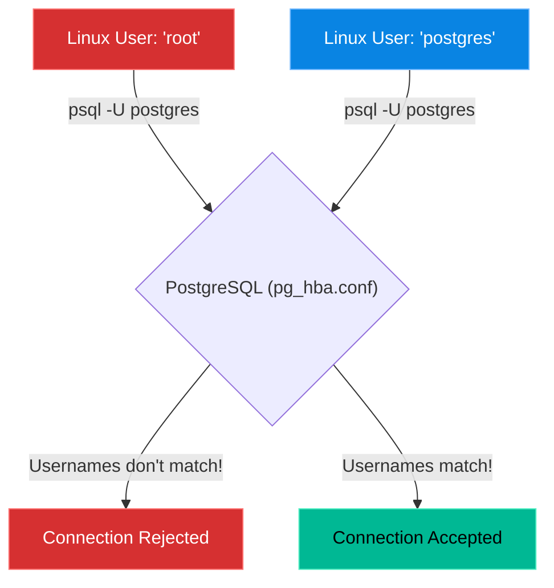

# Chapter 8 — Deploying PostgreSQL

* **Difficulty:** Intermediate
* **Estimated Time:** 1.5 Hours
* **Hands-on Labs:** 1
* **Interview Questions:** 3

## Learning Objectives

By the end of this chapter, you will be able to:
* Explain why PostgreSQL is preferred for complex enterprise applications.
* Understand the `postgres` Linux system user.
* Connect to the `psql` shell using `peer` authentication.
* Modify `pg_hba.conf` to allow standard password authentication.

## Visual Architecture: Peer Authentication

MariaDB uses standard usernames and passwords right out of the box. PostgreSQL is much more paranoid. 
By default, PostgreSQL uses a security mechanism called **Peer Authentication**. This means that if you want to log in as the Database User named `postgres`, you MUST be logged into the Linux OS as the system user named `postgres`. Passwords are completely ignored!

## Theory & Concepts

### 1. Why PostgreSQL?
While MariaDB is fast and simple, PostgreSQL is an "Object-Relational" database. It is renowned for its strict adherence to SQL standards, its ability to handle incredibly complex data types (like nested JSON arrays or geographical GPS data), and its rock-solid reliability for financial transactions. 

### 2. The `postgres` System User
When you install PostgreSQL via the package manager, it creates a new Linux system user named `postgres` in your `/etc/passwd` file. 
Because of Peer Authentication, the only way to access the database as an administrator is to become this user in the terminal first:
`sudo -i -u postgres`
Once you are that user, you can type `psql` to enter the database shell.

### 3. The `pg_hba.conf` File
HBA stands for "Host-Based Authentication". This single file controls *who* can connect to the database, *where* they can connect from, and *how* they must authenticate. 
If a web application is trying to connect using a password, you must edit this file and change the authentication method from `peer` to `md5` (or `scram-sha-256`).

## Scenario-Based Troubleshooting

### Scenario A: The Peer Authentication Failure
**The Incident:** A developer builds a Django web application. They configure Django to connect to the local PostgreSQL database using the username `db_admin` and the password `SuperSecret123`. 
When they start the application, it crashes instantly, throwing the error: `FATAL: Peer authentication failed for user "db_admin"`. The developer complains to IT that the password isn't working.

**The Investigation & Fix:**
1. The Support Engineer understands that PostgreSQL isn't even checking the password. It is checking the Linux user running the Django app, and rejecting the connection because the app isn't running as the `db_admin` Linux user!
2. The engineer opens the Host-Based Authentication file:
   `nano /etc/postgresql/14/main/pg_hba.conf`
3. They scroll to the bottom of the file and find the local IPv4 connection rule:
   `host    all             all             127.0.0.1/32            peer`
4. The engineer changes the word `peer` to `md5`. This tells Postgres: "If a local app tries to connect, ask for a password instead of checking their Linux username."
   `host    all             all             127.0.0.1/32            md5`
5. The engineer reloads the database service (`systemctl reload postgresql`).
6. The Django application connects perfectly using the password.

## Hands-on Lab

> [!TIP]
> **Practice Assignment Available**
> Proceed to the [Chapter 8 Practice Guide](../practice-files/V3-C08-practice.md) to install PostgreSQL, assume the identity of the `postgres` user, and access the `psql` shell!

## Interview Questions

### Question 1: What is the primary difference in use-case between MariaDB and PostgreSQL?
* **Target Answer**: "MariaDB is known for being lightweight, incredibly fast for simple read-heavy workloads, and easy to set up. PostgreSQL is a highly advanced, object-relational database known for strict data integrity, handling complex queries, and supporting advanced data types like JSONB and PostGIS (geospatial data). It is typically preferred for enterprise applications with complex logic."

### Question 2: You just installed PostgreSQL. You type `psql -U postgres` to log in as the database administrator, but you receive a "Peer authentication failed" error. Why?
* **Target Answer**: "By default, PostgreSQL uses 'Peer Authentication' for local connections. This means the database checks the name of the active Linux system user executing the command, and ensures it matches the requested database user. To log in as the database user `postgres`, I must first switch my Linux session to the system user `postgres` using a command like `sudo -i -u postgres`, and then run `psql`."

### Question 3: How do you configure PostgreSQL to accept standard username and password connections from a web application running on the same server?
* **Target Answer**: "You must modify the Host-Based Authentication file, `pg_hba.conf`. You need to locate the IPv4 local connection line (`host all all 127.0.0.1/32`) and change the authentication method from `peer` (or `ident`) to a password-based method like `md5` or `scram-sha-256`. After saving the file, you must reload the PostgreSQL service."

## Chapter Summary

PostgreSQL is a fortress. It is designed to be impenetrable by default. By mastering the `pg_hba.conf` file, you gain the keys to the fortress, allowing you to securely connect your applications to one of the most powerful database engines on the planet.

## Completion Checklist

- [ ] I understand the concept of Peer Authentication.
- [ ] I know how to use `sudo -i -u` to switch to the `postgres` user.
- [ ] I understand the purpose of the `pg_hba.conf` file.

---

## Navigation

⬅ Previous:
[Chapter 7 – Deploying MariaDB / MySQL](V3-C07-deploying-mariadb.md)

🏠 Volume Contents:
[Table of Contents](../TOC.md)

➡ Next:
[Chapter 9 – Database Security & User Management](V3-C09-database-security.md)
