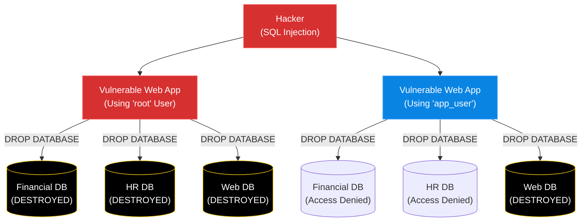

# Chapter 9 — Database Security & User Management

* **Difficulty:** Intermediate
* **Estimated Time:** 1.5 Hours
* **Hands-on Labs:** 1
* **Interview Questions:** 3

## Learning Objectives

By the end of this chapter, you will be able to:
* Explain the Principle of Least Privilege.
* Create a dedicated database for an application.
* Create a dedicated user with a strong password.
* Grant specific, limited permissions to a user using SQL.

## Visual Architecture: The Blast Radius

If you give a web application the `root` database credentials, you have created an infinite blast radius. If a hacker finds a vulnerability in the web app (like SQL Injection), they can delete *every single database* on the server. 
If you create a dedicated user that only has access to one specific database, the hacker's blast radius is contained. They can only damage that single database.

## Theory & Concepts

### 1. The Principle of Least Privilege
This is the golden rule of IT Security. A user, program, or process should only be given the bare minimum privileges necessary to perform its intended function, and nothing more.

### 2. Creating Databases and Users
You should never put multiple applications inside the same database. Create a unique container for every app.
`CREATE DATABASE company_blog;`
Then, create a user specifically for that app.
`CREATE USER 'blog_user'@'localhost' IDENTIFIED BY 'SuperSecure123';`

### 3. The `GRANT` Syntax
Once the user is created, they have zero power. You must explicitly grant them permission to touch their database.
`GRANT ALL PRIVILEGES ON company_blog.* TO 'blog_user'@'localhost';`
`FLUSH PRIVILEGES;`
*(Note: `FLUSH PRIVILEGES` tells the database daemon to reload the security tables into RAM, applying your changes immediately).*

## Scenario-Based Troubleshooting

### Scenario A: The Blast Radius
**The Incident:** The company hosts a WordPress blog and a highly sensitive HR portal on the same Linux database server. Over the weekend, the WordPress blog is hacked via an outdated plugin. The hacker executes a malicious SQL script to drop (delete) all tables on the server. The CEO is terrified that employee Social Security numbers were stolen or deleted.

**The Investigation & Fix:**
1. The Support Engineer investigates the database logs. They see the hacker's queries coming in through the WordPress application.
2. The engineer checks the WordPress configuration file (`wp-config.php`). 
3. Because the engineer followed the Principle of Least Privilege, the WordPress configuration was using a user called `wp_app_user`, NOT `root`.
4. The engineer checks the privileges of `wp_app_user`.
   `SHOW GRANTS FOR 'wp_app_user'@'localhost';`
5. The output proves that the user only had `GRANT ALL PRIVILEGES ON wordpress_db.*`. 
6. The engineer checks the `hr_portal` database. It is completely intact. The hacker tried to drop the HR tables, but the database daemon returned an `Access Denied` error because the WordPress user had no permissions outside its own database.
7. The blast radius was successfully contained. The engineer restores the WordPress database from a backup, updates the vulnerable plugin, and the crisis is averted.

## Hands-on Lab

> [!TIP]
> **Practice Assignment Available**
> Proceed to the [Chapter 9 Practice Guide](../practice-files/V3-C09-practice.md) to log into your MariaDB server, create a database, and configure a dedicated user!

## Interview Questions

### Question 1: Explain the 'Principle of Least Privilege' in the context of database administration.
* **Target Answer**: "The Principle of Least Privilege states that a user or application should only be granted the absolute minimum permissions required to perform its job. In a database, this means an application should never connect using the `root` account. Instead, it should use a dedicated user account that only has permissions (like `SELECT`, `INSERT`, `UPDATE`) for its own specific database, isolating it from the rest of the server."

### Question 2: You just ran a `GRANT` command in MySQL/MariaDB to give a user new permissions, but the user says they still get an 'Access Denied' error. What did you forget to do?
* **Target Answer**: "I likely forgot to run the `FLUSH PRIVILEGES;` command. When you manually modify the grant tables, the database daemon doesn't automatically realize the security rules have changed. The flush command tells the database to reload the grant tables from the disk into its RAM, applying the new permissions immediately."

### Question 3: What does the syntax `company_blog.*` mean in the command `GRANT ALL PRIVILEGES ON company_blog.* TO 'blog_user'@'localhost';`?
* **Target Answer**: "The `company_blog` part specifies the exact name of the database. The `.*` is a wildcard that means 'all tables'. Therefore, this syntax grants the user permissions across every single table, but *only* within the `company_blog` database, preventing them from accessing or modifying any other databases on the server."

## Chapter Summary

The `root` database user is for humans. It is for you, the Support Engineer, to create databases, manage backups, and perform maintenance. You must never, ever put the `root` username and password into an application's configuration file. Always create a dedicated user, grant it access to a single database, and limit the blast radius!

## Completion Checklist

- [ ] I understand the Principle of Least Privilege.
- [ ] I know how to create a database and a user using SQL.
- [ ] I know how to use the `GRANT` and `FLUSH` commands.

---

## Navigation

⬅ Previous:
[Chapter 8 – Deploying PostgreSQL](V3-C08-deploying-postgresql.md)

🏠 Volume Contents:
[Table of Contents](../TOC.md)

➡ Next:
[Chapter 10 – Database Backup & Restoration](V3-C10-database-backups.md)
