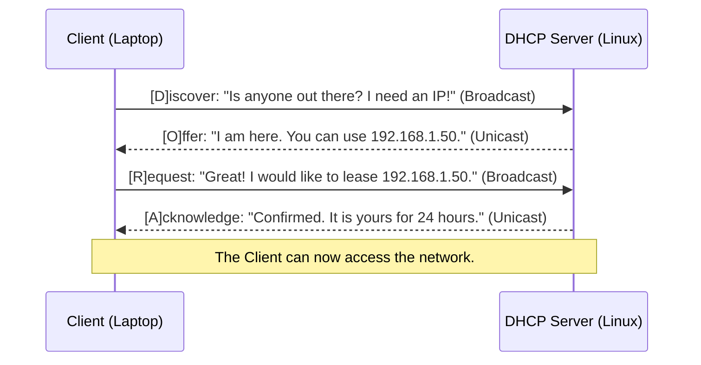

# Chapter 12 — Dynamic Host Configuration (DHCPd)

* **Difficulty:** Intermediate
* **Estimated Time:** 1.5 Hours
* **Hands-on Labs:** 1
* **Interview Questions:** 3

## Learning Objectives

By the end of this chapter, you will be able to:
* Explain the DORA (Discover, Offer, Request, Acknowledge) process.
* Understand the concept of an IP Lease.
* Configure a Linux DHCP daemon (`dhcpd`).
* Resolve network IP Conflicts using MAC Address Reservations.

## Visual Architecture: The DORA Process

When you plug a laptop into a network switch, it has no IP address, no subnet mask, and no idea how to reach the internet. It relies on the Dynamic Host Configuration Protocol (DHCP). 
The laptop shouts a broadcast message to the entire network. A Linux server running a DHCP daemon hears the shout, checks its pool of available IP addresses, and assigns one to the laptop.



## Theory & Concepts

### 1. The Lease
DHCP does not permanently give away IP addresses. It *leases* them. If the lease time is 24 hours, the client will usually attempt to renew the lease at the 12-hour mark. If a guest connects to the guest Wi-Fi and then leaves, their lease will expire, and the DHCP server will reclaim the IP address to give to someone else tomorrow.

### 2. The Configuration File
On Linux, the standard DHCP server is `isc-dhcp-server` (or `dhcpd`). The main configuration file is `/etc/dhcp/dhcpd.conf`.
You define a "subnet" and a "pool" (range) of addresses that the server is allowed to give away:
```text
subnet 192.168.1.0 netmask 255.255.255.0 {
  range 192.168.1.100 192.168.1.200;
  option routers 192.168.1.1;
  option domain-name-servers 8.8.8.8;
}
```

### 3. Static IP vs. DHCP Reservation
Servers (like database or web servers) should never have dynamically changing IPs. You can either configure a Static IP manually on the server itself, or you can create a **DHCP Reservation** on the DHCP server. A reservation tells the DHCP server: "Whenever you see this specific MAC address, always give it this exact IP address."

> [!IMPORTANT]  
> **Best Practice: The Reservation Rule**  
> If you create a MAC address reservation on a DHCP server, the reserved IP address **must** be outside the dynamic `range` pool. If your range is `.100` to `.200`, make your reservations between `.10` and `.99`. If you reserve an IP that is inside the dynamic pool, the DHCP server might accidentally give it away to a laptop before the reserved server boots up!

## Scenario-Based Troubleshooting

### Scenario A: The IP Conflict
**The Incident:** A department manager purchases a new network printer for the office. They plug it into the wall and manually configure the printer's static IP address to `192.168.1.150`. 
An hour later, an employee brings their laptop back from a meeting. The laptop connects to the network and instantly throws a critical OS error: `IP Address Conflict Detected`. The laptop cannot reach the internet.

**The Investigation & Fix:**
1. The Support Engineer looks at the DHCP server's configuration file. The dynamic pool range is `.100` to `.200`. 
2. The engineer checks the DHCP lease file (`/var/lib/dhcp/dhcpd.leases`). The server just assigned `192.168.1.150` to the employee's laptop!
3. The engineer realizes the problem: The DHCP server has no idea that a printer is secretly using `.150`. When the laptop asked for an IP, the DHCP server handed out `.150`. Now, two devices on the network have the exact same IP address, breaking routing for both of them.
4. The engineer logs into the printer's web interface. They change the printer's setting from "Static" to "DHCP". 
5. The engineer finds the printer's hardware MAC address. They open `/etc/dhcp/dhcpd.conf` and create a reservation *outside* the dynamic pool:
   ```text
   host office-printer {
     hardware ethernet 00:1A:2B:3C:4D:5E;
     fixed-address 192.168.1.20;
   }
   ```
6. The engineer reloads the `dhcpd` service. They reboot the printer and the laptop.
7. The printer boots, asks for an IP, and the server says: "Ah, I recognize your MAC! Here is `192.168.1.20`."
8. The laptop boots, asks for an IP, and the server says: "Here is `.150` from the dynamic pool." The conflict is resolved forever.

## Hands-on Lab

> [!TIP]
> **Practice Assignment Available**
> Proceed to the [Chapter 12 Practice Guide](../practice-files/V3-C12-practice.md) to inspect a theoretical DHCP configuration and identify active leases!

## Interview Questions

### Question 1: Explain the DORA process in DHCP.
* **Target Answer**: "DORA stands for Discover, Offer, Request, Acknowledge. When a client joins a network, it broadcasts a 'Discover' packet. The DHCP server responds with an 'Offer' of an IP address. The client broadcasts a 'Request' to formally accept the offered IP. Finally, the server sends an 'Acknowledge' packet, finalizing the lease and providing gateway and DNS information."

### Question 2: What causes an IP Conflict on a network?
* **Target Answer**: "An IP conflict occurs when two devices on the same network subnet are assigned the exact same IP address. This usually happens when a user manually configures a Static IP on a device (like a printer or server) using an address that falls inside the DHCP server's dynamic allocation pool. The DHCP server eventually leases that same address to another device, breaking network connectivity for both."

### Question 3: How do you guarantee a specific server always gets the same IP address without configuring a static IP on the server itself?
* **Target Answer**: "You can configure a DHCP (or MAC address) Reservation on the DHCP server. You input the hardware MAC address of the server's Network Interface Card (NIC) into the DHCP configuration and map it to a specific IP address outside the dynamic pool. Whenever that server boots and asks for an IP, the DHCP server recognizes the MAC and always provides that specific, fixed address."

## Chapter Summary

IP Conflicts are one of the most frustrating Layer 2/Layer 3 networking issues to troubleshoot. By enforcing a strict policy of using DHCP Reservations (and never allowing users to set manual Static IPs inside a dynamic pool), you eliminate the possibility of conflicts and centralize all your network IP management into one single Linux file.

## Completion Checklist

- [ ] I can explain the four steps of the DORA process.
- [ ] I understand the difference between a dynamic range and a fixed reservation.
- [ ] I know why manual static IPs cause network conflicts.

---

## Navigation

⬅ Previous:
[Chapter 11 – The Domain Name System (BIND9)](V3-C11-dns-bind.md)

🏠 Volume Contents:
[Table of Contents](../TOC.md)

➡ Next:
[Chapter 13 – Email Infrastructure (Postfix)](V3-C13-email-postfix.md)
