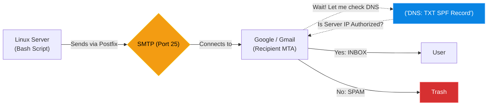

# Chapter 13 — Email Infrastructure (Postfix)

* **Difficulty:** Advanced
* **Estimated Time:** 1.5 Hours
* **Hands-on Labs:** 1
* **Interview Questions:** 3

## Learning Objectives

By the end of this chapter, you will be able to:
* Differentiate between SMTP and IMAP/POP3.
* Configure Postfix to send outgoing transactional emails.
* Understand why emails get marked as spam.
* Configure an SPF (Sender Policy Framework) record in DNS.

## Visual Architecture: The Mail Transfer Agent

Sending an email in Linux is incredibly easy. Getting Microsoft or Google to actually *accept* that email and put it in the user's Inbox (instead of the Spam folder) is one of the hardest tasks in IT. 
Your Linux server uses a Mail Transfer Agent (MTA) like Postfix to send mail via SMTP (Simple Mail Transfer Protocol).

## Theory & Concepts

### 1. SMTP vs. IMAP
* **SMTP (Simple Mail Transfer Protocol):** Used exclusively for *sending* mail between servers (Port 25/587). Postfix is an SMTP server.
* **IMAP / POP3:** Used by client applications (like Outlook or Apple Mail) to *read* mail from a server. Dovecot is an IMAP server.

> [!CAUTION]  
> **Best Practice: Never Host User Email**  
> As a Linux Support Engineer, you should configure Postfix to *send* automated system alerts (transactional email). You should **never** attempt to build a full email server (Postfix + Dovecot) for human users to send and receive daily mail. The complexity of fighting modern spam networks is overwhelming. Pay Google Workspace or Microsoft 365 to handle your human email hosting.

### 2. The Spam Problem
SMTP was invented in 1982. It has no built-in security. Anyone in the world can write a bash script, connect to Port 25, and say: `MAIL FROM: <ceo@yourcompany.com>`. 
Because email spoofing is so easy, major providers (Gmail, Outlook) assume *every* incoming email is a malicious scam unless proven otherwise. 

### 3. SPF (Sender Policy Framework)
To prove you aren't a scammer, you use DNS (which we learned in Chapter 11!). 
You create a `TXT` record on your domain name called an SPF record. It contains a list of IP addresses that are legally allowed to send email on behalf of your domain. 
When Google receives an email claiming to be from `reports@company.com`, it checks the DNS SPF record for `company.com`. If your Linux server's IP is not in that TXT record, Google throws the email straight into the Spam folder (or deletes it entirely).

## Scenario-Based Troubleshooting

### Scenario A: The Spam Filter
**The Incident:** The IT team writes a brilliant bash script that runs every night. It analyzes the web server logs, generates a PDF report, and emails it to the IT Director. The script works perfectly, but the Director complains they are not receiving the emails. 

**The Investigation & Fix:**
1. The Support Engineer checks the mail logs on the Linux server:
   `tail -f /var/log/mail.log`
2. They see the exact moment Postfix attempted to hand the email to Google's servers. The log reads: `550-5.7.26 This message does not have authentication information or fails to pass authentication checks. To best protect our users from spam, the message has been blocked.`
3. The engineer realizes the script is sending the email from `reporting@company.com`, but this specific Linux server's IP address (e.g., `203.0.113.50`) is not authorized to send mail for that domain.
4. The engineer logs into the company's Authoritative DNS provider (Route53).
5. They find the existing SPF `TXT` record, which currently only authorizes Microsoft 365:
   `v=spf1 include:spf.protection.outlook.com -all`
6. They modify the record to include the Linux server's IP address:
   `v=spf1 ip4:203.0.113.50 include:spf.protection.outlook.com -all`
7. The engineer saves the DNS record and waits for the TTL to expire. The next night, the report is successfully delivered to the Director's inbox.

## Hands-on Lab

> [!TIP]
> **Practice Assignment Available**
> Proceed to the [Chapter 13 Practice Guide](../practice-files/V3-C13-practice.md) to install `mailutils` and send a test email from the Linux command line!

## Interview Questions

### Question 1: What is the difference between Postfix and Dovecot?
* **Target Answer**: "Postfix is an MTA (Mail Transfer Agent) that uses SMTP to send and route emails between servers over Port 25. Dovecot is an MDA (Mail Delivery Agent) that provides IMAP or POP3 services, allowing end-user client applications like Outlook or Apple Mail to connect and read the emails sitting in their inbox."

### Question 2: Why is it strongly discouraged for small companies to host their own fully-featured email servers?
* **Target Answer**: "Modern email delivery is incredibly complex due to the massive volume of global spam. If a small company hosts their own mail server, they must flawlessly maintain their IP reputation, manage SPF, DKIM, and DMARC records, handle PTR reverse-DNS lookups, and constantly monitor blacklists. A single mistake will result in all company emails being silently dropped by Gmail or Microsoft. It is safer and more reliable to outsource human email hosting to dedicated providers."

### Question 3: An automated Linux script is sending emails that are landing in the recipient's Spam folder. How do you fix this using DNS?
* **Target Answer**: "The emails are being flagged as spoofed because the recipient's mail server cannot verify the sender's identity. I must configure an SPF (Sender Policy Framework) record. This is a DNS `TXT` record on the sender's domain that explicitly lists the public IP address of the Linux server, authorizing it to legally send mail on behalf of that domain."

## Chapter Summary

Sending an email is easy. Proving you aren't a spammer is hard. As an Infrastructure Engineer, you must deeply understand how SMTP intersects with DNS. Never send an automated email without first configuring your SPF records!

## Completion Checklist

- [ ] I understand the difference between SMTP and IMAP.
- [ ] I understand why SPF records are mandatory.
- [ ] I know how to check `/var/log/mail.log` for bounce messages.

---

## Navigation

⬅ Previous:
[Chapter 12 – Dynamic Host Configuration (DHCPd)](V3-C12-dhcp.md)

🏠 Volume Contents:
[Table of Contents](../TOC.md)

➡ Next:
[Chapter 14 – Time Synchronization (Chrony/NTP)](V3-C14-time-synchronization.md)
