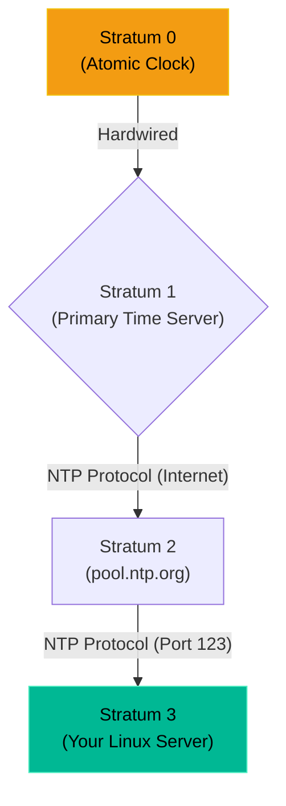

# Chapter 14 — Time Synchronization (Chrony/NTP)

* **Difficulty:** Beginner
* **Estimated Time:** 1 Hour
* **Hands-on Labs:** 1
* **Interview Questions:** 3

## Learning Objectives

By the end of this chapter, you will be able to:
* Explain why accurate time is critical for Distributed Systems and Authentication.
* Understand the NTP (Network Time Protocol) Stratum hierarchy.
* Install and configure the `chrony` daemon.
* Troubleshoot Clock Drift issues.

## Visual Architecture: The Stratum Hierarchy

Computers are terrible at keeping time. Their internal hardware clocks drift by several seconds every month. To fix this, we use the Network Time Protocol (NTP). 
NTP uses a hierarchy of "Stratum" levels. 
* **Stratum 0:** Atomic Clocks and GPS satellites (Perfect Time).
* **Stratum 1:** Servers physically wired to a Stratum 0 device.
* **Stratum 2:** Servers that pull time from Stratum 1 over the internet.
* **Stratum 3:** Your Linux Server, pulling time from Stratum 2.

## Theory & Concepts

### 1. Why Time Matters
If your watch is 5 minutes fast, you are early to a meeting. If a Linux server is 5 minutes fast, the entire company goes offline. 
* **SSL/TLS Certificates:** If a server's clock thinks it is 2024, but a certificate is only valid starting in 2026, the server will reject the certificate as "Not Yet Valid."
* **Authentication (Kerberos/SAML):** Security tokens usually have a 5-minute expiration window to prevent hackers from stealing and reusing them. If your server is 6 minutes out of sync, it will reject every single valid login attempt.
* **Database Replication:** If two database servers are out of sync, the database cannot figure out which transaction happened first, causing massive data corruption.

### 2. ntpd vs. chrony
Historically, Linux used the `ntpd` daemon. However, `ntpd` was designed for servers that are permanently connected to the network. 
Today, modern Linux distributions use **Chrony** (`chronyd`). Chrony is much better at handling virtual machines (which frequently pause/resume) and laptops (which frequently lose internet connection). 

### 3. The `pool.ntp.org` Project
Instead of pointing your server to one specific IP address, you point your `/etc/chrony/chrony.conf` file to `pool.ntp.org`. This is a massive, global cluster of volunteer time servers. Chrony will automatically find the closest and fastest servers to synchronize with.

## Scenario-Based Troubleshooting

### Scenario A: The Broken Authentication
**The Incident:** A junior engineer provisions a new web server to host a secure internal application. They hook the application up to the company's Single Sign-On (SSO) provider. 
The developer attempts to log in. They type their correct password, but the application instantly kicks them out with a generic `HTTP 401 Unauthorized` error.

**The Investigation & Fix:**
1. The Support Engineer is called in to investigate. They look at the SSO logs. The logs say: `Token rejected: Issued in the future`.
2. The engineer instantly knows this is a Time Synchronization issue. 
3. The engineer logs into the new web server and types `date`. The server claims it is `14:15`. 
4. The engineer looks at their phone. It is actually `14:08`. The server's clock is 7 minutes fast! When the SSO provider generates a token stamped `14:08`, the web server looks at the token, sees it was (from its perspective) generated 7 minutes ago, assumes it is a hacked/expired token, and rejects the login.
5. The engineer installs `chrony` and starts the service (`systemctl start chronyd`).
6. They run `chronyc makestep` to force an immediate time correction.
7. The server's clock snaps back to `14:08`. 
8. The developer tries to log in again. The token is accepted instantly, and the application works perfectly.

## Hands-on Lab

> [!TIP]
> **Practice Assignment Available**
> Proceed to the [Chapter 14 Practice Guide](../practice-files/V3-C14-practice.md) to check your own server's synchronization status using `chronyc tracking`!

## Interview Questions

### Question 1: Why is accurate time synchronization critical for enterprise authentication systems like Kerberos or SAML?
* **Target Answer**: "Modern authentication systems rely on time-stamped security tokens to prevent 'replay attacks' (where a hacker steals a token and tries to use it later). These tokens usually have a strict validity window (e.g., 5 minutes). If the application server's clock drifts beyond that 5-minute window compared to the authentication server, it will perceive all newly generated tokens as either expired or issued in the future, resulting in a total authentication failure for all users."

### Question 2: What is the difference between `ntpd` and `chrony`?
* **Target Answer**: "Both are implementations of the Network Time Protocol (NTP). `ntpd` is the older, legacy daemon designed for servers with permanent, stable network connections. `chrony` is the modern replacement used by default in RHEL and Ubuntu. `chrony` synchronizes clocks much faster, is more accurate, and handles intermittent network connections or virtual machine pauses far better than `ntpd`."

### Question 3: How does the NTP Stratum hierarchy work?
* **Target Answer**: "The Stratum hierarchy measures the distance from a perfectly accurate time source. Stratum 0 represents actual hardware atomic clocks or GPS receivers. Stratum 1 servers are directly connected to Stratum 0 devices. Stratum 2 servers synchronize over a network with Stratum 1 servers, and so on. A standard Linux server is usually Stratum 3, pulling its time from a Stratum 2 server like `pool.ntp.org`."

## Chapter Summary

Clock drift is silent. It doesn't generate loud error messages; it just causes bizarre, inexplicable authentication and database failures. Whenever you build a new server, before you install Apache, before you install PostgreSQL, you must ensure `chrony` is running.

## Completion Checklist

- [ ] I understand why clock drift breaks SSL and Authentication.
- [ ] I can explain the Stratum hierarchy.
- [ ] I know that `chrony` is the modern replacement for `ntpd`.

---

## Navigation

⬅ Previous:
[Chapter 13 – Email Infrastructure (Postfix)](V3-C13-email-postfix.md)

🏠 Volume Contents:
[Table of Contents](../TOC.md)

➡ Next:
[Chapter 15 – Virtual Private Networks (OpenVPN/WireGuard)](V3-C15-vpns.md)
