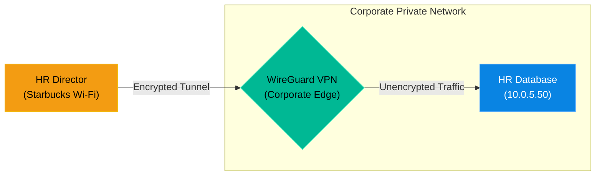

# Chapter 15 — Virtual Private Networks (OpenVPN/WireGuard)

* **Difficulty:** Advanced
* **Estimated Time:** 2 Hours
* **Hands-on Labs:** 1
* **Interview Questions:** 3

## Learning Objectives

By the end of this chapter, you will be able to:
* Explain the concept of VPN Tunneling and Encryption.
* Differentiate between legacy OpenVPN (User-Space) and modern WireGuard (Kernel-Space).
* Understand how VPNs provide access to private subnets over the public internet.
* Generate public and private cryptographic keys for WireGuard.

## Visual Architecture: The Secure Tunnel

In Chapter 9, we built an HR Database. To keep it secure, we blocked Port 3306 on the firewall, meaning nobody on the public internet can access it. 
But what happens when the HR Director wants to work from a coffee shop? We cannot open Port 3306 to the whole world just for them. 
Instead, we use a **Virtual Private Network (VPN)**. We open a single UDP port for the VPN. The HR Director's laptop creates an encrypted "tunnel" through the hostile internet and connects to the VPN. The VPN then securely drops their traffic *inside* the private corporate network.

## Theory & Concepts

### 1. OpenVPN vs. WireGuard
For 20 years, **OpenVPN** was the enterprise standard. However, it operates in "User-Space", making it slow, and its codebase is massive (hundreds of thousands of lines of code), making it hard to audit for security vulnerabilities.
**WireGuard** is the modern replacement. It operates directly inside the Linux Kernel ("Kernel-Space"), making it blisteringly fast. Its codebase is tiny (only 4,000 lines of code), and it uses modern, state-of-the-art cryptography (ChaCha20). 

### 2. Cryptographic Routing
WireGuard does not use usernames and passwords. It uses the exact same concept as SSH Keys (which we learned in Volume 2). 
The HR Director generates a Private Key on their laptop, and gives the Public Key to the Linux Engineer. The Linux Engineer puts that Public Key into the WireGuard configuration file (`/etc/wireguard/wg0.conf`) and assigns it a specific internal IP address (like `10.8.0.2`). 

### 3. IP Forwarding
For a VPN to actually work, the Linux server must be allowed to act as a router. By default, Linux drops any packets that aren't destined for itself. You must enable **IP Forwarding** in the kernel (`sysctl -w net.ipv4.ip_forward=1`) so the VPN server can take the packet from the HR Director and forward it to the HR Database.

## Scenario-Based Troubleshooting

### Scenario A: The Remote Worker
**The Incident:** The HR Director is traveling. They connect to the hotel Wi-Fi and attempt to open the company's internal HR web portal. The page fails to load. The Director submits an angry ticket: "The portal is down again!"

**The Investigation & Fix:**
1. The Support Engineer checks the internal monitoring dashboard. The HR portal is completely online and healthy.
2. The engineer replies to the ticket: "Are you connected to the WireGuard VPN?"
3. The Director replies: "Oh, I forgot to turn it on."
4. The Director clicks 'Connect' on their WireGuard client. The client uses its Private Key to mathematically prove its identity to the corporate VPN server.
5. The VPN server accepts the connection, assigns the Director the internal IP `10.8.0.2`, and creates the encrypted tunnel.
6. The Director refreshes the webpage. The traffic flows through the tunnel, into the corporate network, hits the HR portal, and returns securely to the hotel. The webpage loads perfectly.

> [!IMPORTANT]  
> **Best Practice: Split Tunneling vs. Full Tunneling**  
> When you configure a VPN, you decide the "Allowed IPs". If you configure Full Tunneling (`AllowedIPs = 0.0.0.0/0`), *all* of the remote worker's internet traffic (including Netflix and YouTube) goes through your corporate network, wasting your bandwidth. If you configure Split Tunneling (`AllowedIPs = 10.0.5.0/24`), only traffic destined for the corporate servers goes through the tunnel, and their YouTube traffic goes straight to the internet!

## Hands-on Lab

> [!TIP]
> **Practice Assignment Available**
> Proceed to the [Chapter 15 Practice Guide](../practice-files/V3-C15-practice.md) to generate your own WireGuard cryptographic keys!

## Interview Questions

### Question 1: What is the primary difference in performance between OpenVPN and WireGuard?
* **Target Answer**: "OpenVPN operates in User-Space, meaning every packet of data must be passed back and forth between the Linux kernel and the application layer, which creates significant CPU overhead and latency. WireGuard is integrated directly into the Linux Kernel (Kernel-Space), which allows it to process packets incredibly quickly with minimal CPU usage, resulting in much higher throughput and lower latency."

### Question 2: A user is successfully connected to the VPN, but they cannot reach any internal servers. The VPN server itself can ping the internal servers perfectly. What Linux setting is likely disabled?
* **Target Answer**: "The Linux kernel feature `net.ipv4.ip_forward` is likely disabled (set to 0). By default, a Linux machine will drop any network packets that are not explicitly destined for its own IP address. To allow the VPN server to act as a router and forward the VPN client's packets to the internal subnet, IP Forwarding must be enabled via `sysctl`."

### Question 3: What is the difference between 'Split Tunneling' and 'Full Tunneling' in a VPN configuration?
* **Target Answer**: "Full Tunneling forces 100% of the client's network traffic (including general web browsing) to travel through the encrypted VPN tunnel to the corporate network, which is highly secure but consumes massive amounts of corporate bandwidth. Split Tunneling only routes traffic destined for specific internal corporate subnets (e.g., 10.0.0.0/24) through the tunnel, while allowing standard internet traffic to bypass the VPN and go directly to the internet."

## Chapter Summary

VPNs are the bridge between the hostile public internet and your secure, isolated internal infrastructure. WireGuard has revolutionized this space by replacing massive, complex OpenVPN configurations with simple, elegant cryptography. 

## Completion Checklist

- [ ] I can explain the difference between Kernel-Space and User-Space VPNs.
- [ ] I understand how IP Forwarding allows a Linux server to act as a router.
- [ ] I know the difference between Split and Full tunneling.

---

## Navigation

⬅ Previous:
[Chapter 14 – Time Synchronization (Chrony/NTP)](V3-C14-time-synchronization.md)

🏠 Volume Contents:
[Table of Contents](../TOC.md)

➡ Next:
[Chapter 16 – Advanced File Sharing (Samba) *[Coming Soon]*](#)
