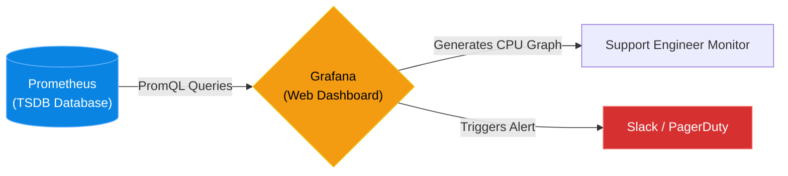

# Chapter 19 — Data Visualization (Grafana)

* **Difficulty:** Intermediate
* **Estimated Time:** 1.5 Hours
* **Hands-on Labs:** 1
* **Interview Questions:** 3

## Learning Objectives

By the end of this chapter, you will be able to:
* Explain why raw metric data requires visualization.
* Connect Prometheus as a Data Source in Grafana.
* Understand the purpose of a NOC (Network Operations Center) dashboard.
* Write a basic PromQL query to generate a line graph.

## Visual Architecture: The Single Pane of Glass

In Chapter 18, we proved that looking at raw metrics (`node_memory_MemFree_bytes 3.14159e+08`) is impossible for humans to process quickly. 
**Grafana** is a web-based visualization tool. You install Grafana, tell it where your Prometheus database is located, and it uses PromQL (Prometheus Query Language) to fetch the raw numbers and draw beautiful line graphs, gauges, and heatmaps. This is often called the "Single Pane of Glass."

## Theory & Concepts

### 1. Data Sources
Grafana does not store any data itself. It is purely a drawing tool. You must configure a "Data Source." While Prometheus is the most popular, Grafana can also draw graphs using data from Elasticsearch, MySQL, or AWS CloudWatch.

### 2. PromQL (Prometheus Query Language)
When you create a panel in Grafana, you must tell it what to draw. You write a PromQL query. 
For example, to calculate the percentage of free memory, you might write:
`(node_memory_MemFree_bytes / node_memory_MemTotal_bytes) * 100`
Grafana executes this math against the Prometheus database and graphs the resulting percentage over time.

### 3. The NOC Dashboard
In large enterprise environments, there is usually a room called the NOC (Network Operations Center) with massive TVs on the wall displaying Grafana dashboards. If a line graph suddenly turns red and spikes upwards, the NOC engineers instantly know an incident is occurring, often before the customers even notice.

## Scenario-Based Troubleshooting

### Scenario A: The CPU Spike
**The Incident:** It is Friday at 4:30 PM. The software developers push a new version of the company's Python application to production. They assure the infrastructure team that it is a minor update. 
Five minutes later, the Support Engineer glances at the Grafana NOC dashboard on the wall. The line graph tracking `node_cpu_seconds_total` for the application servers has instantly spiked from a healthy 20% to a terrifying 98%. 

**The Investigation & Fix:**
1. The Support Engineer doesn't wait for a customer to complain. They know the servers will crash within minutes under this CPU load.
2. They click on the Grafana CPU panel and change the time window from "Last 24 Hours" to "Last 15 Minutes". The graph confirms the massive spike happened at the exact second the new code was deployed.
3. The engineer pings the lead developer: "Your new code has an infinite loop or a massive memory leak. CPU is at 98%. Initiating emergency rollback."
4. The engineer runs the automated rollback script, reverting the application to Thursday's version.
5. They watch the Grafana dashboard. The CPU line graph drops instantly back to 20%. The servers stabilize. A massive weekend outage was prevented purely through proactive visual monitoring.

> [!IMPORTANT]  
> **Best Practice: Alert Fatigue**  
> Grafana allows you to configure Slack or Email alerts when a graph crosses a threshold. Do not create alerts for things that don't require human intervention (e.g., "CPU hit 80% for 2 seconds"). If you spam your team with useless alerts, they will develop "Alert Fatigue" and start ignoring them. Only alert on actionable emergencies (e.g., "Disk space has 5 minutes remaining").

## Hands-on Lab

> [!TIP]
> **Practice Assignment Available**
> Proceed to the [Chapter 19 Practice Guide](../practice-files/V3-C19-practice.md) to conceptually design your own Server Monitoring Dashboard!

## Interview Questions

### Question 1: What is the relationship between Prometheus and Grafana?
* **Target Answer**: "Prometheus is the backend Time-Series Database that scrapes and stores the raw metric data from the servers. Grafana is the frontend visualization tool. Grafana does not store data; it connects to Prometheus as a Data Source, executes PromQL queries, and translates the raw numbers into human-readable dashboards, graphs, and alerts."

### Question 2: Why is it dangerous to rely solely on customer support tickets to identify server outages?
* **Target Answer**: "If you rely on customer tickets, it means the outage has already impacted your business and damaged your reputation. By utilizing visual monitoring tools like Grafana, Support Engineers can proactively observe metrics (like CPU spikes or memory leaks) and resolve the underlying issue before it cascades into a total failure that the customer would notice."

### Question 3: What is 'Alert Fatigue' and how do you prevent it when configuring Grafana alerts?
* **Target Answer**: "Alert Fatigue occurs when engineers receive too many non-critical or false-positive alerts, causing them to subconsciously ignore all alerts, including real emergencies. To prevent it, Grafana alerts should only be configured for actionable, critical thresholds (e.g., a database disk is 95% full), rather than transient, self-resolving spikes (e.g., CPU hit 90% for one minute)."

## Chapter Summary

Raw data is useless if you cannot interpret it quickly. Grafana takes the millions of data points collected by Prometheus and turns them into a story. If the story turns red, you know exactly when and where to act.

## Completion Checklist

- [ ] I understand the separation of concerns between Prometheus (Storage) and Grafana (Visualization).
- [ ] I know how PromQL is used to generate graphs.
- [ ] I understand the danger of Alert Fatigue.

---

## Navigation

⬅ Previous:
[Chapter 18 – Application Performance Monitoring (Prometheus)](V3-C18-monitoring-prometheus.md)

🏠 Volume Contents:
[Table of Contents](../TOC.md)

➡ Next:
[Chapter 20 – Caching Services (Redis)](V3-C20-caching-redis.md)
