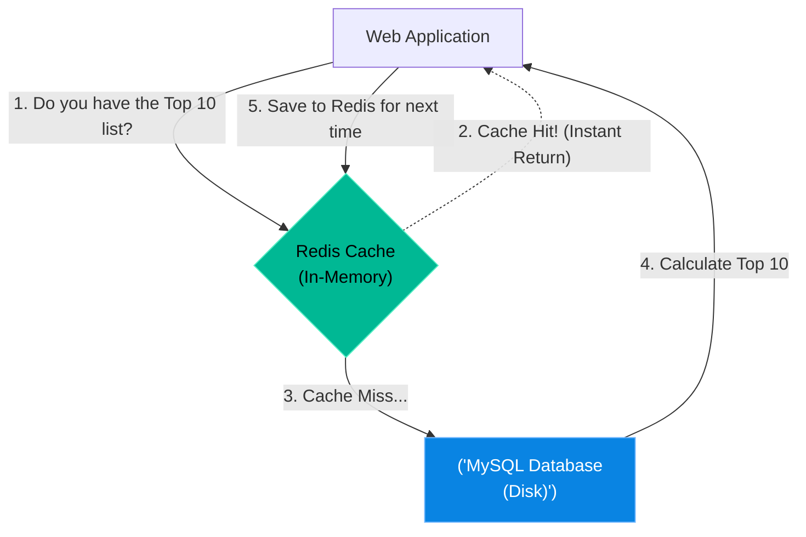

# Chapter 20 — Caching Services (Redis)

## Learning Objectives

By the end of this chapter, you will be able to:
* Explain the performance difference between Disk storage (MySQL) and In-Memory storage (Redis).
* Understand Key-Value architecture.
* Define Cache Hits vs. Cache Misses.
* Use `redis-cli` to set and retrieve data manually.

## Visual Architecture: The Database Shield

In Chapter 7 and 8, we built robust Relational Databases (MariaDB/PostgreSQL). These databases store data permanently on the hard drive (Disk). 
However, Disk I/O is slow. If a web server asks MySQL for the same complex data 10,000 times a second, the CPU will melt and the database will crash. 
To prevent this, we place a **Caching Service** (like Redis) in front of the database. Redis stores data entirely in RAM (Memory). Reading from RAM is exponentially faster than reading from Disk.

## Theory & Concepts

### 1. Key-Value Stores
Unlike a relational database with columns and rows, Redis is incredibly simple. It operates on a Key-Value pair system. 
You set a Key: `SET username "Alice"`
You retrieve the Key: `GET username`
Because there are no complex table joins, retrieving data from Redis takes microseconds.

### 2. Cache Hits vs. Misses
* **Cache Hit:** The application asks Redis for data, and Redis has it. The database is entirely bypassed.
* **Cache Miss:** The application asks Redis for data, but Redis doesn't have it. The application must suffer the performance penalty of querying the slow database, and then it usually saves the result into Redis so the next user gets a Cache Hit.

### 3. Expiration (TTL)
Because RAM is expensive and limited, you cannot store everything in Redis forever. You must configure data to expire (Time-To-Live). If a news website caches the "Front Page Articles", they might set the TTL to 5 minutes. After 5 minutes, Redis deletes the data, forcing the application to suffer a Cache Miss and fetch the absolute newest articles from the database.

## Scenario-Based Troubleshooting

### Scenario A: The Database Meltdown
**The Incident:** An e-commerce company launches a massive Black Friday sale. The homepage features a "Top 10 Trending Products" section. 
Calculating the Top 10 requires MySQL to scan 5 million transaction rows. As thousands of users load the homepage simultaneously, MySQL is forced to calculate the Top 10 thousands of times a second. The database CPU hits 100%, and the entire website goes offline.

**The Investigation & Fix:**

1. The Support Engineer opens the Grafana dashboard and identifies that the MySQL server is completely overwhelmed by read-queries.
2. The engineer realizes the "Top 10" list only realistically changes once every 5 minutes. There is no reason to force MySQL to calculate it 10,000 times a second!
3. The engineer installs `redis-server` alongside the web application.
4. The developers update the application code to implement a caching layer.
5. **The New Flow:** When User #1 visits the site, they suffer a Cache Miss. MySQL calculates the Top 10 (taking 2 seconds). The application saves the result in Redis with a TTL of 5 minutes (`EXPIRE top_10_products 300`). 
6. When Users #2 through #10,000 visit the site over the next 5 minutes, they get a Cache Hit! Redis instantly returns the Top 10 list from RAM in 0.001 seconds. MySQL does absolutely zero work.
7. The website comes back online, and the database CPU drops from 100% to 2%.

> [!CAUTION]  
> **Best Practice: Cache Invalidation**  
> There are two hard problems in computer science: naming things, and Cache Invalidation. If an administrator deletes a product from the database, but forgets to clear the Redis cache, customers will continue to see the deleted product on the website until the TTL expires! Always ensure your application is configured to proactively delete (invalidate) cached keys when the underlying database is updated.

> [!TIP]
> **Senior Engineer Note**
> When troubleshooting Caching Services (Redis) in production, never restart the service immediately. Restarts clear memory buffers, wipe temporary state, and destroy the exact evidence you need to find the root cause. Always capture logs (e.g., `journalctl` or container logs) *before* attempting a fix.

## Hands-on Lab

> [!TIP]
> **Practice Assignment Available**
> Proceed to the [Chapter 20 Practice Guide](../practice-files/V3-C20-practice.md) to install `redis-cli` and manually cache and retrieve a data string!

## Interview Questions

### Question 1: Why is an In-Memory cache like Redis exponentially faster than a Relational Database like MySQL?
* **Target Answer**: "MySQL stores data persistently on the physical hard drive (Disk I/O), which is the slowest component of a server. It also performs complex calculations like table JOINs. Redis stores its data entirely in RAM (Random Access Memory), which is incredibly fast, and uses a simple Key-Value structure, eliminating the need for complex SQL computations. This allows Redis to return data in microseconds."

### Question 2: Explain the concepts of a Cache Hit and a Cache Miss.
* **Target Answer**: "A Cache Hit occurs when an application requests data from the Redis cache and the data is present, allowing for an instant, low-latency response. A Cache Miss occurs when the data is not in Redis (either because it hasn't been cached yet, or its TTL expired). On a Cache Miss, the application must query the slower backend database to retrieve the information."

### Question 3: What does the `EXPIRE` command do in Redis, and why is it necessary?
* **Target Answer**: "The `EXPIRE` command sets a Time-To-Live (TTL) in seconds on a specific key. Once the timer reaches zero, Redis automatically deletes the key. This is critical for two reasons: First, RAM is limited, so we must purge old data to prevent the server from running out of memory. Second, it ensures the cache does not hold stale data indefinitely; forcing a periodic Cache Miss ensures the application fetches fresh data from the primary database."

## Chapter Summary

The secret to scaling massive web applications is not buying bigger databases; it's buying smaller databases and placing a massive Redis cache in front of them. By understanding how to offload read-heavy traffic to RAM, you become an invaluable asset to any high-traffic engineering team.

## Completion Checklist

- [ ] I understand why RAM is faster than Disk storage.
- [ ] I can explain the difference between a Cache Hit and Miss.
- [ ] I know why Time-To-Live (TTL) is critical for preventing stale data.

---

## Navigation

← Previous: [Chapter 19 — Data Visualization (Grafana)](V3-C19-visualization-grafana.md)

↑ Volume Contents: [Table of Contents](TOC.md)

→ Next: [Chapter 21 — The Container Revolution (the Container Runtime)](V3-C21-container-revolution.md)
