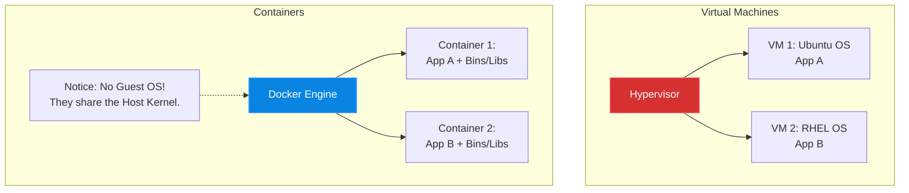

# Chapter 21 — The Container Revolution (Docker)

* **Difficulty:** Intermediate
* **Estimated Time:** 1.5 Hours
* **Hands-on Labs:** 1
* **Interview Questions:** 3

## Learning Objectives

By the end of this chapter, you will be able to:
* Explain the architectural difference between a Virtual Machine (Hypervisor) and a Container.
* Understand Linux Kernel Namespaces and Control Groups (Cgroups).
* Explain how containers solve the "Dependency Hell" problem.
* Install the Docker Engine and run your first container.

## Visual Architecture: VMs vs. Containers

For a decade, the standard way to deploy applications was using Virtual Machines. If you had an empty physical server, you installed a Hypervisor (like VMware), and then installed three separate, complete Operating Systems (Windows, Ubuntu, RHEL). Each VM had its own kernel, taking minutes to boot and consuming massive amounts of RAM just to stay alive.

**Containers** changed everything. Instead of virtualizing the hardware, containers virtualize the *Operating System*. A container uses the exact same Linux Kernel as the host machine, meaning it has zero boot-time and uses almost zero RAM.

## Theory & Concepts

### 1. Namespaces and Cgroups
Docker did not invent containers. Linux did. Docker is just a wrapper around two massive Linux kernel features:
* **Namespaces:** This provides isolation. A namespace lies to a process. When you run Apache in a container, the namespace tells Apache: "You are the only process running on this machine! Your PID is 1." 
* **Cgroups (Control Groups):** This provides resource limitation. A cgroup tells the kernel: "This specific container is never allowed to use more than 500MB of RAM, even if the physical server has 64GB."

### 2. Dependency Hell ("It works on my machine!")
The biggest problem in software engineering is dependencies. A developer writes an app on their Mac using Python 3.10 and specific libraries. They hand the code to the Support Engineer to deploy on the Ubuntu production server, which is running Python 3.8. The app crashes. 
The developer says, "It works on my machine!" 

### 3. The Container Solution
With containers, the developer does not just hand you the code. They hand you a fully packaged box (an Image) containing the code, Python 3.10, and all the required libraries. You drop that box onto the production server. Because the container is isolated in a namespace, it runs perfectly, completely ignoring the host's Python 3.8 installation.

## Scenario-Based Troubleshooting

### Scenario A: The Dependency Conflict
**The Incident:** The marketing team buys a new PHP 8.1 web application. They submit a ticket to the Support Engineer: "Please install this on the main web server."
The engineer logs into the main web server. It is currently hosting the company's critical legacy ERP system, which requires PHP 7.4. 

**The Investigation & Fix:**
1. The engineer knows that if they run `apt-get upgrade php`, the new marketing app will work, but the legacy ERP system will instantly crash because it is incompatible with PHP 8.1.
2. If they don't upgrade PHP, the marketing app cannot be installed. This is a classic Dependency Conflict.
3. The engineer refuses to touch the host operating system. Instead, they install Docker.
4. The engineer downloads a container image that contains PHP 8.1 and NGINX. 
5. They place the new marketing code inside the container and spin it up on Port 8080.
6. **The Result:** The host OS is still running PHP 7.4, keeping the legacy ERP system perfectly safe. Simultaneously, the new container is happily running PHP 8.1 in total isolation. The conflict is completely resolved without buying a second server!

> [!IMPORTANT]  
> **Best Practice: Never Upgrade the Host**  
> In a modern containerized environment, the Host OS (Ubuntu/RHEL) should be as empty as possible. You should *never* run `apt-get install python3` or `dnf install nginx` on the host. The host's only job is to run the Docker Engine. Everything else must live inside a container.

## Hands-on Lab

> [!TIP]
> **Practice Assignment Available**
> Proceed to the [Chapter 21 Practice Guide](../practice-files/V3-C21-practice.md) to install Docker and run your first isolated Ubuntu container!

## Interview Questions

### Question 1: What is the fundamental architectural difference between a Virtual Machine and a Container?
* **Target Answer**: "A Virtual Machine relies on a Hypervisor to emulate physical hardware, requiring a complete, heavy Guest Operating System (like Windows or Ubuntu) to boot up. A container relies on a Container Engine (like Docker) and virtualizes the Operating System level. Containers share the Host machine's Linux kernel directly, making them incredibly lightweight, with near-instant boot times and minimal RAM overhead."

### Question 2: How do containers solve the 'It works on my machine' problem?
* **Target Answer**: "Historically, code would work on a developer's laptop but fail in production due to different OS versions, conflicting libraries, or missing dependencies. Containers solve this by packaging the application code *together* with its exact runtime, libraries, and dependencies into a single, immutable Image. When that image runs on the production server, it executes in an isolated environment exactly as it did on the developer's laptop."

### Question 3: Explain the role of Namespaces and Cgroups in Linux containers.
* **Target Answer**: "Namespaces provide isolation. They trick the processes inside the container into believing they have their own dedicated filesystem, network stack, and process tree (PID 1), completely separate from the host. Cgroups (Control Groups) provide resource governance. They enforce hard limits on the amount of CPU, memory, and disk I/O a container is allowed to consume, preventing a single container from crashing the entire host."

## Chapter Summary

Containers have completely destroyed the traditional paradigm of server administration. We no longer treat servers as fragile pets that we carefully nurse with dependency updates. We treat servers as dumb, identical hosts whose only purpose is to run Docker.

## Completion Checklist

- [ ] I understand the difference between a Hypervisor and a Container Engine.
- [ ] I can explain what a Namespace and a Cgroup do.
- [ ] I understand why we should never install application dependencies on the Host OS.

---

## Navigation

⬅ Previous:
[Volume 3, Part 4: Infrastructure Services](../README.md)

🏠 Volume Contents:
[Table of Contents](../TOC.md)

➡ Next:
[Chapter 22 – Building Container Images (Dockerfiles)](V3-C22-building-images.md)
