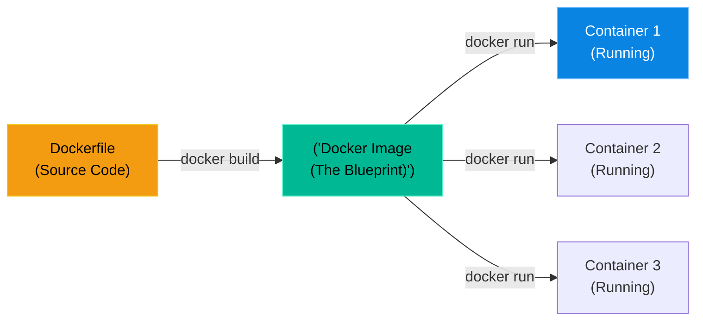

# Chapter 22 — Building Container Images (Dockerfiles)

* **Difficulty:** Intermediate
* **Estimated Time:** 1.5 Hours
* **Hands-on Labs:** 1
* **Interview Questions:** 3

## Learning Objectives

By the end of this chapter, you will be able to:
* Differentiate between a Docker Image and a Docker Container.
* Understand the anatomy of a `Dockerfile`.
* Build a custom image using `docker build`.
* Optimize the Image Layer Cache to drastically speed up build times.

## Visual Architecture: The Blueprint vs. The House

A common point of confusion is the difference between an Image and a Container.
* **The Image:** The blueprint. It is a static, read-only file sitting on your hard drive. It contains the OS, the binaries, and your code. It does nothing.
* **The Container:** The house. When you tell Docker to "run" an Image, Docker allocates RAM and CPU, creates a Namespace, and brings the Image to life. You can run 50 identical Containers from 1 single Image.



## Theory & Concepts

### 1. The Dockerfile Anatomy
To create a custom Image, you write a text file named `Dockerfile` (no extension). 
* `FROM ubuntu:26.04`: (Mandatory) The Base Image you are building upon.
* `RUN apt install -y nginx`: Executes a bash command during the build process to install software.
* `COPY ./index.html /var/www/html/`: Copies a file from your laptop into the image.
* `CMD ["nginx", "-g", "daemon off;"]`: The single command the container will execute when it starts. If this command stops, the container dies.

### 2. The Layer Cache
Docker builds images in "Layers". Each line in the Dockerfile is a new layer. 
If you run `docker build` a second time, Docker does not rebuild from scratch. It looks at the cache. If the line in the Dockerfile hasn't changed, it instantly loads that layer from the cache!

> [!IMPORTANT]  
> **Best Practice: The Cache Invalidation Rule**  
> If Layer 3 changes, Docker invalidates the cache for Layer 3 **AND EVERY LAYER BELOW IT**. Therefore, you must always put commands that change frequently (like `COPY ./code`) at the absolute bottom of the Dockerfile, and commands that change rarely (like `RUN apt install`) at the absolute top!

## Scenario-Based Troubleshooting

### Scenario A: The Broken Cache
**The Incident:** A junior developer is containerizing a Python application. They submit a ticket to DevOps complaining that their laptop is incredibly slow. "Every time I fix a typo in my Python code and run `docker build`, it takes 15 minutes to finish!"

**The Investigation & Fix:**
1. The Support Engineer asks to see the developer's `Dockerfile`. It looks like this:
   ```dockerfile
   FROM python:3.10
   COPY . /app
   WORKDIR /app
   RUN pip install -r requirements.txt
   CMD ["python", "main.py"]
   ```
2. The engineer immediately sees the problem. The developer put the `COPY . /app` command (which copies their Python code) at the top of the file!
3. Because the developer is constantly changing their Python code, the `COPY` layer is different every single time they type `docker build`.
4. Because the `COPY` layer changed, Docker invalidates the cache for *all subsequent layers*. It is being forced to completely reinstall all the massive Python dependencies (`pip install -r requirements.txt`) every single time the developer fixes a typo!
5. The engineer rewrites the `Dockerfile` to optimize the cache:
   ```dockerfile
   FROM python:3.10
   WORKDIR /app
   COPY requirements.txt /app/
   RUN pip install -r requirements.txt
   COPY . /app
   CMD ["python", "main.py"]
   ```
6. **The Result:** Now, the expensive `pip install` happens *before* the Python code is copied. When the developer changes their code, only the final `COPY . /app` layer is rebuilt. The build time drops from 15 minutes to 0.5 seconds.

## Hands-on Lab

> [!TIP]
> **Practice Assignment Available**
> Proceed to the [Chapter 22 Practice Guide](../practice-files/V3-C22-practice.md) to write a Dockerfile and build a custom NGINX image!

## Interview Questions

### Question 1: What is the difference between a Docker Image and a Docker Container?
* **Target Answer**: "A Docker Image is a static, read-only template that contains the application code, libraries, and system tools required to run a piece of software. A Docker Container is the active, running instance of that Image. You can spin up multiple independent Containers from a single Image."

### Question 2: Explain the purpose of the `CMD` instruction in a Dockerfile.
* **Target Answer**: "The `CMD` instruction defines the default executable or process that should run when the container starts. A container's entire lifespan is tied to the PID 1 process defined in the `CMD`. If that specific process exits or crashes, the entire container immediately shuts down."

### Question 3: A developer's `docker build` process takes 10 minutes because the `RUN apt install` command executes every single time, even when they only modified one line of their HTML code. How do you fix the Dockerfile?
* **Target Answer**: "The developer has likely placed the `COPY` instruction for their HTML code *above* the `RUN apt install` instruction in the Dockerfile. Because Docker caches layers sequentially, changing the HTML code invalidates the cache for the `COPY` layer and every layer beneath it. The fix is to move the `COPY` instruction to the bottom of the Dockerfile so that the static software installation layers can remain cached."

## Chapter Summary

Writing a Dockerfile is easy. Writing a *good* Dockerfile is hard. Understanding how the layer cache operates is the difference between a CI/CD pipeline that finishes in 30 seconds and one that takes 30 minutes.

## Completion Checklist

- [ ] I understand the difference between an Image and a Container.
- [ ] I can explain the `FROM`, `RUN`, `COPY`, and `CMD` commands.
- [ ] I know how to order a Dockerfile to optimize the layer cache.

---

## Navigation

⬅ Previous:
[Chapter 21 – The Container Revolution (Docker)](V3-C21-container-revolution.md)

🏠 Volume Contents:
[Table of Contents](../TOC.md)

➡ Next:
[Chapter 23 – Multi-Container Apps (Docker Compose)](V3-C23-docker-compose.md)
