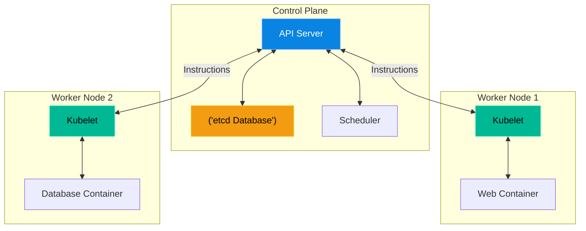

# Chapter 1 — Kubernetes Architecture & The Control Plane

* **Difficulty:** Advanced
* **Estimated Time:** 1.5 Hours
* **Hands-on Labs:** 1
* **Interview Questions:** 3

## Learning Objectives

By the end of this chapter, you will be able to:
* Explain the physical difference between the Control Plane and Worker Nodes.
* Understand the core components: API Server, etcd, Scheduler, and Kubelet.
* Explain what happens when a node loses network connectivity.
* Use `kubectl` to query the status of a cluster.

## Visual Architecture: The Master and the Workers

In Volume 3, you managed Docker on a single server. In Kubernetes (often abbreviated as **K8s**), you manage a "Cluster" of many servers (Nodes). 
Nodes are strictly divided into two roles:
1. **The Control Plane (Master Nodes):** The brain. These servers do not run your application code. They make decisions (like scheduling) and store the state of the cluster.
2. **Worker Nodes:** The muscle. These servers run your actual application containers. 

## Theory & Concepts

### 1. The Control Plane Components
* **Kube-API Server:** The absolute center of the universe. Every single command you run, and every internal component, must talk exclusively to the API Server. No component talks directly to another.
* **etcd:** A highly-available Key-Value store. It is the *only* place where Kubernetes stores state. If you lose your `etcd` data, you lose your entire cluster.
* **Kube-Scheduler:** Watches the API Server for newly created Pods that have no Node assigned. It calculates which Worker Node has enough CPU/RAM and assigns the Pod to it.

### 2. The Worker Node Components
* **Kubelet:** The agent that runs on every single Worker Node. It listens to the API Server. If the API Server says, "Run an NGINX container," the Kubelet instructs the local container engine (like containerd) to start it.
* **Kube-proxy:** Maintains network rules on the node, allowing network communication to your Pods from network sessions inside or outside of your cluster.

### 3. The Command Line Tool (`kubectl`)
You do not SSH into Kubernetes servers to start containers. Instead, you sit on your local laptop and use the `kubectl` CLI tool. It sends REST API requests securely over the internet to the Kube-API Server.

## Scenario-Based Troubleshooting

### Scenario A: The Split Brain
**The Incident:** A company has a Kubernetes cluster with 1 Control Plane node and 3 Worker Nodes. A network switch fails, completely severing the connection between the Control Plane and Worker Node #3. The applications on Worker Node #3 are still running perfectly and serving customer traffic, but the engineer notices something strange when running `kubectl get nodes`. Worker Node #3 says `NotReady`. 

**The Investigation & Fix:**
1. The Support Engineer understands Kubernetes architecture. `kubectl` talks to the API Server. The API Server talks to the `kubelet` on Worker Node #3.
2. Because the network switch died, the API Server cannot hear the `kubelet`'s heartbeat. After 5 minutes, the Control Plane officially marks Node #3 as "Dead".
3. **The Orchestration Magic:** Because the Control Plane thinks the node is dead, it assumes all the web containers on Node #3 are also dead. The Control Plane immediately tells the Scheduler to spin up replacement containers on Worker Nodes #1 and #2!
4. The engineer fixes the physical network switch. 
5. Worker Node #3 re-establishes communication with the API Server. The API Server realizes it now has *too many* web containers running, and gracefully deletes the extras to return the cluster to the desired state. 
6. Total customer downtime: 0 seconds.

> [!IMPORTANT]  
> **Best Practice: Control Plane High Availability**  
> In the scenario above, the Control Plane was fine, so it could heal the cluster. But what if the single Control Plane node died? The Worker Nodes would keep running the apps, but the cluster could no longer self-heal, scale, or accept new deployments. For production, you must *always* run an odd number of Control Plane nodes (usually 3 or 5) to establish an `etcd` quorum and prevent a total administrative lockout.

## Hands-on Lab

> [!TIP]
> **Practice Assignment Available**
> Proceed to the [Chapter 1 Practice Guide](../practice-files/V4-C01-practice.md) to install `kubectl` and query a theoretical cluster!

## Interview Questions

### Question 1: What is the role of `etcd` in a Kubernetes cluster?
* **Target Answer**: "`etcd` is a distributed, highly-available key-value store used as Kubernetes' backing store for all cluster data. It holds the absolute "Source of Truth" (the desired state) of the cluster. If the data in `etcd` is corrupted or lost, the Control Plane cannot function."

### Question 2: A developer says "I SSH'd into the Kubernetes node to restart the container, but it didn't work." What architectural principle did they violate?
* **Target Answer**: "In Kubernetes, you should never manually SSH into a Worker Node to manipulate containers. The `kubelet` manages the state of the node based *only* on instructions from the API Server. If you manually kill or start a container via SSH, the `kubelet` will detect the drift from the API Server's desired state and immediately reverse your changes. All commands must be sent via `kubectl` to the API Server."

### Question 3: Explain the interaction between the API Server, the Scheduler, and the Kubelet when deploying a new application.
* **Target Answer**: "1. The engineer sends a YAML deployment to the API Server via `kubectl`. 2. The API Server writes this desired state to `etcd`. 3. The Scheduler notices a new pending Pod, finds a suitable Worker Node with enough resources, and tells the API Server its decision. 4. The `kubelet` on that specific Worker Node sees the API Server's update, downloads the container image, and starts the application."

## Chapter Summary

Kubernetes is not magic; it is simply a highly complex control loop. The API Server writes down what you *want*, and the Kubelets constantly work to make reality match that written desire. 

## Completion Checklist

- [ ] I understand the separation between the Control Plane and Worker Nodes.
- [ ] I know the roles of the API Server, Scheduler, and `etcd`.
- [ ] I understand why we use `kubectl` instead of SSH.

---

## Navigation

⬅ Previous:
[Volume 3: Enterprise Linux Services](../README.md)

🏠 Volume Contents:
[Table of Contents](../TOC.md)

➡ Next:
[Chapter 2 – Pods, Deployments, & ReplicaSets](V4-C02-deployments.md)
