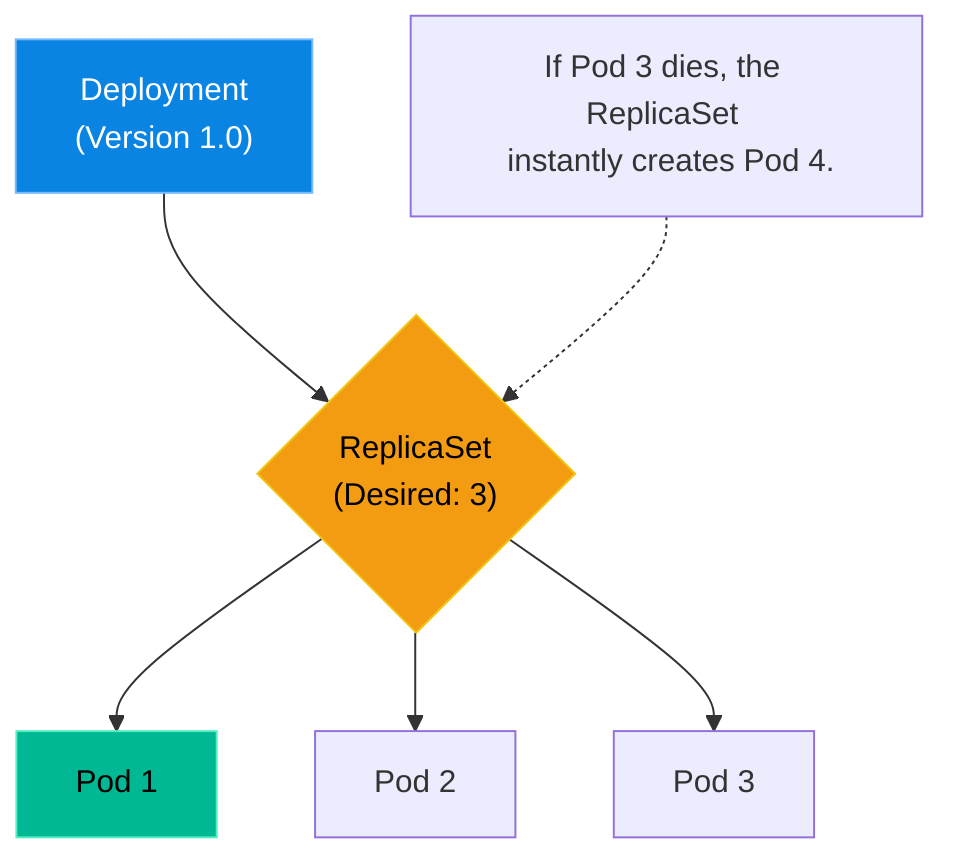

# Chapter 2 — Pods, Deployments, & ReplicaSets

## Learning Objectives

Deployments are the lifeblood of Kubernetes applications. In this chapter, we explore how to safely roll out updates and instantly roll back when things go wrong, ensuring zero downtime.

By the end of this chapter, you will be able to:
* Define a Pod and explain why Kubernetes uses them instead of bare containers.
* Understand the hierarchy of Deployments -> ReplicaSets -> Pods.
* Explain the concept of a Zero-Downtime Rolling Update.
* Execute a rollback using `kubectl rollout undo`.

## Visual Architecture: The Kubernetes Hierarchy

In Docker, you manage Containers directly. In Kubernetes, you almost never manage Containers directly. You manage them through a strict hierarchy of higher-level abstractions.

1. **The Pod:** The smallest deployable unit in Kubernetes. A Pod is a "wrapper" that usually contains one Container (e.g., an NGINX container), but it *can* contain multiple containers that share the exact same IP address and storage volume. 

2. **The ReplicaSet:** You never create a Pod manually. You create a ReplicaSet. You tell it, "I want 3 NGINX Pods." If a Pod dies, the ReplicaSet instantly creates a new one to maintain the number 3.

3. **The Deployment:** You never create a ReplicaSet manually! You create a Deployment. A Deployment manages ReplicaSets and allows for zero-downtime updates (Rollouts).



## Theory & Concepts

### 1. Why Pods?
Why did Google invent the Pod? Because sometimes two containers need to be glued together tightly. For example, you have a Web Container, and you have a Logging Container that reads the Web Container's files and ships them to Elasticsearch. By putting both containers inside a single Pod, they are guaranteed to be scheduled on the exact same physical server, sharing the same `localhost` network namespace and file volumes.

### 2. The Rolling Update
When you update a Deployment from Version 1.0 to Version 2.0, Kubernetes does not destroy all the old Pods at once. That would cause a total outage!
Instead, the Deployment creates a *new* ReplicaSet for Version 2.0. It spins up one V2 Pod. Once that Pod is healthy, it destroys one V1 Pod. It repeats this process one by one until all Pods are V2. This is a **Zero-Downtime Rolling Update**.

### 3. Declarative YAML
In Kubernetes, you do not type imperative commands like `kubectl run nginx --replicas=3`. You write a declarative YAML file that states your exact desired reality, and you apply it: `kubectl apply -f deployment.yaml`. The API Server handles the rest.

## Scenario-Based Troubleshooting

### Scenario A: The Botched Update

> [!IMPORTANT]  
> **Incident Report: The Botched Update**  
> **Reporter:** Automated Monitoring / End User  
> **The Incident:** It is 2:00 PM on a Tuesday. The developers want to release Version 2.0 of the company's main Python application. The Support Engineer updates the `deployment.yaml` file to use `image: python-app:v2.0` and applies it.
Kubernetes successfully executes a Rolling Update. However, 5 minutes later, customer support lines light up. The new V2 code has a fatal bug causing the checkout cart to crash!


**The Investigation (Single Engineer Diagnosis):**

1. In the old Virtual Machine days, the engineer would have to frantically search for the old V1 code, recompile it, and figure out how to manually install it over the broken V2 code, taking hours.

2. Because the engineer is using Kubernetes Deployments, this is trivial. The Deployment automatically kept the old V1 ReplicaSet paused in the background.

3. The engineer simply types:

    > **👨‍🔧 Support Engineer executes:**
    > ```bash
    > $ kubectl rollout undo deployment python-app
    > deployment.apps/python-app rolled back
    > ```

4. **The Orchestration Magic:** Kubernetes instantly spins the V1 ReplicaSet back up and gracefully terminates the broken V2 Pods. 
5. Within 15 seconds, the entire application is reverted to the stable V1 code. The checkout cart works again. The engineer tells the developers to fix their code in a staging environment.

> [!IMPORTANT]  
> **Best Practice: Never Use 'Latest'**  
> In your Deployment YAML, never use `image: nginx:latest`. If a Pod crashes and the Kubelet tries to restart it, it will reach out to Docker Hub and pull whatever the absolute newest version of NGINX is on that specific day. This can introduce breaking changes silently. Always pin your versions (e.g., `image: nginx:1.21.4`).

## Hands-on Lab

> [!TIP]
> **Practice Assignment Available**
> Proceed to the [Chapter 2 Practice Guide](../practice-files/V4-C02-practice.md) to deploy a ReplicaSet, kill a Pod manually, and watch Kubernetes self-heal!

## Interview Questions

### Question 1: What is the difference between a Pod and a Container?
* **Target Answer**: "A Container is the actual isolated process running the application code (like Docker). A Pod is a Kubernetes abstraction that wraps one or more containers. Containers within the same Pod share the same network namespace (they can communicate via `localhost`) and can share storage volumes. Kubernetes schedules Pods, not containers."

### Question 2: Why should you create a Deployment instead of creating Pods manually?
* **Target Answer**: "If you create a Pod manually and the physical node dies, the Pod is permanently gone. A Deployment manages a ReplicaSet, which constantly monitors the cluster to ensure the exact requested number of Pods are running. Furthermore, Deployments allow for zero-downtime rolling updates and instant rollbacks to previous versions."

### Question 3: Describe the process of a Zero-Downtime Rolling Update in Kubernetes.
* **Target Answer**: "When a Deployment is updated with a new image version, it creates a new ReplicaSet. It then scales up the new ReplicaSet by one Pod, waits for it to become healthy, and scales down the old ReplicaSet by one Pod. It repeats this process sequentially until the old ReplicaSet is at zero and the new ReplicaSet is fully scaled, ensuring the application remains available to users throughout the entire update."

## Chapter Summary

Kubernetes shifts the burden of availability from the engineer to the software. By declaring what you want in a Deployment YAML, you guarantee that Kubernetes will fight aggressively to maintain that state, even in the face of hardware failure or botched code updates.

## Completion Checklist

- [ ] I understand the Pod -> ReplicaSet -> Deployment hierarchy.
- [ ] I understand why multiple containers might share a Pod.
- [ ] I can explain how a rolling update prevents downtime.

---

## Navigation

⬅ Previous:
[Chapter 1 – Kubernetes Architecture & The Control Plane](V4-C01-k8s-architecture.md)

🏠 Volume Contents:
[Table of Contents](../TOC.md)

➡ Next:
[Chapter 3 – Kubernetes Networking](V4-C03-k8s-networking.md)
