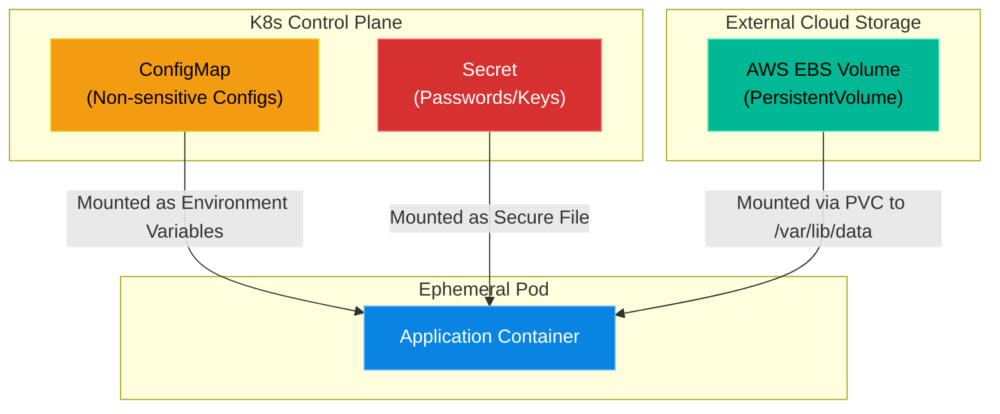

# Chapter 4 — Stateful Applications in K8s

## Learning Objectives

Containers are ephemeral, but databases are forever. In this chapter, we tackle the complexities of StatefulSets and PersistentVolumes, ensuring data survives even when Pods die.

By the end of this chapter, you will be able to:
* Explain the difference between Stateless and Stateful applications.
* Define PV (PersistentVolume) and PVC (PersistentVolumeClaim).
* Decouple configuration from code using ConfigMaps.
* Securely inject sensitive data into Pods using K8s Secrets.

## Visual Architecture: Decoupling State from Compute

In Volume 3, we learned that containers are ephemeral. If a database container dies, you lose its data unless you attach a Volume. 
Kubernetes takes this concept further. Because Pods can be scheduled on *any* node in the cluster at any time, local hard drives are basically useless. Kubernetes forces you to fully decouple your Data (State) and your Configuration from the actual compute Pods. 



## Theory & Concepts

### 1. PV and PVC
* **PersistentVolume (PV):** A piece of physical storage in the cluster (like an NFS share or an AWS EBS volume). It exists independently of any Pod.
* **PersistentVolumeClaim (PVC):** A request for storage by a user. A developer writes a PVC saying, "I need 10GB of fast SSD." The K8s Control Plane automatically finds a matching PV and binds them together. The Pod then mounts the PVC. If the Pod dies, the PVC and PV remain completely safe.

### 2. ConfigMaps
Applications often behave differently depending on the environment. In Dev, the logging level should be `DEBUG`. In Prod, the logging level should be `ERROR`. 
Instead of building two different Docker images, you build one image and inject a **ConfigMap**. The ConfigMap acts as a dictionary of key-value pairs that are injected into the Pod at runtime as Environment Variables or configuration files.

### 3. Secrets
A K8s Secret is exactly like a ConfigMap, but it is meant for sensitive data (API keys, database passwords). Kubernetes base64-encodes the data and stores it securely in `etcd`. 

## Scenario-Based Troubleshooting

### Scenario A: The Hardcoded Secret

> [!IMPORTANT]  
> **Incident Report: The Hardcoded Secret**  
> **Reporter:** Automated Monitoring / End User  
> **The Incident:** A security auditor is reviewing the company's GitHub repository. They discover that a junior developer committed a file named `database-deployment.yaml`. Inside the file, under the environment variables section, the auditor finds: `DB_PASSWORD: "SuperSecretAdminPassword123"`. 
This is a massive security violation. Anyone with read access to the GitHub repository now has the production database password.


**The Investigation (Single Engineer Diagnosis):**

1. The Support Engineer (You) is tasked with fixing the vulnerability.

2. The engineer immediately rotates the database password.

3. The engineer removes the hardcoded password from the `database-deployment.yaml` file. 
4. The engineer creates a Kubernetes Secret object directly in the cluster:
    `kubectl create secret generic db-passwords --from-literal=DB_PASSWORD='NewSecurePassword456'`
5. The engineer modifies the `database-deployment.yaml` file to reference the Secret, rather than hardcoding it:

    ```yaml
    env:
     - name: DB_PASSWORD
       valueFrom:
         secretKeyRef:
           name: db-passwords
           key: DB_PASSWORD

    ```
6. **The Result:** The YAML file in GitHub is now completely safe. It simply tells Kubernetes, "Go find the Secret named `db-passwords` and inject it." The actual password lives securely inside the encrypted `etcd` database of the Kubernetes Control Plane.

> [!CAUTION]  
> **Best Practice: Secrets are not Encrypted by Default**  
> Kubernetes Secrets are base64-encoded, *not* encrypted. Anyone with `kubectl` access to the namespace can easily decode them by running `echo "password" | base64 --decode`. In true enterprise environments, you must configure Encryption at Rest for the `etcd` database, or use an external KMS (Key Management Service) like HashiCorp Vault.

## Hands-on Lab

> [!TIP]
> **Practice Assignment Available**
> Proceed to the [Chapter 4 Practice Guide](../practice-files/V4-C04-practice.md) to create a K8s Secret and securely mount it into a Pod!

## Interview Questions

### Question 1: What is the difference between a PersistentVolume (PV) and a PersistentVolumeClaim (PVC)?
* **Target Answer**: "A PersistentVolume (PV) is the actual physical storage resource in the cluster, such as an AWS EBS volume or an NFS share, provisioned by the cluster administrator. A PersistentVolumeClaim (PVC) is a request made by a developer/user for a specific amount of storage and access mode. Kubernetes dynamically binds the PVC to an available PV, allowing a Pod to mount the PVC and safely write data independent of the Pod's lifecycle."

### Question 2: Why should you use a ConfigMap instead of hardcoding environment variables directly into a Dockerfile or Pod YAML?
* **Target Answer**: "ConfigMaps allow you to completely decouple application configuration from the container image. This means you can use the exact same Docker image across Dev, Staging, and Production environments, simply by mounting a different ConfigMap in each cluster. Hardcoding variables into a Dockerfile would require rebuilding the image for every environment change."

### Question 3: A developer commits a Kubernetes Secret YAML file containing `password: bXlfc2VjcmV0` to a public GitHub repository. They claim it is secure because it is encrypted. Are they correct?
* **Target Answer**: "No, they are fundamentally incorrect. Kubernetes Secrets are base64-encoded, which is a data formatting scheme, not an encryption algorithm. Anyone who finds that string can easily decode it back to plain text (`my_secret`). Secrets should never be committed to source control in plain text or base64 format."

## Chapter Summary

The true power of Kubernetes is decoupling. By strictly separating Compute (Pods), Networking (Services), Configuration (ConfigMaps), Secrets, and Storage (PVCs), you create highly modular architectures that can survive almost any infrastructure failure.

## Completion Checklist

- [ ] I understand how PVs and PVCs interact.
- [ ] I understand the purpose of a ConfigMap.
- [ ] I know why Secrets should never be hardcoded into Deployment YAMLs.

---

## Navigation

⬅ Previous:
[Chapter 3 – Kubernetes Networking](V4-C03-k8s-networking.md)

🏠 Volume Contents:
[Table of Contents](../TOC.md)

➡ Next:
[Chapter 5 – Helm & Package Management](V4-C05-helm-package-manager.md)
