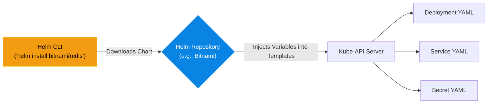

# Chapter 5 — Helm & Package Management

## Learning Objectives

Writing raw YAML files for complex applications is tedious and error-prone. In this chapter, we introduce Helm, the package manager that simplifies Kubernetes deployments through templating.

By the end of this chapter, you will be able to:
* Explain the problem with managing raw Kubernetes YAML files at scale.
* Define what a Helm Chart is.
* Install external Helm Repositories.
* Deploy complex third-party software using `helm install`.

## Visual Architecture: The Kubernetes Package Manager

In Linux, if you want to install NGINX, you do not write a massive configuration file from scratch. You run `apt install nginx`. 
In Kubernetes, deploying a production-ready application requires writing a Deployment YAML, a Service YAML, a ConfigMap YAML, a Secret YAML, and a PVC YAML. This can easily total 500 lines of code. 

**Helm** is the package manager for Kubernetes. A "Helm Chart" is a pre-packaged bundle of YAML templates. Instead of writing 500 lines of code to deploy Redis, you simply run `helm install my-redis bitnami/redis`.

## Theory & Concepts

### 1. The Helm Chart Structure
A Helm Chart is simply a directory containing two main things:

1. **Templates:** YAML files with blanks in them (e.g., `replicas: {{ .Values.replicaCount }}`).

2. **`values.yaml`:** A single file containing the default values to fill in those blanks (e.g., `replicaCount: 3`).

### 2. Overriding Values
The true power of Helm is customization without touching the core code. If you download a public Helm Chart for WordPress, but you want 5 replicas instead of the default 1, you do not edit the public templates. You simply pass a custom values file during installation: 
`helm install my-blog bitnami/wordpress -f my-custom-values.yaml`

### 3. Upgrades and Rollbacks
Helm keeps a history of everything you deploy (called a Release). If you upgrade a Helm Chart to a new version and it breaks, you can instantly revert the entire architecture (the Deployments, Services, ConfigMaps, and Secrets) back to the previous state with a single command: `helm rollback my-blog`.

## Scenario-Based Troubleshooting

### Scenario A: The Tedious Deployment

> [!IMPORTANT]  
> **Incident Report: The Tedious Deployment**  
> **Reporter:** Automated Monitoring / End User  
> **The Incident:** The CTO requests that the engineering team deploy Prometheus and Grafana into the new Kubernetes cluster. A junior engineer spends three days reading documentation and writing 15 different YAML files (Deployments, Services, ClusterRoles, ServiceAccounts) to get it working. They finally succeed and present it to the Senior Support Engineer for review.

**The Investigation (Single Engineer Diagnosis):**

1. The Senior Engineer looks at the 1,500 lines of raw YAML code. "This is great for learning," they say, "but who is going to maintain this? When Prometheus releases a new version next month, you'll have to manually update 15 files."

2. The Senior Engineer deletes the junior's manual YAML files from the cluster.

3. They install Helm on their laptop.
4. They add the official Prometheus community repository:
    `helm repo add prometheus-community https://prometheus-community.github.io/helm-charts`
5. They deploy the entire stack in one command:
    `helm install my-monitoring prometheus-community/kube-prometheus-stack`
6. **The Result:** Within 60 seconds, Helm deploys the exact same 15 YAML resources, perfectly configured by the maintainers of Prometheus themselves. The junior engineer realizes they wasted three days doing manual labor that a package manager could do in one minute.

> [!IMPORTANT]  
> **Best Practice: Never Reinvent the Wheel**  
> If you are deploying third-party software (like Redis, Postgres, GitLab, or Jenkins) into Kubernetes, *always* look for an official Helm Chart first. Do not write manual YAML files for software you did not create. The creators of the software maintain the Helm Chart, embedding all their security and performance best practices directly into the templates.

## Hands-on Lab

> [!TIP]
> **Practice Assignment Available**
> Proceed to the [Chapter 5 Practice Guide](../practice-files/V4-C05-practice.md) to install Helm and deploy an entire Apache web stack with one command!

## Interview Questions

### Question 1: What problem does Helm solve in a Kubernetes environment?
* **Target Answer**: "Deploying complex applications into Kubernetes requires managing dozens of interdependent YAML files (Deployments, Services, RBAC, PVCs). Helm solves this by acting as a package manager. It bundles these YAML files into a single 'Chart', utilizing templates and variables to allow engineers to deploy, upgrade, and rollback massive architectures with a single CLI command."

### Question 2: Explain the relationship between Helm Templates and the `values.yaml` file.
* **Target Answer**: "Helm Templates are generic YAML manifests with placeholder variables instead of hardcoded values. The `values.yaml` file is a central configuration file containing the actual data (like replica counts, image tags, and passwords). During deployment, the Helm engine merges the `values.yaml` data into the Templates to generate the final, valid Kubernetes manifests."

### Question 3: Why is it considered a Best Practice to use official Helm Charts for third-party software instead of writing your own YAML?
* **Target Answer**: "Official Helm Charts are maintained by the creators of the software or large open-source communities. They embed years of production experience, security hardening, and optimal configurations into the chart. Writing your own YAML for third-party software is 'reinventing the wheel' and dramatically increases the risk of misconfiguration and operational overhead."

## Chapter Summary

Helm bridges the gap between infrastructure engineers and software consumers. It allows you to treat a massive, highly-available, 15-component distributed architecture as a single, easily installable package. 

## Completion Checklist

- [ ] I understand what a Helm Chart is.
- [ ] I understand how the `values.yaml` file works.
- [ ] I know why we use Helm instead of manual YAML for third-party apps.

---

## Navigation

⬅ Previous:
[Chapter 4 – Stateful Applications in K8s](V4-C04-stateful-apps.md)

🏠 Volume Contents:
[Table of Contents](../TOC.md)

➡ Next:
[Volume 4, Part 2: Infrastructure as Code (Automation at Scale) *[Planned]*](#)
