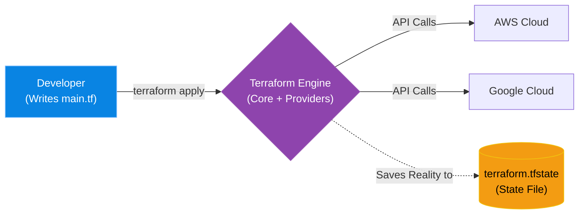

# Chapter 6 — Introduction to IaC & Terraform

* **Difficulty:** Intermediate
* **Estimated Time:** 1.5 Hours
* **Hands-on Labs:** 1
* **Interview Questions:** 3

## Learning Objectives

By the end of this chapter, you will be able to:
* Define Infrastructure as Code (IaC).
* Differentiate between "Click-Ops" and Declarative configuration.
* Understand the purpose of a Terraform Provider.
* Explain the critical importance of the `.tfstate` file.

## Visual Architecture: The End of Click-Ops

For decades, SysAdmins built infrastructure by logging into a web console (like AWS or vSphere) and manually clicking buttons to create Virtual Machines and Networks. This is mockingly called "Click-Ops". 
**Infrastructure as Code (IaC)** replaces the mouse with a keyboard. You write a text file describing your desired infrastructure. You hand the file to a tool like **Terraform**, and it automatically sends the correct API calls to the cloud provider to build it exactly as written.

## Theory & Concepts

### 1. HashiCorp Terraform
Terraform, created by HashiCorp, is the undisputed industry standard for IaC. It uses a declarative language called HCL (HashiCorp Configuration Language). 
* **Declarative:** You state *what* you want (e.g., "I want 3 Ubuntu VMs"). You do not tell Terraform *how* to build them. Terraform figures out the API calls required to achieve that reality.

### 2. Providers
Terraform itself is just a core engine. To talk to AWS, you must download the AWS "Provider". To talk to VMware, you download the VMware "Provider". A Provider is simply a plugin containing the translation logic to turn your HCL code into the specific API calls required by that vendor.

### 3. The State File (`.tfstate`)
This is the most critical concept in Terraform. When you run `terraform apply`, Terraform builds your servers and then writes a JSON file called `terraform.tfstate` to your hard drive. 
This file is the mapping between your local code and the real world. If you change your code to "4 VMs" and run `apply` again, Terraform reads the state file, realizes 3 VMs already exist, and knows it only needs to create 1 new VM.

## Scenario-Based Troubleshooting

### Scenario A: The Click-Ops Disaster
**The Incident:** A junior engineer is tasked with deleting an unused "Sandbox" network in the AWS web console. They log in, find a VPC, and click delete. Unfortunately, they were in the wrong AWS region. They just deleted the entire European Production VPC. 
All European web servers, databases, and subnets are instantly destroyed. The company is losing $10,000 a minute.

**The Investigation & Fix:**
1. If the infrastructure had been built using "Click-Ops", the Senior Engineer would have to frantically try to remember exactly how the network was configured. They would spend hours manually clicking through the AWS console to recreate 5 subnets, 3 route tables, and 12 security groups.
2. Fortunately, the infrastructure was built using Terraform!
3. The Senior Engineer opens their laptop and navigates to the `eu-prod-network` directory. 
4. The engineer types:
   `terraform apply`
5. **The Orchestration Magic:** Terraform reads the `.tfstate` file, compares it to the reality in AWS, and realizes the entire VPC is missing. Terraform instantly generates an execution plan to recreate all 50 network components in the exact, perfect order required by AWS.
6. The engineer types `yes`.
7. Within 3 minutes, the entire production network is rebuilt flawlessly. The downtime was minimal, and no human error was introduced during the recovery.

> [!IMPORTANT]  
> **Best Practice: Never Touch the Console**  
> Once a resource is managed by Terraform, you must *never* modify it via the web console. If you change a security group rule in the AWS console, Terraform will not know about it. The next time you run `terraform apply`, Terraform will see a discrepancy between the real world and your `.tfstate` file, and it will aggressively overwrite your manual changes to force reality back to match the code.

## Hands-on Lab

> [!TIP]
> **Practice Assignment Available**
> Proceed to the [Chapter 6 Practice Guide](../practice-files/V4-C06-practice.md) to install the Terraform CLI and write your first configuration using the Local Provider!

## Interview Questions

### Question 1: What is the difference between Declarative and Imperative configuration?
* **Target Answer**: "Imperative configuration is a step-by-step list of commands (e.g., a Bash script that runs `aws ec2 run-instances`, then `aws ec2 create-tags`). Declarative configuration (like Terraform) simply defines the final desired end-state (e.g., 'I want one EC2 instance with these tags'). The Terraform engine calculates the difference between reality and the desired state, and automatically executes the necessary commands to achieve it."

### Question 2: Why is the `terraform.tfstate` file critical, and what happens if you delete it?
* **Target Answer**: "The state file acts as the source of truth that maps the declarative Terraform code to the actual physical resources in the cloud. If you delete the state file, Terraform suffers amnesia. It still has your code, and the cloud resources still exist, but Terraform no longer knows it owns them. If you run `terraform apply` again, it will attempt to create brand new duplicate resources, causing massive errors and conflicts."

### Question 3: A team member modifies a Terraform-managed Security Group directly in the AWS Web Console. What happens during the next `terraform apply`?
* **Target Answer**: "This is known as 'Configuration Drift'. During the `apply` phase, Terraform will refresh its state by querying the AWS API. It will detect that the reality in AWS no longer matches the desired state defined in the `.tf` code. Because Terraform is declarative, it will automatically overwrite or delete the manual console changes to force the Security Group back into alignment with the code."

## Chapter Summary

Infrastructure as Code treats datacenters like software. By defining your networks and servers in text files, you gain the ability to version control your infrastructure in Git, review changes before they happen, and recover from catastrophic disasters in minutes.

## Completion Checklist

- [ ] I understand the dangers of "Click-Ops".
- [ ] I can explain what a Terraform Provider is.
- [ ] I understand the purpose and fragility of the `.tfstate` file.

---

## Navigation

⬅ Previous:
[Volume 4, Part 1: The Kubernetes Ecosystem](../README.md)

🏠 Volume Contents:
[Table of Contents](../TOC.md)

➡ Next:
[Chapter 7 – Provisioning Cloud Resources](V4-C07-cloud-provisioning.md)
