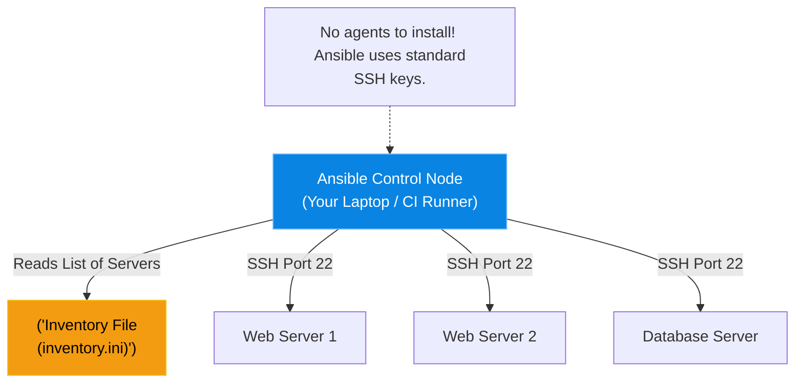

# Chapter 8 — Configuration Management at Scale

* **Difficulty:** Intermediate
* **Estimated Time:** 1.5 Hours
* **Hands-on Labs:** 1
* **Interview Questions:** 3

## Learning Objectives

By the end of this chapter, you will be able to:
* Differentiate between Infrastructure Provisioning (Terraform) and Configuration Management (Ansible).
* Explain Ansible's "Agentless" architecture.
* Define an Ansible Inventory file.
* Execute Ansible Ad-Hoc commands across multiple servers simultaneously.

## Visual Architecture: The Agentless Automator

If Terraform's job is to ask AWS for 50 blank Ubuntu servers, **Ansible's** job is to log into those 50 servers and install NGINX on them. 
Other configuration management tools (like Puppet or Chef) require you to install a heavy "Agent" daemon on every single server you want to manage. Ansible is **Agentless**. It only requires Python and SSH. The central Ansible controller simply SSHs into the remote servers, executes Python scripts, and logs out. 



## Theory & Concepts

### 1. The Inventory (`inventory.ini`)
Before Ansible can do anything, it needs to know *who* it is managing. You create an Inventory file grouping your IP addresses together.
```ini
[webservers]
192.168.1.10
192.168.1.11

[databases]
192.168.1.50
```

### 2. Ad-Hoc Commands
Sometimes you don't need a massive script; you just need to do one thing very quickly on 50 servers. You can use the `ansible` CLI to run Ad-Hoc commands. 
For example, to check the uptime of every web server in your inventory:
`ansible webservers -a "uptime" -u root`

### 3. Ansible Modules
Ansible doesn't just run raw bash commands. It uses **Modules**. Modules are pre-written Python scripts that abstract away the underlying OS. 
If you want to install Apache, you don't write `apt install apache2` (which would fail on RHEL). You use the `package` module: 
`ansible webservers -m package -a "name=apache2 state=present"`

## Scenario-Based Troubleshooting

### Scenario A: The Mass Password Rotation
**The Incident:** The Chief Information Security Officer (CISO) bursts into the NOC. A disgruntled system administrator was just fired. The CISO demands that the root password on all 500 company Linux servers be rotated immediately. 

**The Investigation & Fix:**
1. A Junior Sysadmin groans. "It takes me about 2 minutes to SSH into a server, run `passwd`, generate a secure string, and log out. 500 servers will take me 16 hours. I'll get some coffee."
2. The Senior DevOps Engineer laughs. "Sit down. We use Ansible."
3. The Senior Engineer opens their laptop. They already have an `inventory.ini` file that contains the IP addresses of all 500 servers.
4. They generate a secure hashed password. 
5. They run a single ad-hoc Ansible command, utilizing the `user` module:
   `ansible all -m user -a "name=root password='$6$HASHED_PASSWORD'" --become`
6. **The Orchestration Magic:** Ansible instantly initiates 500 concurrent SSH connections to all the servers. It executes the Python user module, rotates the password, and logs out. 
7. **The Result:** The entire 500-server fleet is secured in exactly 12 seconds. The CISO is thrilled.

> [!CAUTION]  
> **Best Practice: Never Use Passwords for SSH**  
> Because Ansible relies on SSH, it is theoretically possible to hardcode an SSH password into your `inventory.ini` file (`ansible_ssh_pass=secret`). **Never do this.** You must use SSH Key Pairs (Public/Private keys). Drop your public key onto the target servers, and use `ssh-agent` on your Ansible control node to authenticate seamlessly and securely.

## Hands-on Lab

> [!TIP]
> **Practice Assignment Available**
> Proceed to the [Chapter 8 Practice Guide](../practice-files/V4-C08-practice.md) to install Ansible and run your first ad-hoc ping command!

## Interview Questions

### Question 1: What is the primary difference between Terraform and Ansible?
* **Target Answer**: "Terraform is an Infrastructure Provisioning tool designed to manage cloud APIs and create the underlying hardware (VPCs, EC2 instances, S3 buckets). Ansible is a Configuration Management tool designed to connect to the operating systems running *on* that hardware to install software, manage users, and deploy application code."

### Question 2: Explain Ansible's "Agentless" architecture and why it is a major advantage.
* **Target Answer**: "Tools like Puppet or Chef require a dedicated 'Agent' software daemon to be installed and running constantly on every managed server. Ansible is Agentless; it only requires Python and a standard SSH connection. This is a massive advantage because there is no agent software to upgrade, no agent CPU/RAM overhead on the target servers, and you can manage a brand new server instantly as long as you have SSH access."

### Question 3: What is the purpose of an Ansible Module?
* **Target Answer**: "An Ansible Module is a standalone, reusable script (usually written in Python) that Ansible executes on the target node. Instead of writing raw bash scripts, which are error-prone and OS-specific, you use Modules (like `user`, `package`, or `copy`) to abstract away the underlying OS commands. Modules handle the complex logic of checking the system state before making changes."

## Chapter Summary

If you find yourself SSH'ing into more than two servers a day to perform the exact same task, you are doing it wrong. Ansible allows you to treat a fleet of 1,000 servers identically to how you treat 1 server.

## Completion Checklist

- [ ] I understand the difference between Terraform and Ansible.
- [ ] I can explain the benefits of an Agentless architecture.
- [ ] I know how to use an Inventory file and run Ad-Hoc commands.

---

## Navigation

⬅ Previous:
[Chapter 7 – Provisioning Cloud Resources](V4-C07-cloud-provisioning.md)

🏠 Volume Contents:
[Table of Contents](../TOC.md)

➡ Next:
[Chapter 9 – Writing Ansible Playbooks & Roles](V4-C09-ansible-playbooks.md)
