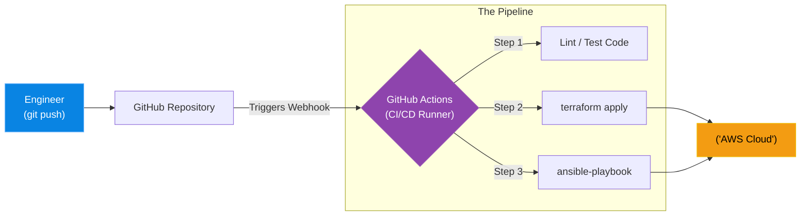

# Chapter 10 — CI/CD Pipelines

* **Difficulty:** Advanced
* **Estimated Time:** 1.5 Hours
* **Hands-on Labs:** 1
* **Interview Questions:** 3

## Learning Objectives

By the end of this chapter, you will be able to:
* Define Continuous Integration (CI) and Continuous Deployment (CD).
* Explain the danger of executing Terraform or Ansible from a local laptop.
* Understand the concept of CI/CD Runners.
* Trace the lifecycle of a code change from `git push` to production deployment.

## Visual Architecture: The Automated Factory

In Chapter 7, we ran `terraform apply` from our laptop. In Chapter 9, we ran `ansible-playbook` from our laptop. While great for learning, executing production deployments from a personal laptop is an enterprise anti-pattern. Laptops get lost, internet connections drop mid-deployment, and colleagues cannot see what you are executing.
**CI/CD (Continuous Integration / Continuous Deployment)** moves the execution to the Cloud. You simply push your code to Git. A CI/CD Platform (like GitLab CI or GitHub Actions) detects the push, spins up an isolated "Runner" container, and executes the Terraform or Ansible commands on your behalf.

## Theory & Concepts

### 1. Continuous Integration (CI)
CI focuses on the code *before* it is deployed. When a developer pushes Python code or Terraform HCL to a repository, the CI pipeline runs immediately. It executes automated unit tests, checks for syntax errors (linting), and scans for security vulnerabilities. If a test fails, the pipeline halts, and the code is rejected. This ensures the main branch is always in a pristine, working state.

### 2. Continuous Deployment (CD)
If the CI tests pass, the CD pipeline takes over. It compiles the code (or builds the Docker image) and automatically deploys it to the Staging environment. After an automated approval step, it runs the final deployment to Production. 

### 3. CI/CD Runners
A Runner is an ephemeral worker machine (usually a Docker container) managed by the CI/CD platform. The platform securely injects the AWS API keys and SSH keys into the Runner as environment variables. The Runner executes the pipeline, deploys the code, and then instantly destroys itself. This means your AWS keys never leave the secure boundary of the CI platform.

## Scenario-Based Troubleshooting

### Scenario A: The Laptop Bottleneck
**The Incident:** The Lead DevOps Engineer goes on a two-week vacation to a cabin with no internet access. On Wednesday, the marketing team demands an urgent update to the production web servers. The junior engineers try to run the Ansible playbook, but it fails. The SSH keys required to access the production servers only exist on the Lead Engineer's physical laptop. 
All deployments come to a complete halt for two weeks.

**The Investigation & Fix:**
1. When the Lead Engineer returns, they realize that local execution creates a massive Single Point of Failure (themselves).
2. They migrate all Terraform and Ansible code into a GitHub repository.
3. They create a `.github/workflows/deploy.yml` file defining a CI/CD pipeline.
4. They store the AWS API keys and the Production SSH keys as highly encrypted **GitHub Secrets**.
5. **The New Workflow:** A junior engineer wants to update the web servers. They modify the Ansible playbook locally and create a Pull Request in GitHub.
6. The Senior Engineer reviews the code in the browser and clicks "Approve & Merge".
7. GitHub Actions instantly spins up a Runner, injects the secure SSH keys, and runs `ansible-playbook` against the production environment. 
8. **The Result:** Anyone with approval can deploy code without needing secure keys on their personal laptops. The laptop bottleneck is permanently resolved.

> [!CAUTION]  
> **Best Practice: Protect the Main Branch**  
> If an automated CD pipeline is configured to deploy to production every time code is pushed to the `main` branch, you must enforce Branch Protections. No human should ever be allowed to `git push` directly to `main`. All changes must go through a Pull Request and require at least one code review approval before the pipeline is allowed to execute the deployment.

## Hands-on Lab

> [!TIP]
> **Practice Assignment Available**
> Proceed to the [Chapter 10 Practice Guide](../practice-files/V4-C10-practice.md) to conceptually design a GitLab CI/CD pipeline file!

## Interview Questions

### Question 1: Why is executing Terraform or Ansible directly from an engineer's laptop considered an enterprise anti-pattern?
* **Target Answer**: "Local execution introduces several critical risks: First, it requires sensitive API and SSH keys to be stored on physical hardware that can be stolen or compromised. Second, it creates a 'Laptop Bottleneck' where deployments rely on a specific engineer being online. Third, there is no centralized audit trail of the execution logs. CI/CD pipelines solve this by moving execution to secure, centralized, and fully auditable cloud runners."

### Question 2: Explain the difference between Continuous Integration (CI) and Continuous Deployment (CD).
* **Target Answer**: "Continuous Integration (CI) is the automated process of testing, linting, and validating code every time it is pushed to a repository, ensuring bad code is caught before it is merged. Continuous Deployment (CD) is the subsequent automated process of taking that validated code, building the necessary artifacts (like Docker images), and deploying it out to the staging or production infrastructure."

### Question 3: How does a CI/CD Runner authenticate to AWS or a production server without exposing credentials in the Git repository?
* **Target Answer**: "Credentials should never be hardcoded in the pipeline files (`.gitlab-ci.yml` or GitHub Actions workflows) or committed to Git. Instead, credentials are saved securely as masked 'Secrets' within the CI/CD platform's settings. When the ephemeral Runner spins up to execute a job, the platform securely injects those secrets into the Runner as temporary environment variables, which are immediately destroyed when the job completes."

## Chapter Summary

CI/CD is the glue that binds modern DevOps together. By combining the declarative power of Terraform and Ansible with the automation of pipelines, you can build an environment where thousands of servers can be provisioned, configured, and updated simply by clicking "Merge" in a web browser.

## Completion Checklist

- [ ] I can define CI and CD.
- [ ] I understand why local execution causes bottlenecks.
- [ ] I know how secrets are securely managed in CI/CD platforms.

---

## Navigation

⬅ Previous:
[Chapter 9 – Writing Ansible Playbooks & Roles](V4-C09-ansible-playbooks.md)

🏠 Volume Contents:
[Table of Contents](../TOC.md)

➡ Next:
[Volume 4, Part 3: Advanced Network & Security Architecture *[Planned]*](#)
