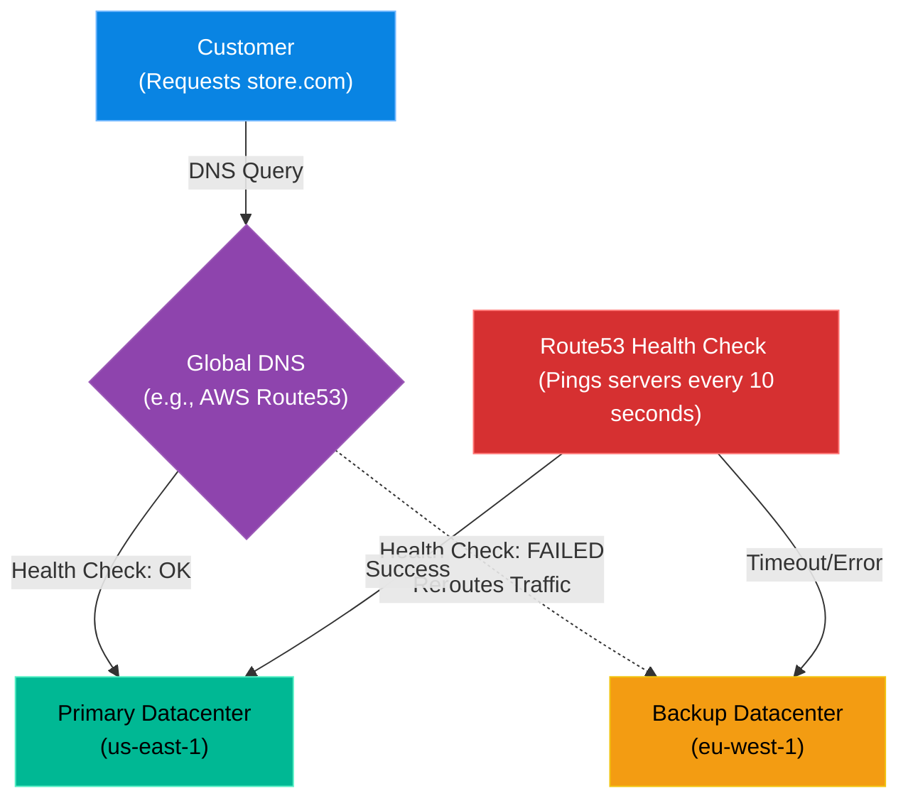

# Chapter 11 — Enterprise DNS & Global Traffic Management

* **Difficulty:** Advanced
* **Estimated Time:** 1.5 Hours
* **Hands-on Labs:** 1
* **Interview Questions:** 3

## Learning Objectives

By the end of this chapter, you will be able to:
* Differentiate between standard DNS (Bind9) and Enterprise Anycast DNS (Route53/Cloudflare).
* Understand how DNS Health Checks enable active-passive failover.
* Explain Latency-Based and Geolocation-Based routing.
* Troubleshoot global traffic routing failures.

## Visual Architecture: Surviving the Unsurvivable

In Volume 2, you learned how to configure a local `bind9` DNS server. This is fine for an office building. However, if you are running a global e-commerce platform, a single DNS server—or even a single datacenter—is a massive Single Point of Failure.
If a hurricane destroys your primary datacenter in Virginia, you cannot wait for an engineer to wake up, log into the DNS server, and manually change the A-Records to point to the backup datacenter in Ireland. It takes too long.
**Enterprise Global DNS** (like AWS Route53 or Cloudflare) automates this survival mechanism.

## Theory & Concepts

### 1. Anycast Routing
Standard DNS relies on Unicast: one IP address maps to one specific server somewhere in the world. If a customer in Japan queries a Unicast DNS server in New York, the request is slow. 
**Anycast** allows a global network of DNS servers to share the *exact same IP address*. When a customer in Japan queries Route53, the internet backbone routes their request to the physically closest Route53 server (e.g., in Tokyo). This results in lightning-fast DNS resolution globally.

### 2. DNS Health Checks & Failover
Enterprise DNS doesn't just statically return IP addresses. It actively tests them! Route53 will ping your primary web server every 10 seconds. If the web server returns a `500 Internal Server Error` or times out three times in a row, Route53 instantly marks the A-Record as "Unhealthy". It will stop returning the primary IP and automatically start returning the IP of your Backup Datacenter.

### 3. Advanced Routing Policies
* **Latency Routing:** If you have datacenters in New York and Sydney, Route53 will calculate which datacenter will provide the lowest latency for the specific user making the request, and route them accordingly.
* **Geolocation Routing:** You can enforce geographical boundaries. For example, you can write a rule stating: "If the IP address originates from Europe, return the IP of the European datacenter to comply with GDPR."

## Scenario-Based Troubleshooting

### Scenario A: The Regional Outage
**The Incident:** It is 3:00 AM on a Sunday. A massive fiber-optic cable is accidentally cut by a construction crew in Virginia, completely severing the AWS `us-east-1` region from the internet. The company's primary application load balancers go completely dark.

**The Investigation & Fix:**
1. The Support Engineer is asleep. 
2. At 3:00:10 AM, AWS Route53 attempts its routine health check on the primary load balancer. The request times out.
3. At 3:00:30 AM, Route53 registers three consecutive failures. The Health Check status flips from `HEALTHY` to `UNHEALTHY`.
4. At 3:00:31 AM, Route53 automatically triggers the **Active-Passive Failover** policy. It instantly alters the global DNS records for `www.company.com`. It stops returning the dead `us-east-1` IP address and begins returning the IP address for the Disaster Recovery datacenter in `eu-west-1` (Ireland).
5. At 3:01 AM, customers attempting to reach the website are routed to Ireland. The site loads perfectly. 
6. At 8:00 AM, the Support Engineer wakes up, checks the Slack alerts, and realizes the company survived a catastrophic datacenter failure without a single human having to log in or type a command. 

> [!CAUTION]  
> **Best Practice: Mind the TTL (Time to Live)**  
> DNS Failover is only effective if your DNS records have a very low TTL (e.g., 60 seconds). If you set your TTL to 24 hours, customer web browsers and ISPs will cache the dead IP address for an entire day, completely bypassing Route53's attempt to redirect them to the backup datacenter!

## Hands-on Lab

> [!TIP]
> **Practice Assignment Available**
> Proceed to the [Chapter 11 Practice Guide](../practice-files/V4-C11-practice.md) to conceptually design a Route53 Active-Passive failover configuration!

## Interview Questions

### Question 1: What is the difference between Unicast and Anycast DNS?
* **Target Answer**: "In Unicast DNS, an IP address points to a single specific server in one geographic location. In Anycast DNS, the exact same IP address is advertised by dozens of servers globally. The core internet routing protocols (BGP) automatically route the user's DNS query to the physically closest server advertising that IP, massively reducing latency and increasing DDoS resilience."

### Question 2: Explain how DNS Failover works in an Active-Passive architecture.
* **Target Answer**: "In an Active-Passive architecture, all traffic normally flows to the Primary (Active) datacenter. The Enterprise DNS provider continuously monitors the Primary datacenter via Health Checks (HTTP/TCP probes). If the Primary datacenter fails to respond, the DNS provider marks it as unhealthy and automatically changes the A-record response to return the IP address of the Backup (Passive) datacenter, redirecting all user traffic."

### Question 3: Why is a low TTL critical for disaster recovery routing?
* **Target Answer**: "TTL (Time to Live) dictates how long downstream DNS resolvers and client web browsers are allowed to cache a DNS record. If a catastrophic failure occurs and the DNS provider updates the record to point to a backup datacenter, users will not see the change until their cached record expires. A low TTL (e.g., 60 seconds) ensures global traffic shifts to the backup datacenter almost immediately."

## Chapter Summary

Enterprise DNS is no longer a static phonebook; it is a dynamic, intelligent traffic cop. By utilizing health checks and advanced routing policies, DNS becomes the first and most critical layer of your disaster recovery strategy.

## Completion Checklist

- [ ] I understand the concept of Anycast routing.
- [ ] I can explain how DNS Health Checks enable failover.
- [ ] I understand why TTL dictates failover speed.

---

## Navigation

⬅ Previous:
[Volume 4, Part 2: Infrastructure as Code](../README.md)

🏠 Volume Contents:
[Table of Contents](../TOC.md)

➡ Next:
[Chapter 12 – Zero Trust Architecture & Identity Providers](V4-C12-zero-trust.md)
