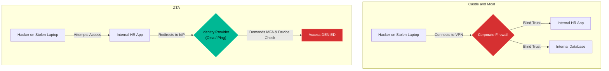

# Chapter 12 — Zero Trust Architecture & Identity Providers

## Learning Objectives

The traditional network perimeter is dead. In this chapter, we introduce Zero Trust Architecture, exploring how to authenticate and authorize every request, regardless of where it originates.

By the end of this chapter, you will be able to:
* Explain the fundamental flaw of the traditional "Corporate VPN" perimeter.
* Define Zero Trust Architecture (ZTA).
* Understand the role of an Identity Provider (IdP) like Okta or Keycloak.
* Explain the basics of SAML and OAuth2 Authentication flows.

## Visual Architecture: The Death of the VPN

For twenty years, corporate security relied on the "Castle and Moat" model (The VPN). If you were outside the corporate network, you were untrusted. Once you connected to the VPN, you were inside the "Castle," and the network blindly trusted you to access internal HR systems, code repositories, and databases.
**Zero Trust Architecture** assumes the network is *always* hostile. It eliminates the concept of "inside" and "outside." Even if you are sitting at a desk inside the corporate headquarters, the network does not trust you. Trust is no longer based on your IP address; it is based exclusively on your **Identity** and your **Device Posture**.

## Theory & Concepts

### 1. Identity is the New Perimeter
Instead of securing a network boundary, enterprises now secure the applications themselves using an **Identity Provider (IdP)**. An IdP is a centralized database of users and security policies. Popular IdPs include Okta, Microsoft Entra ID (Azure AD), and the open-source Keycloak. 

### 2. SAML and OAuth2
When you navigate to an internal company application (the **Service Provider**), the application does not ask for your password. 

1. The application immediately redirects your browser to the IdP (Okta). 

2. Okta verifies your identity using MFA (Multi-Factor Authentication).

3. Okta redirects you back to the application with a cryptographically signed token (using protocols like SAML or OIDC/OAuth2).
4. The application verifies the signature and grants you access.

### 3. Device Posture
Zero Trust evaluates *context*. Even if you have the correct password and the correct MFA push notification on your phone, the IdP will still block the login if the laptop you are typing on does not have the corporate Antivirus installed or if it is currently located in a sanctioned country.

## Scenario-Based Troubleshooting

### Scenario A: The Stolen Laptop

> [!IMPORTANT]  
> **Incident Report: The Stolen Laptop**  
> **Reporter:** Automated Monitoring / End User  
> **The Incident:** A Senior Developer goes to a coffee shop. They get up to grab their coffee, and a thief steals their unlocked laptop. The laptop already has an active, authenticated VPN session connected to the corporate network.

**The Investigation (Single Engineer Diagnosis):**

1. **The Traditional Outcome:** The thief takes the laptop home. Because the VPN is active, the corporate firewall trusts the laptop's IP address. The thief opens the browser, navigates to the internal Jira server, downloads the company's proprietary source code, and navigates to the internal HR portal to download employee social security numbers. Massive data breach.

2. **The Zero Trust Outcome:** The thief takes the laptop home. The company does not use a VPN. The internal Jira server is exposed to the public internet, but protected by a Zero Trust proxy (like Cloudflare Access or Zscaler) tied to Okta.

3. The thief opens the browser and navigates to Jira. 
4. Even though the laptop was previously authenticated, the Zero Trust proxy enforces a strict "Verify Every Request" policy. It detects that the laptop's IP address changed from the coffee shop to the thief's home network (a context change).
5. The proxy immediately intercepts the request and redirects the thief's browser to Okta.
6. Okta demands a biometric fingerprint scan (WebAuthn) or a YubiKey tap to re-authenticate the session. 
7. The thief cannot provide the biometric factor. Access is denied. The laptop is utterly useless. The source code and HR data remain perfectly safe.

> [!IMPORTANT]  
> **Best Practice: Eliminate Shared Accounts**  
> Zero Trust is impossible if you have shared accounts (e.g., a single `admin` account that 5 engineers use to log into a server). If the `admin` account does something malicious, you cannot determine *which* human was responsible. In a Zero Trust environment, every single action must be tied to a unique, cryptographically verified human identity.

## Hands-on Lab

> [!TIP]
> **Practice Assignment Available**
> Proceed to the [Chapter 12 Practice Guide](../practice-files/V4-C12-practice.md) to understand the technical flow of a SAML authentication transaction!

## Interview Questions

### Question 1: What is the fundamental flaw in the traditional VPN "Castle and Moat" security model?
* **Target Answer**: "The traditional VPN model relies on implicit trust based on network location. Once an attacker breaches the perimeter firewall or compromises an internal device, they are granted broad lateral movement across the entire network because the internal systems blindly trust the 'internal' IP address. Zero Trust eliminates this by demanding strict identity verification for every single request, regardless of where the request originates."

### Question 2: Explain the roles of the Identity Provider (IdP) and the Service Provider (SP) in a SAML transaction.
* **Target Answer**: "The Service Provider (SP) is the application the user wants to access (e.g., Salesforce, Jira, or an internal HR app). The Identity Provider (IdP) is the centralized authentication authority (e.g., Okta or Keycloak). The SP never sees the user's password; it redirects the user to the IdP. The IdP authenticates the user (via MFA) and redirects them back to the SP with a cryptographically signed SAML assertion proving their identity."

### Question 3: How does Device Posture enhance Zero Trust Architecture beyond simple MFA?
* **Target Answer**: "MFA only proves that the correct human is logging in, but it doesn't prove the device is safe. An employee might approve an MFA prompt while logging in from a malware-infected home computer. Device Posture integrates with the IdP to evaluate the context of the device itself (e.g., checking if the corporate MDM profile is installed, if the OS is patched, and if the firewall is active). If the device fails the posture check, the IdP blocks access even if the password and MFA are correct."

## Chapter Summary

The days of building a giant firewall around a corporate office are over. In the modern era of remote work and cloud computing, the perimeter has dissolved. By embracing Identity Providers and Zero Trust, you ensure that every application defends itself.

## Completion Checklist

- [ ] I can explain why traditional VPNs are vulnerable to lateral movement.
- [ ] I understand the flow of a SAML/OAuth redirect.
- [ ] I can explain how Device Posture provides contextual security.

---

## Navigation

⬅ Previous:
[Chapter 11 – Enterprise DNS & Global Traffic Management](V4-C11-global-dns.md)

🏠 Volume Contents:
[Table of Contents](../TOC.md)

➡ Next:
[Chapter 13 – Secrets Management & PKI](V4-C13-secrets-management.md)
