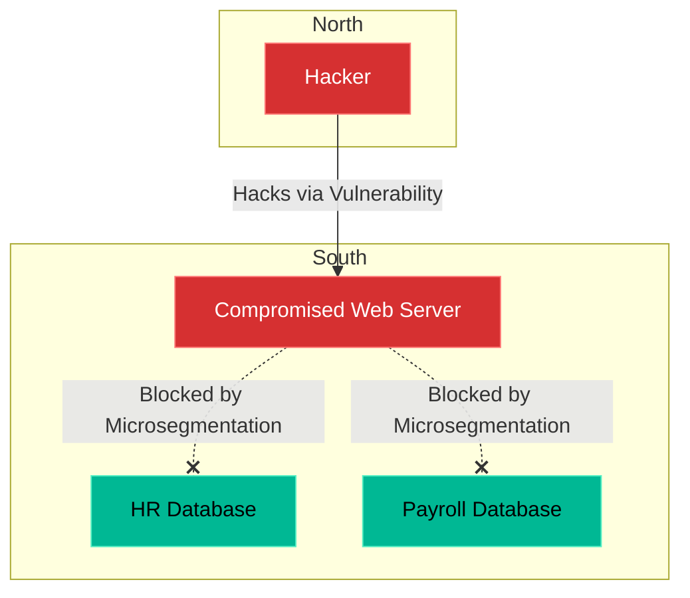

# Chapter 14 — Network Policies & Microsegmentation

## Learning Objectives

If an attacker breaches a web server, they shouldn't have unrestricted access to the database. In this chapter, we use Microsegmentation to strictly limit lateral movement within your networks.

By the end of this chapter, you will be able to:
* Define North-South vs East-West traffic.
* Explain the concept of Microsegmentation.
* Understand why a flat network is a security liability.
* Write a Kubernetes `NetworkPolicy` to isolate Pods.

## Visual Architecture: Securing East-West Traffic

In traditional networking, a giant perimeter firewall secures **North-South traffic** (traffic coming in from the internet). However, once traffic passes the firewall, the internal network is usually "flat." This means Server A can ping Server B, even if they have no business talking to each other. 
This is dangerous. If a hacker compromises Server A, they use that trusted internal connection to move laterally and compromise Server B (this is **East-West traffic**).
**Microsegmentation** solves this by putting a microscopic firewall around *every single application*, ensuring they can only communicate with explicitly approved peers.

## Theory & Concepts

### 1. The Flat Network Problem
By default, Kubernetes clusters are completely flat. Every Pod in the cluster can talk to every other Pod in the cluster, even across different Namespaces! If you have a Dev Namespace and a Prod Namespace, a compromised Dev Pod can reach out and attack the Prod database!

### 2. Kubernetes NetworkPolicies
A **NetworkPolicy** is a declarative YAML file that acts as a distributed firewall inside the cluster. It is implemented by the Container Network Interface (CNI) plugin (like Calico or Cilium).
You use Labels to define rules. For example: "The Database Pod will drop all incoming TCP traffic *unless* the traffic comes from a Pod labeled `role: backend-api`."

### 3. The Default Deny Strategy
The absolute best practice in microsegmentation is the "Default Deny" posture. You write a NetworkPolicy that blocks *all* traffic in the entire Namespace. Instantly, all your applications break. 
Then, you surgically write "Allow" policies to punch microscopic holes in the firewall, permitting only the exact traffic paths required for the application to function. 

## Scenario-Based Troubleshooting

### Scenario A: The Lateral Movement

> [!IMPORTANT]  
> **Incident Report: The Lateral Movement**  
> **Reporter:** Automated Monitoring / End User  
> **The Incident:** A company runs a WordPress blog and a highly secure Payroll application in the same Kubernetes cluster. A hacker finds an unpatched plugin on the WordPress blog, executes a Remote Code Execution (RCE) exploit, and gains a root shell inside the WordPress container. 
The hacker downloads `nmap` and begins scanning the internal cluster network to see what else they can find. They discover the IP address of the Payroll Postgres database and attempt to connect to it.

**The Investigation (Single Engineer Diagnosis):**

1. **The Flat Network Outcome:** The Postgres database accepts the TCP connection. The hacker brute-forces the password, dumps the Payroll tables, and steals the data.

2. **The Microsegmentation Outcome:** The Support Engineer had previously implemented a Kubernetes `NetworkPolicy` on the Payroll database. 

3. The hacker attempts to `curl` or `telnet` to the Postgres port. 
4. The connection simply hangs, and eventually times out. 
5. **The Orchestration Magic:** The Calico CNI plugin running on the Worker Node intercepts the packet. It sees that the packet came from a Pod labeled `app: wordpress`. It checks the Payroll NetworkPolicy, which states: `allow ingress from app: payroll-api`. Because the labels do not match, the Linux Kernel instantly drops the TCP packet.
6. The hacker is trapped inside the WordPress container, unable to move laterally. The intrusion is contained.

> [!CAUTION]  
> **Best Practice: Verify Your CNI Plugin**  
> If you write a `NetworkPolicy.yaml` and apply it to your cluster, the API Server will happily accept it and return `created`. However, if your cluster's CNI plugin (like Flannel) does not support Network Policies, the rules will be completely ignored, and traffic will flow freely! Always ensure you are running a policy-enforcing CNI like Calico or Cilium in production.

## Hands-on Lab

> [!TIP]
> **Practice Assignment Available**
> Proceed to the [Chapter 14 Practice Guide](../practice-files/V4-C14-practice.md) to conceptually design a Kubernetes NetworkPolicy that isolates a database!

## Interview Questions

### Question 1: What is the difference between North-South and East-West network traffic?
* **Target Answer**: "North-South traffic refers to data flowing into or out of the datacenter (e.g., from a user on the public internet hitting an external load balancer). East-West traffic refers to data flowing laterally *within* the datacenter (e.g., a web server communicating with a backend database). Traditional security focused heavily on North-South firewalls, while ignoring East-West."

### Question 2: Why is a default Kubernetes network configuration considered a security risk?
* **Target Answer**: "By default, Kubernetes implements a 'flat' network architecture where all Pods can communicate with all other Pods across all Namespaces without restriction. This is a massive security risk because if a single public-facing container is compromised, the attacker can use it as a jump host to launch lateral attacks against internal databases or other sensitive applications within the cluster."

### Question 3: How do Kubernetes Network Policies implement Microsegmentation?
* **Target Answer**: "Network Policies act as declarative, distributed firewalls. They use Label Selectors to identify specific groups of Pods and explicitly define which ingress and egress traffic is permitted. By implementing a 'Default Deny' policy and explicitly whitelisting only the necessary communication paths (Microsegmentation), you ensure that a compromised Pod is isolated and cannot move laterally."

## Chapter Summary

Trusting an IP address just because it is "inside" your network is a recipe for disaster. Microsegmentation ensures that even if the outer castle wall is breached, every single room inside the castle is locked by a vault door.

## Completion Checklist

- [ ] I can define North-South vs East-West traffic.
- [ ] I understand the danger of a flat network.
- [ ] I know how a NetworkPolicy uses Labels to restrict traffic.

---

## Navigation

⬅ Previous:
[Chapter 13 – Secrets Management & PKI](V4-C13-secrets-management.md)

🏠 Volume Contents:
[Table of Contents](../TOC.md)

➡ Next:
[Chapter 15 – Incident Response & Security Auditing](V4-C15-incident-response.md)
