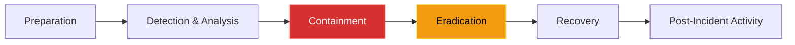

# Chapter 15 — Incident Response & Security Auditing

* **Difficulty:** Advanced
* **Estimated Time:** 1.5 Hours
* **Hands-on Labs:** 1
* **Interview Questions:** 3

## Learning Objectives

By the end of this chapter, you will be able to:
* Define the phases of the Incident Response Lifecycle.
* Differentiate between Containment and Eradication.
* Understand the role of `auditd` in Linux forensics.
* Explain the purpose of a SIEM (Security Information and Event Management) system.

## Visual Architecture: The Incident Response Lifecycle

Despite the best Firewalls, Zero Trust, and Microsegmentation, you *will* eventually be hacked. A zero-day vulnerability in a core piece of software can bypass all defenses.
When this happens, the Senior Support Engineer must follow a strict lifecycle. Panic causes mistakes. 

## Theory & Concepts

### 1. Containment vs Eradication
The most common mistake junior engineers make during a breach is instantly deleting the hacked server or killing the malicious process. This is **Eradication**, and doing it too early destroys all forensic evidence!
**Containment** means stopping the bleeding *without* destroying the server. If a VM is compromised, you do not delete it. You change its AWS Security Group to block all inbound and outbound internet access, isolating it. This allows the security team to SSH in (via a secure bastion) and analyze the RAM and logs to figure out *how* the hacker got in.

### 2. Linux Auditing (`auditd`)
If a hacker steals a file, `/var/log/syslog` will likely not record it. To track exact system calls (like a process opening `/etc/shadow`), Linux uses the **Audit Daemon (`auditd`)**.
`auditd` ties deeply into the Linux kernel. It can record every time a specific user executes a command, opens a specific file, or changes a permission, providing an irrefutable trail of evidence during forensic analysis.

### 3. SIEM and Log Aggregation
If a hacker gains root access to a server, the very first thing they do is type `rm -rf /var/log/audit/` to delete the evidence of their crime.
To prevent this, enterprises use a **SIEM** (like Splunk or ELK). A small daemon on the Linux server instantly streams every single log line over the network to the centralized, highly-secure SIEM cluster. Even if the hacker deletes the local logs, the SIEM already has a permanent, read-only copy of their actions.

## Scenario-Based Troubleshooting

### Scenario A: The Crypto Miner
**The Incident:** At 4:00 PM, Prometheus triggers a PagerDuty alert: `CPU Usage > 99% for 15 minutes` on a legacy internal file server. 

**The Investigation & Fix:**
1. The Support Engineer SSHes into the server and runs `top`. They see a process named `kthreadd` consuming 100% of the CPU. 
2. The engineer recognizes this as a common disguise for a crypto-mining malware script. 
3. **The Rookie Mistake:** The engineer considers typing `kill -9 <PID>` to stop the miner. They stop themselves. Doing so would tip off the hacker that they have been discovered, and destroy the malicious binary in RAM.
4. **Containment:** Instead, the engineer logs into the AWS Console and modifies the EC2 Security Group. They remove the `0.0.0.0/0` outbound rule, completely disconnecting the server from the internet. The malware can no longer communicate with its mining pool or exfiltrate data, but it is still running in memory for analysis.
5. **Detection & Analysis:** The engineer queries the centralized SIEM for logs related to this server over the past 24 hours. They discover that a developer's SSH key was used to log in at 3:15 PM from a Russian IP address. 
6. **Eradication:** The engineer finds the developer, revokes their compromised SSH key globally, and wipes the infected server completely, replacing it with a fresh image from a clean Terraform state.
7. **Post-Incident Activity:** The engineer writes an incident report detailing the failure, resulting in a new policy requiring Okta MFA for all SSH access.

> [!IMPORTANT]  
> **Best Practice: Immutable Infrastructure**  
> In modern environments, Eradication and Recovery are often the same step. You do not try to "clean" a hacked server. You contain it for forensic analysis, and then you use Terraform/Kubernetes to instantly deploy a brand new, clean replacement server. The infected server is treated as toxic waste and eventually destroyed.

## Hands-on Lab

> [!TIP]
> **Practice Assignment Available**
> Proceed to the [Chapter 15 Practice Guide](../practice-files/V4-C15-practice.md) to configure `auditd` to monitor the `/etc/shadow` file for unauthorized access!

## Interview Questions

### Question 1: During a security breach, why is Containment prioritized before Eradication?
* **Target Answer**: "If an engineer immediately eradicates a threat (e.g., by deleting the infected server or killing the malicious process), they destroy all forensic evidence in RAM and local logs. This prevents the security team from analyzing the malware, determining the root cause of the breach, or discovering if the attacker moved laterally to other systems. Containment (like changing firewall rules to isolate the server) stops the attack while preserving the crime scene."

### Question 2: What is the purpose of the Linux `auditd` daemon?
* **Target Answer**: "Standard system logs (`syslog`) generally only capture high-level application events. The `auditd` daemon ties directly into the Linux kernel to monitor system calls. It provides a highly granular, irrefutable audit trail of security-relevant events, such as tracking exactly which user ID read a sensitive file, executed a specific binary, or modified system permissions."

### Question 3: A hacker gains root access to a server and immediately deletes the `/var/log` directory to cover their tracks. How does a SIEM architecture defeat this?
* **Target Answer**: "A SIEM (Security Information and Event Management) architecture relies on log forwarding agents running on the endpoint servers. These agents instantly stream log events over the network to a centralized, highly secure logging cluster (like Splunk or ELK) in near real-time. By the time the hacker gains root access and deletes the local log files, the evidence of their intrusion has already been safely transmitted and permanently stored in the centralized SIEM."

## Chapter Summary

Incident Response is a high-stress test of your engineering discipline. By strictly following the lifecycle, prioritizing containment over hasty eradication, and relying on centralized SIEM logs, you can systematically dismantle an attack and prevent it from ever happening again.

## Completion Checklist

- [ ] I understand the difference between Containment and Eradication.
- [ ] I know how `auditd` tracks kernel-level system calls.
- [ ] I understand why local logs cannot be trusted after a root compromise.

---

## Navigation

⬅ Previous:
[Chapter 14 – Network Policies & Microsegmentation](V4-C14-microsegmentation.md)

🏠 Volume Contents:
[Table of Contents](../TOC.md)

➡ Next:
[Volume 4, Part 4: The Art of Troubleshooting (Senior Diagnostics) *[Planned]*](#)
