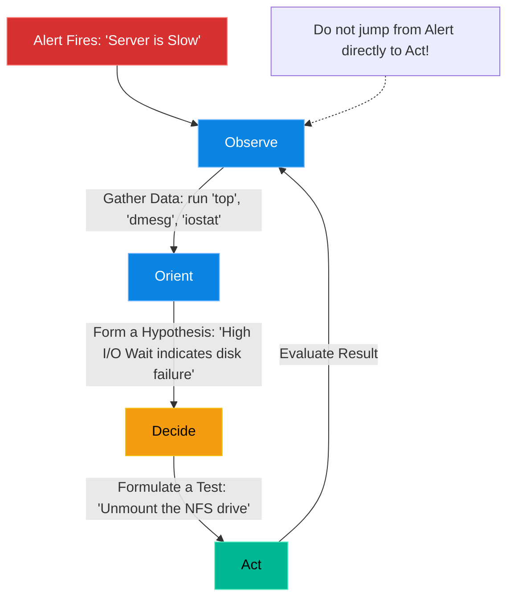

# Chapter 16 — The Scientific Method of Troubleshooting

## Learning Objectives

Guessing wastes time and breaks things further. In this chapter, we introduce Scientific Troubleshooting, a rigorous methodology for isolating and resolving the most complex, obscure system failures.

By the end of this chapter, you will be able to:
* Differentiate between "Guess-and-Check" and Scientific Troubleshooting.
* Apply the OODA Loop (Observe, Orient, Decide, Act) to system failures.
* Isolate variables systematically.
* Explain why blindly rebooting a server is a critical failure of engineering.

## Visual Architecture: The OODA Loop

When a massive outage occurs, inexperienced engineers panic. They Google the error message, find a StackOverflow post from 2014, blindly copy a command, and hit enter. This is **Guess-and-Check**. It is dangerous, and it often makes the outage worse. 
Senior Engineers do not guess. They use the **OODA Loop**, a cognitive framework originally developed for fighter pilots.

## Theory & Concepts

### 1. Observe (Gathering Data)
Do not touch the system state. Look at the logs. Look at the metrics (CPU, RAM, Disk I/O, Network). If a user says "the database is down," do not believe them. *Prove* the database is down by attempting to connect to it via `psql` or `telnet`. 

### 2. Orient (Forming a Hypothesis)
Correlate the data. If the CPU is at 100%, and the logs show thousands of incoming connections, your hypothesis might be: "We are under a DDoS attack." If the CPU is at 0%, but the application is frozen, your hypothesis might be: "The application is deadlocked waiting on a network resource."

### 3. Decide & Act (Isolating Variables)
If a website is broken, is it the Browser? The DNS? The Load Balancer? The Web Server? The Database? 
You must divide and conquer by isolating variables. 
* Bypass the Load Balancer and `curl` the Web Server directly. If it works, the Load Balancer is broken.
* If it fails, bypass the Web Server and query the Database directly. If it works, the Web Server is broken. 

### 4. The Cardinal Sin: The Blind Reboot
If an engineer encounters a bizarre issue and immediately types `sudo reboot`, they have committed the cardinal sin of troubleshooting. Yes, the reboot might fix the problem *temporarily*. But they destroyed all the RAM and state data. They did not find the Root Cause. Next week, the server will break again at 3:00 AM, and they will have learned absolutely nothing.

## Scenario-Based Troubleshooting

### Scenario A: The "Slow" Server

> [!IMPORTANT]  
> **Incident Report: The "Slow" Server**  
> **Reporter:** Automated Monitoring / End User  
> **The Incident:** The customer service team submits a High Priority ticket: "The CRM server is incredibly slow. Clicking any button takes 30 seconds."

**The Investigation (Single Engineer Diagnosis):**

1. **The Junior Approach:** The junior admin logs in, sees the server is indeed slow, panics, and runs `sudo reboot`. The server comes back up, works fine for 5 minutes, and then grinds to a halt again. The junior admin tells the customer, "I don't know, maybe we need more RAM?"

2. **The Senior Approach:** The Senior Engineer takes over and applies the OODA loop.

3. **Observe:** The engineer runs `top`. The CPU usage is at 5%. The RAM usage is at 20%. The server is not starved for compute resources. However, the engineer notices the `wa` (I/O Wait) metric in `top` is hovering at 95%. 
4. **Orient:** High I/O wait means the CPU is literally sitting idle, waiting for a hard drive to spin or return data. The engineer runs `df -h` and notices an NFS (Network File System) share is mounted at `/var/www/uploads`.
5. **Decide:** Hypothesis: The network connection to the NFS server is dropping packets, causing the CRM application to freeze every time a user uploads a file.
6. **Act:** The engineer uses `ping` to test the network latency to the NFS server. The ping returns a 40% packet loss!
7. **Resolution:** The engineer contacts the network team, who fixes a failing switch port connecting to the NFS server. The `wa` metric instantly drops to 0%, and the CRM server becomes lightning fast. The Senior Engineer found the true Root Cause without ever rebooting the CRM server.

> [!IMPORTANT]  
> **Best Practice: Change One Thing at a Time**  
> If you form a hypothesis and execute a test, *only change one variable*. If you change the NGINX config, update the Python code, and restart the database all at the same time, and the system starts working... you have no idea which of the three actions actually fixed it. 

## Hands-on Lab

> [!TIP]
> **Practice Assignment Available**
> Proceed to the [Chapter 16 Practice Guide](../practice-files/V4-C16-practice.md) to create a systematic troubleshooting matrix for a complex failure!

## Interview Questions

### Question 1: Describe the 'Divide and Conquer' method of troubleshooting a complex web architecture.
* **Target Answer**: "Divide and Conquer involves systematically eliminating variables to isolate the point of failure. If a user cannot reach a web application, I would start in the middle. I would bypass the CDN and test the Load Balancer directly. If that works, I know the issue is 'upstream' (DNS/CDN/Internet). If it fails, I know the issue is 'downstream' (Web Servers/Database). I then cut the remaining path in half again until the exact failing component is isolated."

### Question 2: Why is rebooting a server considered a poor first step in troubleshooting an unknown issue?
* **Target Answer**: "Rebooting a server is an act of 'Eradication' without 'Analysis'. While it may temporarily restore service by clearing deadlocked memory or zombie processes, it destroys the transient state data (RAM, `/tmp` files, active network connections) required to determine *why* the server failed in the first place. Without finding the Root Cause, the issue is guaranteed to happen again."

### Question 3: In the output of the `top` command, what does a high `wa` (I/O Wait) percentage indicate?
* **Target Answer**: "A high `wa` (I/O Wait) percentage indicates that the CPU is not actually busy processing math or application logic. Instead, the CPU is spending a massive amount of time sitting completely idle, blocked while waiting for a slow physical hardware device (usually a local hard drive or a network attached storage volume) to read or write data."

## Chapter Summary

Troubleshooting is not an innate magical talent; it is a rigid, scientific discipline. By suppressing the urge to guess, carefully observing the metrics, and systematically isolating variables, you can confidently diagnose any system in the world, even systems you have never seen before.

## Completion Checklist

- [ ] I can define the 4 steps of the OODA loop.
- [ ] I understand the danger of changing multiple variables at once.
- [ ] I know why I/O Wait causes a system to feel slow despite low CPU usage.

---

## Navigation

⬅ Previous:
[Volume 4, Part 3: Advanced Network & Security Architecture](../README.md)

🏠 Volume Contents:
[Table of Contents](../TOC.md)

➡ Next:
[Chapter 17 – Kernel Panics & Crash Analysis](V4-C17-kernel-panics.md)
