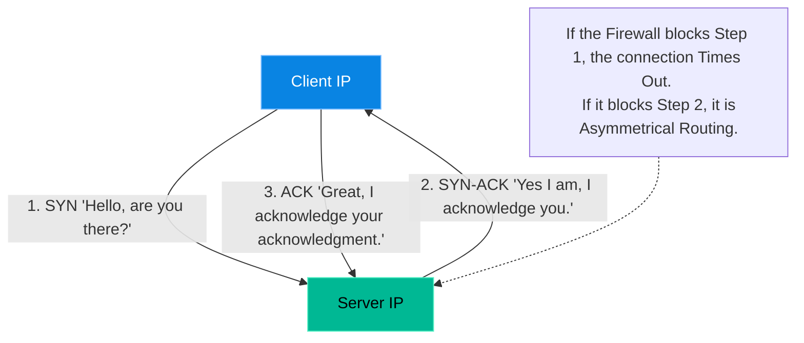

# Chapter 18 — Advanced Network Packet Analysis

* **Difficulty:** Advanced
* **Estimated Time:** 1.5 Hours
* **Hands-on Labs:** 1
* **Interview Questions:** 3

## Learning Objectives

By the end of this chapter, you will be able to:
* Diagram the TCP 3-Way Handshake.
* Explain what a SYN Flood is and how it causes Denial of Service.
* Use `tcpdump` to capture packets on a specific interface and port.
* Read a `.pcap` file using Wireshark for advanced visual analysis.

## Visual Architecture: The 3-Way Handshake

In Volume 2, you learned about Firewalls (`iptables`). When a firewall blocks a connection, the application usually logs "Connection Timeout." But *why* did it timeout? Did the packet never arrive, or did it arrive but the server couldn't reply?
To answer this, Senior Engineers look at the raw packets on the wire. TCP (Transmission Control Protocol) is stateful. Before any data can be transferred, it must establish a connection via the **3-Way Handshake**.

## Theory & Concepts

### 1. SYN Floods (DDoS)
A SYN Flood is a classic Denial of Service attack. The attacker sends 10,000 `SYN` packets per second to the server. The server eagerly replies with `SYN-ACK` and waits for the final `ACK`. The attacker never sends the final `ACK`. The server's memory fills up with "half-open" connections until it crashes. 

### 2. Sniffing with `tcpdump`
You cannot see packets with standard logging tools. You must use a "packet sniffer" like `tcpdump`, which binds directly to the Network Interface Card (NIC) at Layer 2 and copies every packet as it passes by.
Because a busy server handles thousands of packets a second, you must use filters. For example, to only capture TCP traffic on port 80:
`sudo tcpdump -i eth0 tcp port 80`

### 3. PCAP and Wireshark
Reading raw hex dumps in the terminal is difficult. Engineers use `tcpdump` to capture the packets into a file (called a `.pcap` file), download it to their laptop, and open it in **Wireshark**. Wireshark provides a beautiful GUI that dissects the packets, showing exactly where a connection failed.

## Scenario-Based Troubleshooting

### Scenario A: The Silent Drop
**The Incident:** A web application in the AWS Cloud needs to connect to an on-premise mainframe over a Corporate VPN tunnel. The developer says, "My app is getting a Connection Timeout." The Network Team says, "The VPN firewall is completely open. The problem is your application." 
The two teams argue for three hours.

**The Investigation & Fix:**
1. The Senior Support Engineer steps in to mediate. They know that "Connection Timeout" means the 3-Way Handshake is failing.
2. The engineer SSHes into the AWS Web Server and runs:
   `sudo tcpdump -i eth0 host 10.0.5.50` (The IP of the mainframe).
3. The engineer tells the developer to trigger the connection.
4. **The Observation:** In the `tcpdump` output, the engineer sees the Web Server sending a `SYN` packet to the mainframe. A millisecond later, they see a `SYN-ACK` packet return from the mainframe. But the Web Server never sends the final `ACK`. Instead, it re-transmits the `SYN` packet!
5. **The Hypothesis:** Why would the Web Server ignore the `SYN-ACK`? The engineer checks the routing table (`ip route`). 
6. **The Resolution:** The engineer discovers **Asymmetrical Routing**. The `SYN` packet goes out through the VPN tunnel. The mainframe replies with the `SYN-ACK`, but due to a misconfiguration on the on-premise router, the `SYN-ACK` is sent back via the *public internet*, not the VPN tunnel! The AWS server's firewall sees a random `SYN-ACK` arriving from the public internet (without a corresponding outbound connection on that interface) and instantly drops it. 
7. The engineer provides the packet capture to the Network Team, proving the on-premise routing is asymmetrical. The network team fixes their router, and the connection works perfectly.

> [!CAUTION]  
> **Best Practice: Secure your PCAP files**  
> `tcpdump` captures the *entire* packet, including the payload. If you run `tcpdump` on a web server capturing unencrypted HTTP traffic, you will capture customer passwords, session cookies, and credit card numbers in plain text. Always treat `.pcap` files as highly sensitive, confidential data, and delete them from the server immediately after analysis.

## Hands-on Lab

> [!TIP]
> **Practice Assignment Available**
> Proceed to the [Chapter 18 Practice Guide](../practice-files/V4-C18-practice.md) to run your first `tcpdump` and capture raw packets to a file!

## Interview Questions

### Question 1: Describe the TCP 3-Way Handshake.
* **Target Answer**: "To establish a reliable TCP connection, the client first sends a `SYN` (Synchronize) packet to the server. The server responds with a `SYN-ACK` (Synchronize-Acknowledge) packet, indicating it is ready. Finally, the client sends an `ACK` (Acknowledge) packet back to the server. Once this handshake is complete, data transmission can begin."

### Question 2: What is a SYN Flood attack, and how does it overwhelm a server?
* **Target Answer**: "A SYN Flood is a DDoS attack where the attacker rapidly sends thousands of `SYN` requests to a server, but deliberately never sends the final `ACK` to complete the handshake. The server allocates memory for each 'half-open' connection, waiting for the final ACK. Eventually, the server's connection queue fills up, exhausting memory and preventing legitimate users from connecting."

### Question 3: How does `tcpdump` help prove that a firewall is blocking traffic?
* **Target Answer**: "By using `tcpdump`, you can observe the raw packets on the wire. If you see the client sending `SYN` packets but never receiving a `SYN-ACK` reply, you can prove the traffic is being dropped before it reaches the application. If you run `tcpdump` on the destination server and do not even see the incoming `SYN` packets, you have definitive proof that an upstream firewall or router is dropping the traffic."

## Chapter Summary

Logs can lie. Applications can provide misleading error messages. The Network Team might insist their firewalls are open. But packets never lie. By mastering `tcpdump`, you gain the ability to see the absolute truth of what is happening on the wire.

## Completion Checklist

- [ ] I can diagram the 3-Way Handshake.
- [ ] I understand how Asymmetrical Routing breaks connections.
- [ ] I know how to filter `tcpdump` output.

---

## Navigation

⬅ Previous:
[Chapter 17 – Kernel Panics & Crash Analysis](V4-C17-kernel-panics.md)

🏠 Volume Contents:
[Table of Contents](../TOC.md)

➡ Next:
[Chapter 19 – Profiling Application Bottlenecks](V4-C19-profiling-bottlenecks.md)
