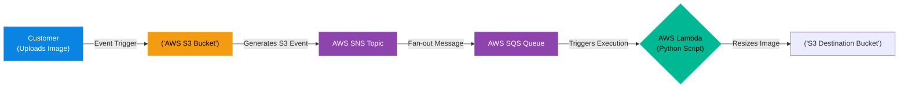

# Chapter 1 — Serverless & Event-Driven Architecture

* **Difficulty:** Advanced
* **Estimated Time:** 1.5 Hours
* **Hands-on Labs:** 1
* **Interview Questions:** 3

## Learning Objectives

By the end of this chapter, you will be able to:
* Define Serverless computing (FaaS).
* Explain the difference between Synchronous and Asynchronous execution.
* Understand the role of Message Queues (SQS) and Pub/Sub Notifications (SNS).
* Design an Event-Driven architecture for data processing.

## Visual Architecture: The Death of the Web Server

In Volume 3, we built an NGINX web server on a Linux VM. That server runs 24/7. If zero customers visit the website at 3:00 AM, you are still paying AWS for the CPU and RAM. If 10,000 customers visit at 3:00 PM, the server crashes from CPU exhaustion.
**Serverless (Function-as-a-Service / FaaS)** like AWS Lambda changes the paradigm. There is no server to manage. You write a small block of Python code and upload it to AWS. The code *only executes* when a specific Event triggers it. You are billed by the millisecond, meaning if there are zero customers, your bill is $0.00.

## Theory & Concepts

### 1. Synchronous vs Asynchronous
* **Synchronous:** A user clicks a button, the web server processes the request, and the user's browser hangs on a loading spinner until the server replies. This is slow and prone to timeouts.
* **Asynchronous (Event-Driven):** A user clicks a button, the server instantly replies "Request Received," and drops a message into a Queue. A backend worker processes the message in the background. The user doesn't have to wait.

### 2. SQS (Simple Queue Service)
SQS is a buffer. If you get a massive spike of 100,000 requests in one minute, a normal database will crash. Instead, you send the requests to SQS. SQS holds the messages safely in a line. Your backend servers (or Lambdas) read the messages from the queue at a steady, manageable pace, preventing the database from ever crashing. 

### 3. SNS (Simple Notification Service)
SNS is a Pub/Sub (Publish/Subscribe) engine. It is used for "Fan-out." If a user uploads an image, you might want to do three things: (1) Resize it, (2) Scan it for viruses, (3) Update the database. Instead of writing one giant script to do all three, you have S3 send one event to SNS. SNS instantly duplicates the message and sends it to three separate SQS queues, triggering three separate Lambda functions simultaneously.

## Scenario-Based Troubleshooting

### Scenario A: The Image Processing Pipeline
**The Incident:** A media company allows users to upload high-resolution 4K photos to their web application. The web server uses a PHP library to compress the image and create a thumbnail. On Friday night, a celebrity posts a link, and 5,000 users upload photos simultaneously. The web servers max out at 100% CPU attempting to compress 5,000 photos at once, and the entire website goes offline.

**The Investigation & Fix:**
1. The Senior Cloud Engineer analyzes the outage and realizes that image compression is a highly CPU-intensive task that should *never* be done synchronously on the web server.
2. **The Redesign:** The engineer redesigns the application into an Event-Driven Serverless architecture. 
3. Now, when a user uploads a photo, the web server simply generates an "S3 Pre-signed URL". The user's browser uploads the heavy 4K file directly to an AWS S3 bucket, completely bypassing the web server's CPU.
4. **The Event:** The moment the file lands in S3, S3 generates an event: `ObjectCreated`. 
5. This event is sent to an SQS Queue. 
6. An AWS Lambda function is configured to listen to that Queue. Because there are 5,000 messages in the queue, AWS automatically spins up 5,000 parallel copies of the Lambda function.
7. The Lambdas download the photos, compress them into thumbnails, save them to a new bucket, and then instantly destroy themselves. 
8. **The Result:** The compression takes 3 seconds. The web server CPU remains at 5%. The business only pays for the exact 3 seconds of compute time used by the Lambdas, and the website never crashes again.

> [!CAUTION]  
> **Best Practice: The Lambda Cold Start**  
> Serverless functions are not magical; they are just Docker containers that AWS spins up on-demand. When a Lambda function hasn't been triggered in a while, it goes to sleep. The next time an event triggers it, AWS takes a few seconds to spin up the container and load the Python runtime. This delay is called a "Cold Start." If your application requires a guaranteed 10ms response time, Serverless might not be the right architectural choice!

## Hands-on Lab

> [!TIP]
> **Practice Assignment Available**
> Proceed to the [Chapter 1 Practice Guide](../practice-files/V5-C01-practice.md) to conceptually write the Python code for an AWS Lambda function that processes S3 events!

## Interview Questions

### Question 1: What is the primary difference between a traditional EC2 Web Server and an AWS Lambda function?
* **Target Answer**: "An EC2 instance is a persistent Virtual Machine. You are billed by the hour regardless of utilization, and you must manage the OS, security patches, and scaling. AWS Lambda is Serverless (FaaS). You only upload the application code, and you are billed by the millisecond of execution time. The infrastructure is entirely abstracted, and AWS automatically scales the function from zero to thousands of concurrent executions based on event triggers."

### Question 2: Explain how SQS (Simple Queue Service) protects a backend database during a traffic spike.
* **Target Answer**: "SQS acts as an asynchronous buffer. During a massive traffic spike, synchronous requests can easily overwhelm and crash a backend database. By placing an SQS queue between the web tier and the database tier, the web servers drop the requests into the queue and instantly return a success to the user. The backend workers then pull messages from the queue at a controlled, steady rate that the database can handle, completely smoothing out the traffic spike."

### Question 3: What is the 'Fan-out' pattern, and how do SNS and SQS work together to achieve it?
* **Target Answer**: "The Fan-out pattern is used when a single event needs to trigger multiple independent backend processes. Instead of tightly coupling the systems, the producer sends a single message to an SNS Topic (Pub/Sub). Multiple SQS Queues are 'subscribed' to that Topic. SNS instantly duplicates the message and pushes it into every subscribed SQS Queue, allowing different microservices (e.g., Billing, Inventory, and Shipping) to process the exact same event asynchronously and independently."

## Chapter Summary

Serverless architecture fundamentally shifts the engineer's focus away from managing Linux operating systems, and toward managing the flow of data. By connecting S3, SNS, SQS, and Lambda, you can build systems that scale infinitely without a single SSH connection.

## Completion Checklist

- [ ] I can define Serverless (FaaS).
- [ ] I understand how SQS buffers traffic spikes.
- [ ] I can explain the Fan-out pattern using SNS and SQS.

---

## Navigation

⬅ Previous:
[Volume 5 Overview](../README.md)

🏠 Volume Contents:
[Table of Contents](../TOC.md)

➡ Next:
[Chapter 2 – Auto-Scaling & Load Distribution](V5-C02-auto-scaling.md)
