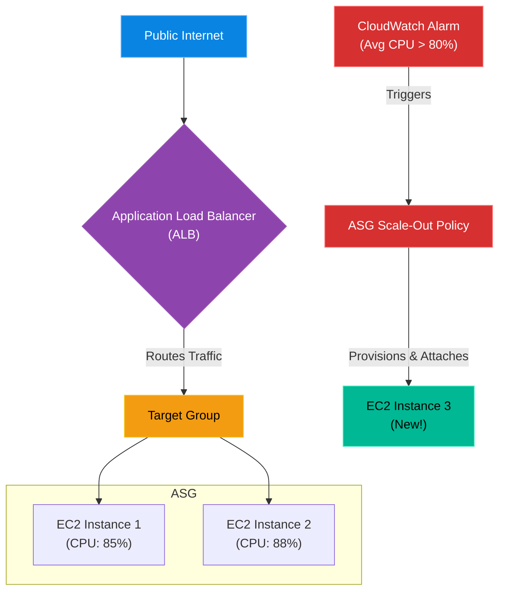

# Chapter 2 — Auto-Scaling & Load Distribution

* **Difficulty:** Intermediate
* **Estimated Time:** 1.5 Hours
* **Hands-on Labs:** 1
* **Interview Questions:** 3

## Learning Objectives

By the end of this chapter, you will be able to:
* Define an Auto Scaling Group (ASG).
* Explain the relationship between an ASG and an Application Load Balancer (ALB).
* Differentiate between On-Demand and Spot Instances.
* Configure CPU-based scaling policies.

## Visual Architecture: The Elastic Fleet

In Volume 4, we used Kubernetes to dynamically scale containerized applications. But what if you are running a monolithic, legacy application directly on Virtual Machines (EC2)? You cannot use Kubernetes. 
Instead, you must use an **Auto Scaling Group (ASG)**. An ASG monitors the health and CPU load of your Virtual Machines. If the load gets too high, the ASG automatically provisions brand new VMs and attaches them to the **Load Balancer** to distribute the traffic. When the traffic dies down, it terminates the extra VMs to save money.

## Theory & Concepts

### 1. The Launch Template
An Auto Scaling Group cannot magically guess how to build your server. You must provide a **Launch Template**. This template defines the AMI (the Linux Golden Image), the Instance Type (e.g., `t3.medium`), the Security Group (firewall), and the User Data script (a bash script that runs once on boot to start the application).

### 2. Target Groups & Health Checks
When the ASG provisions a new EC2 instance, the Load Balancer does not immediately send traffic to it. The new instance is placed into a **Target Group**. The Load Balancer performs a Health Check (e.g., pinging `http://<ip>/health`). Only when the web server successfully replies with a `200 OK` does the Load Balancer start routing live customer traffic to the new instance.

### 3. Purchasing Options: Spot vs On-Demand
* **On-Demand:** You pay a fixed hourly rate. The VM is yours until you terminate it.
* **Spot Instances:** AWS rents out its excess, unused datacenter capacity at a massive discount (up to 90% off). The catch? If AWS suddenly needs that capacity back for a full-paying customer, they will send a 2-minute warning and terminate your VM immediately. Spot Instances are perfect for stateless web servers inside an ASG, because if AWS kills one, the ASG just spins up a new one!

## Scenario-Based Troubleshooting

### Scenario A: The Viral Tweet
**The Incident:** A marketing startup runs a monolithic Ruby on Rails application on a single EC2 instance. At 9:00 PM on a Friday, a famous influencer tweets a link to their product. Traffic spikes 5000%. The EC2 instance CPU hits 100%, and the website crashes with a `504 Gateway Timeout`. The CEO is furious about lost sales.

**The Investigation & Fix:**
1. The Senior Cloud Engineer analyzes the failure. The application was a Single Point of Failure (SPOF) with no elasticity.
2. **The Redesign:** The engineer creates an Application Load Balancer (ALB) and places it in front of the application.
3. They create a Launch Template containing the Ruby on Rails configuration.
4. They create an Auto Scaling Group with a Minimum of 2 instances (for High Availability across two Availability Zones), and a Maximum of 10 instances.
5. They configure a CloudWatch Alarm: "If the Average CPU of the ASG exceeds 70% for 3 minutes, add 2 instances."
6. **The Result:** The next time a viral tweet occurs, the CPU on the initial 2 instances hits 70%. CloudWatch triggers the alarm. The ASG provisions 2 new instances from the Launch Template. The ALB waits for the Health Checks to pass, then routes traffic to the 4 instances, dropping the average CPU back to 40%. The website stays online, and the CEO is happy.

> [!CAUTION]  
> **Best Practice: Avoid Stateful Scaling**  
> Auto Scaling only works if your application is **Stateless**. If your web server stores uploaded user files on its local hard drive (`/var/www/uploads`), and the ASG scales-in (terminates the instance) to save money at midnight, those user files are permanently destroyed! All uploaded files must be sent to S3, and all session data must be sent to a central Redis cache.

## Hands-on Lab

> [!TIP]
> **Practice Assignment Available**
> Proceed to the [Chapter 2 Practice Guide](../practice-files/V5-C02-practice.md) to conceptually design a Terraform configuration for an Auto Scaling Group and a Launch Template!

## Interview Questions

### Question 1: What is the relationship between a Launch Template and an Auto Scaling Group (ASG)?
* **Target Answer**: "An Auto Scaling Group manages the desired capacity and scaling policies for a fleet of virtual machines. However, the ASG does not know *how* to build the VMs. It relies on the Launch Template, which is a blueprint containing the exact AMI ID, instance type, SSH key pair, security groups, and bootstrap scripts required to launch a fully functional instance."

### Question 2: Why must an application be 'Stateless' to safely utilize Auto Scaling?
* **Target Answer**: "Auto Scaling is highly dynamic; it provisions and terminates instances constantly based on traffic load. If an application is stateful—meaning it stores user session data, database records, or uploaded files on the local disk of the EC2 instance—that data will be permanently lost when the ASG terminates the instance during a scale-in event. Stateless applications store all persistent data externally in databases, caches (like Redis), or object storage (like S3)."

### Question 3: What is a Spot Instance, and why is it a good fit for an ASG?
* **Target Answer**: "A Spot Instance is spare compute capacity offered by the cloud provider at a steep discount, with the caveat that it can be terminated with only a two-minute warning. Because an ASG is designed to automatically handle instance failures and replacements, combining stateless web servers with Spot Instances inside an ASG provides massive cost savings (up to 90%) without sacrificing application availability."

## Chapter Summary

The cloud is defined by elasticity. By decoupling your application state from the virtual machine, you can leverage Auto Scaling Groups to automatically expand your infrastructure to handle viral traffic spikes, and shrink it back down to save money while you sleep.

## Completion Checklist

- [ ] I understand the purpose of a Launch Template.
- [ ] I can explain why ALB Health Checks are necessary before routing traffic.
- [ ] I know the difference between Spot and On-Demand instances.

---

## Navigation

⬅ Previous:
[Chapter 1 – Serverless & Event-Driven Architecture](V5-C01-serverless-architecture.md)

🏠 Volume Contents:
[Table of Contents](../TOC.md)

➡ Next:
[Chapter 3 – Cloud Storage & CDN Optimization](V5-C03-cloud-storage-cdn.md)
