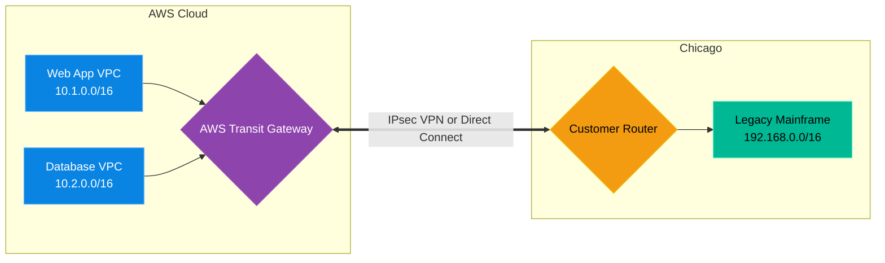

# Chapter 4 — Hybrid Cloud Connectivity

* **Difficulty:** Advanced
* **Estimated Time:** 1.5 Hours
* **Hands-on Labs:** 1
* **Interview Questions:** 3

## Learning Objectives

By the end of this chapter, you will be able to:
* Define a Hybrid Cloud architecture.
* Explain the difference between an IPsec VPN and AWS Direct Connect.
* Understand BGP (Border Gateway Protocol) routing for cloud connectivity.
* Use a Transit Gateway to simplify complex network topologies.

## Visual Architecture: Bridging the Divide

Many tutorials assume a company exists 100% in AWS. In reality, large enterprises (like Banks or Hospitals) have massive legacy datacenters that cannot easily be moved to the cloud. They operate in a **Hybrid Cloud** model. Their modern web applications live in AWS, but those applications must securely talk to the ancient IBM mainframe sitting in a basement in Chicago.
You cannot send this traffic over the public internet. You must build a secure, private bridge between AWS and the on-premise datacenter.

## Theory & Concepts

### 1. IPsec Site-to-Site VPN
The cheapest way to connect your datacenter to AWS is a Site-to-Site VPN. This establishes an encrypted tunnel over the public internet. It is quick to set up, but it relies on the unpredictable public internet. If the internet is congested, your VPN speed will fluctuate, which can cause database timeouts.

### 2. AWS Direct Connect (DX)
For enterprise reliability, you use **Direct Connect**. You physically pay a telecommunications company (like AT&T) to lay a dedicated fiber-optic cable directly from your datacenter building into the nearest AWS facility. It completely bypasses the public internet. It is incredibly expensive, but it provides guaranteed, predictable speeds up to 100 Gbps.

### 3. Transit Gateway (TGW) & BGP
If you have 50 VPCs in AWS and 5 on-premise datacenters, connecting them all together directly creates a "Spaghetti Network" of hundreds of individual VPN tunnels. 
Instead, you use an **AWS Transit Gateway**. It acts as a central Hub. All 50 VPCs connect to the Hub. All 5 datacenters connect to the Hub. 
To manage all the routing tables automatically, the Transit Gateway uses **BGP (Border Gateway Protocol)**. BGP allows the on-premise router to automatically advertise its IP addresses to AWS, so you do not have to type manual static routes.

## Scenario-Based Troubleshooting

### Scenario A: The Overlapping Subnet
**The Incident:** A company acquires a smaller competitor. They want to connect the competitor's on-premise datacenter to the corporate AWS Transit Gateway via a Site-to-Site VPN. The network team successfully establishes the VPN tunnel. The IPSec status shows "UP". However, when the AWS web servers try to ping the competitor's internal servers, the packets just disappear. 

**The Investigation & Fix:**
1. The Senior Cloud Engineer is called in. They verify the VPN tunnel is healthy. The encryption is working.
2. The engineer checks the AWS VPC subnet: `10.0.0.0/16`.
3. The engineer asks the competitor's network team what their on-premise subnet is. The answer: `10.0.0.0/16`.
4. **The Observation:** Both networks are using the exact same private IP addresses! This is known as an **Overlapping CIDR Block**.
5. **The Analysis:** When the AWS Web Server (`10.0.1.50`) tries to ping the competitor's server (`10.0.2.100`), the Linux kernel looks at its local routing table. It sees that `10.0.0.0/16` belongs to its *local* AWS network. Therefore, it never even attempts to send the packet across the VPN tunnel! It just looks for the server locally, fails, and drops the packet.
6. **The Resolution:** You cannot magically route traffic between two identical IP ranges. The competitor's network team must perform the painful task of completely re-IP'ing their datacenter (e.g., changing it to `172.16.0.0/16`), or the engineer must implement complex NAT (Network Address Translation) rules on the router to disguise the IPs. 

> [!CAUTION]  
> **Best Practice: IPAM (IP Address Management)**  
> When you build your very first VPC in AWS, do not just blindly use `10.0.0.0/16`. You must have a global IPAM spreadsheet. Ensure that every new VPC, every new remote office, and every VPN uses a strictly unique, non-overlapping IP address block. Fixing an overlap after 5,000 servers are already deployed is an absolute nightmare.

## Hands-on Lab

> [!TIP]
> **Practice Assignment Available**
> Proceed to the [Chapter 4 Practice Guide](../practice-files/V5-C04-practice.md) to conceptually configure a Transit Gateway attachment using Terraform!

## Interview Questions

### Question 1: What is the primary operational difference between a Site-to-Site VPN and AWS Direct Connect?
* **Target Answer**: "A Site-to-Site VPN establishes an encrypted IPsec tunnel over the public internet, meaning bandwidth and latency are subject to internet congestion. AWS Direct Connect (DX) is a dedicated, physical fiber-optic connection between an on-premise datacenter and an AWS facility, completely bypassing the internet. Direct Connect provides higher bandwidth and consistent, predictable latency, but is significantly more expensive and takes months to physically provision."

### Question 2: Why do large enterprises use a Transit Gateway instead of connecting VPCs using VPC Peering?
* **Target Answer**: "VPC Peering requires a one-to-one relationship. If you have 100 VPCs and want them all to talk to each other, you would need to configure 4,950 individual peering connections (a full mesh), which is an administrative nightmare. A Transit Gateway acts as a centralized Hub-and-Spoke router. You attach all 100 VPCs to the central Hub, allowing them to communicate with each other using a single attachment per VPC, drastically simplifying route management."

### Question 3: How does BGP (Border Gateway Protocol) simplify Hybrid Cloud routing?
* **Target Answer**: "Without BGP, network engineers must manually type 'Static Routes' into both the AWS routing tables and the on-premise routers to tell them where traffic should go. If a new subnet is added, humans must remember to update the static routes on both sides. BGP is a dynamic routing protocol. The on-premise router and the AWS Transit Gateway 'talk' to each other, automatically advertising and propagating their subnets to each other, ensuring routing tables are always instantly up-to-date."

## Chapter Summary

Connecting the Cloud to a physical building requires an understanding of traditional networking. By utilizing Direct Connect for reliability, Transit Gateways for scale, and strict IP Address Management, you can build a seamless Hybrid architecture.

## Completion Checklist

- [ ] I can explain the difference between VPN and Direct Connect.
- [ ] I understand the Hub-and-Spoke model of a Transit Gateway.
- [ ] I know why overlapping CIDR blocks break routing.

---

## Navigation

⬅ Previous:
[Chapter 3 – Cloud Storage & CDN Optimization](V5-C03-cloud-storage-cdn.md)

🏠 Volume Contents:
[Table of Contents](../TOC.md)

➡ Next:
[Chapter 5 – Infrastructure Cost Optimization](V5-C05-cost-optimization.md)
