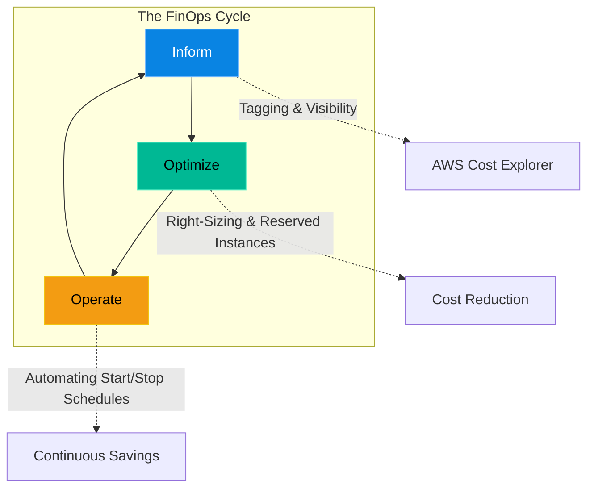

# Chapter 5 — Infrastructure Cost Optimization

* **Difficulty:** Intermediate
* **Estimated Time:** 1 Hour
* **Hands-on Labs:** 1
* **Interview Questions:** 3

## Learning Objectives

By the end of this chapter, you will be able to:
* Define FinOps (Financial Operations) in the Cloud.
* Explain the concept of Right-Sizing.
* Differentiate between On-Demand, Reserved Instances, and Savings Plans.
* Identify "Zombie" infrastructure.

## Visual Architecture: The Hidden Bill

In an on-premise datacenter, a server costs $10,000 upfront. Once it is paid for, it doesn't matter if it sits at 1% CPU utilization for three years. In the Cloud, you rent compute by the minute. If you provision an `m5.24xlarge` EC2 instance with 96 CPU cores, and it sits at 1% utilization, you are actively burning thousands of dollars a month for absolutely no reason.
**FinOps** is the cultural practice of bringing financial accountability to the variable spend model of cloud computing. Senior Engineers do not just optimize for speed and reliability; they optimize for cost.

## Theory & Concepts

### 1. Right-Sizing
Junior engineers often guess how much CPU they need and accidentally provision massive, oversized instances. **Right-Sizing** is the process of using CloudWatch metrics to analyze the *actual* historical CPU and RAM usage of a server, and then scaling it down to the smallest possible instance type that can handle the load.

### 2. Zombie Infrastructure
Because the cloud is API-driven, it is incredibly easy to spin up infrastructure and forget about it. "Zombie" infrastructure includes:
* **Unattached EBS Volumes:** A developer deletes an EC2 instance, but forgets to delete the 500GB hard drive attached to it. AWS continues to charge for the hard drive forever.
* **Orphaned Elastic IPs:** If you reserve a static public IP address but do not attach it to a running server, AWS charges you an hourly penalty fee.
* **Abandoned Dev Environments:** A full replica of production spun up for a 2-week load test, but left running for 6 months.

### 3. Reserved Instances & Savings Plans
If you know for an absolute fact that you will be running a database server 24/7 for the next year, you should not pay the On-Demand hourly rate. AWS offers **Reserved Instances (RIs)** and **Savings Plans**. By signing a 1-year or 3-year contract committing to a specific amount of compute usage, AWS will grant you a massive discount (up to 72%).

## Scenario-Based Troubleshooting

### Scenario A: The Bill Shock
**The Incident:** The CFO looks at the monthly AWS bill and has a panic attack. The bill skyrocketed from $5,000 to $25,000 in a single month. The CTO orders an immediate freeze on all engineering deployments until the leak is found.

**The Investigation & Fix:**
1. The Senior Cloud Engineer logs into AWS Cost Explorer. They group the daily costs by "Service". 
2. They notice that "EC2 - Other" costs spiked drastically on the 14th of the month.
3. The engineer uses the AWS CLI to scan all regions for unattached Elastic Block Store (EBS) volumes.
4. **The Observation:** The engineer finds 1,000 Unattached `gp3` volumes in the `eu-central-1` (Frankfurt) region, each sized at 200GB.
5. **The Analysis:** The engineer investigates the CloudTrail audit logs for the 14th of the month. They discover that a junior developer was attempting to write a Terraform script to deploy a Kubernetes cluster in Germany. The script contained a fatal loop error. It provisioned 1,000 virtual machines, crashed, and then the developer ran `terraform destroy`. 
6. However, the Terraform code was configured to *retain* data volumes on termination to prevent data loss. The VMs were destroyed, but the 1,000 hard drives were left floating in the cloud, costing the company hundreds of dollars a day.
7. **The Resolution:** The engineer deletes the 1,000 zombie volumes. They implement a strict AWS Config Rule that automatically deletes any unattached EBS volume that has been idle for more than 7 days, ensuring this specific leak can never happen again.

> [!CAUTION]  
> **Best Practice: Mandatory Resource Tagging**  
> If you find a random server running in AWS costing $500 a month, can you safely turn it off? If it has no tags, you don't know who owns it or what it does! You must implement strict Resource Tagging policies (e.g., `Owner: BillingTeam`, `Environment: Production`, `CostCenter: 1234`). Without tags, FinOps is impossible, and engineers are too terrified to delete unknown infrastructure.

## Hands-on Lab

> [!TIP]
> **Practice Assignment Available**
> Proceed to the [Chapter 5 Practice Guide](../practice-files/V5-C05-practice.md) to write a bash script that uses the AWS CLI to hunt down zombie EBS volumes!

## Interview Questions

### Question 1: What is 'Right-Sizing' and why is it critical in a cloud environment?
* **Target Answer**: "Right-Sizing is the practice of matching instance types and sizes to your workload's actual performance and capacity requirements. Because the cloud is a pay-as-you-go model, over-provisioning (e.g., using a server with 16 cores when the application only uses 1) results in massive, unnecessary financial waste. Right-Sizing relies on historical CPU/RAM metrics to downgrade instances safely, maximizing cost efficiency."

### Question 2: Explain the financial benefit and the architectural risk of purchasing a 3-Year Reserved Instance (RI).
* **Target Answer**: "A 3-Year Reserved Instance provides the maximum possible discount (up to 72% off the On-Demand price) in exchange for a long-term commitment. The architectural risk is vendor lock-in and inflexibility. If you commit to a specific instance family (e.g., `m5` instances), and a year later your engineering team rewrites the application to be Serverless (Lambda), you are still legally obligated to pay for those EC2 instances for the remaining two years."

### Question 3: How does strict Resource Tagging enable FinOps and cost accountability?
* **Target Answer**: "Without tagging, an AWS bill is just a massive, unreadable list of generic EC2 and S3 charges. You cannot tell which department is spending the money. By enforcing mandatory tags like `Department` and `Project`, FinOps teams can use AWS Cost Explorer to generate granular reports. This allows the business to perform 'Chargebacks' (charging specific departments for their exact cloud usage) and identify exactly who owns a piece of infrastructure that needs to be optimized or deleted."

## Chapter Summary

A Senior Engineer understands that Cloud Architecture is a balance of Performance, Reliability, and Cost. By hunting down zombies, aggressively right-sizing, and leveraging Savings Plans, you prove to the business that you are not just a technical asset, but a financial one.

## Completion Checklist

- [ ] I can define FinOps.
- [ ] I understand the danger of unattached EBS volumes.
- [ ] I know why Resource Tagging is mandatory for cost tracking.

---

## Navigation

⬅ Previous:
[Chapter 4 – Hybrid Cloud Connectivity](V5-C04-hybrid-connectivity.md)

🏠 Volume Contents:
[Table of Contents](../TOC.md)

➡ Next:
[Volume 5, Part 2: Advanced Automation & Scripting *[Planned]*](#)
